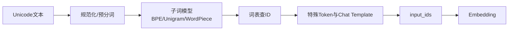

# 5. Tokenizer：BPE、Unigram、特殊 Token 与工程成本

- 原文：[什么是大模型项目的分词器？原理是什么？](https://xiaolinnote.com/ai/llm/tokenizer.html)
- 一句话结论：Tokenizer 将 Unicode 文本和模型词表 ID 序列双向映射；子词算法在词表大小、序列长度和开放词汇之间折中，具体成本必须用目标模型真实 Tokenizer 计算。

## 1. 完整链路



Tokenizer 不只是 `split()`：不同实现可能包含 Unicode 规范化、Byte-level fallback、空格标记、合并规则、特殊 Token、BOS/EOS 策略和 Chat Template。模型权重与 Tokenizer 必须匹配，否则相同 ID 表示不同内容。

## 2. 为什么使用子词

- 字符/字节级：词表小、几乎无 OOV，但序列较长。
- 词级：序列短，但词表巨大，词形变化和新词造成 OOV。
- 子词级：高频片段合并，低频词退化为更小单元，折中词表与长度。

“子词一定没有 OOV”需要条件：Byte-level BPE 或带 Byte Fallback 的模型可覆盖任意字节；纯字符 BPE 若基础字母表未覆盖输入，仍需 `<unk>`。

## 3. BPE 算法

从基础符号序列开始，重复统计相邻 Pair，合并最高频 Pair：

```text
l o w e r
频繁 (l,o) -> lo w e r
频繁 (lo,w) -> low e r
```

训练结果是有顺序的 Merge Table。编码新文本时按规则优先级应用合并。BPE 优化频率压缩；WordPiece 常按似然增益选片段；Unigram 从较大候选词表出发，删除对语料似然贡献较小的 Token。SentencePiece 是可直接在原始文本训练的工具，内部可使用 BPE 或 Unigram，不能与 Unigram 画等号。

## 4. 特殊 Token 和 Chat Template

BOS/EOS/PAD、角色边界、工具调用标记都是词表的一部分。SFT 若用手写 `### Instruction`，而推理使用模型原生 `<|assistant|>` 模板，训练和服务会分布不一致。生产应调用 `tokenizer.apply_chat_template` 或对应官方模板，并明确哪些 Token 参与 Loss。

截断发生在 Token 边界，不会简单产生“半个 Token”；但会截断半个语义单元、代码块或 JSON。Byte-level Token 解码局部前缀时也可能暂时形成不完整 UTF-8，所以流式解码器需缓冲。

## 5. 当前项目与补充实现

[run_day31_sft_lora_light.py](../run_day31_sft_lora_light.py) 使用 `AutoTokenizer.from_pretrained`，缺少 PAD 时回退到 EOS，并把 Tokenizer 保存到输出目录。这是实际 Tokenizer 接入，但 `format_example` 使用自定义纯文本模板，没有调用目标模型 Chat Template。

[run_day36_day38_unified_service.py](../run_day36_day38_unified_service.py) 优先使用 `tokenizer.encode(..., add_special_tokens=False)` 统计 usage；加载失败才退化为 `len(text)//4`，代码明确承认字符估算不精确。

[llm_algorithms_reference.py](examples/llm_algorithms_reference.py) 的 `train_bpe` 和 `bpe_encode` 从字符开始学习确定性合并，测试用 `low/lower/lowest` 学到 `low`。它没有 Byte Fallback、Normalization、Vocabulary ID 和特殊 Token，因此只是 BPE 直觉实现。

## 6. 成本与上下文

Attention 成本对 token 长度敏感。相同文字在不同语言与 Tokenizer 下长度差别很大。网页的“1000 汉字约 1000-1500 token”只能当某些模型的粗估，不应写入配额逻辑。应对真实 messages 套用 Chat Template 后再计数，并为输出、工具结果和系统保留 Buffer。

## 7. 模拟面试

**Q1：Tokenizer 为什么不能跨模型随便换？**  
A：Embedding 行按 Token ID 训练，换词表后 ID 语义错位，模型输入失真。

**Q2：BPE 的训练和编码分别做什么？**  
A：训练学习有序高频 Pair 合并；编码按该顺序将新文本分成词表片段。

**Q3：SentencePiece 等于 Unigram 吗？**  
A：不等于。SentencePiece 是 Tokenizer 工具/框架，可采用 Unigram 或 BPE。

**Q4：所有子词 Tokenizer 都没有 OOV 吗？**  
A：只有基础符号覆盖任意输入（如 Byte-level/Fallback）时才能保证；否则仍可能 `<unk>`。

**Q5：为什么 API 成本不能按字数算？**  
A：Token 粒度取决于词表、语言、空格、代码与模板，必须用目标 Tokenizer 编码。

**Q6：项目 Day31 的模板有什么改进点？**  
A：应优先使用模型 Chat Template，并做 Assistant-only Loss Mask，减少训练/推理格式偏差。

## 8. 复习清单

- 能解释字符、词和子词的取舍。
- 能区分 BPE、Unigram、WordPiece 与 SentencePiece。
- 知道特殊 Token 和 Chat Template 是模型契约。
- 不把字符数粗估当真实 token 账单。