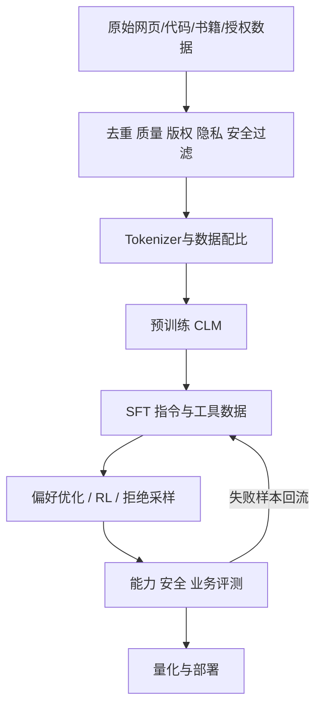

# 6. 大模型训练：预训练、SFT、偏好对齐与工程流水线

- 原文：[大模型是怎么训练出来的？](https://xiaolinnote.com/ai/llm/llm_training.html)
- 一句话结论：预训练学习语言分布和广泛能力，SFT 学习指令行为，偏好/RL 阶段优化质量、安全和可验证目标；真实流程会多轮交替，并非所有模型严格只有三个阶段。

## 1. 从数据到部署

网页用“预训练读书、SFT 学问答、对齐学偏好”建立直觉是合理的。不过 Post-Training 在行业中常包含 SFT 本身；继续预训练、蒸馏、工具训练、安全微调、拒绝采样和多轮 RL 也可能交织，三阶段是教学抽象，不是唯一配方。

## 2. 预训练

数据工程通常包含来源授权、语言/领域分类、文档与近重复去重、质量过滤、PII/密钥清理、安全过滤、污染控制和混合采样。规模大不等于“整个互联网都吞掉”，训练数据来源和许可应以模型报告为准。

Decoder CLM 对每个位置计算交叉熵。训练还需数据并行、Tensor Parallel、Pipeline Parallel、ZeRO/FSDP、混合精度、Gradient Checkpoint、Checkpoint 恢复与故障容错。模型 FLOPs 常粗估为参数量与训练 Token 的乘积常数倍，但具体取决于架构和实现。

## 3. SFT

SFT 数据可能是 `messages`、Instruction/Input/Output、工具轨迹或推理示范。关键不是只把文本拼接起来，而是：

- 使用与推理一致的 Chat Template。
- 通常只对 Assistant 目标计算 Loss。
- Train/Eval 按来源和语义去重，防止模板泄漏。
- 覆盖正常、边缘、拒答、工具失败和安全样本。
- 记录基础模型、Tokenizer、代码和数据版本。

SFT 不只是“学格式”，也能学任务知识与行为；但它受示范分布限制，不能保证所有偏好和安全边界。

## 4. 对齐与后训练

经典 RLHF：偏好标注 -> Reward Model -> PPO/其他 RL，并用 KL 或类似约束限制偏离。DPO 用 Chosen/Rejected 对直接优化隐式偏好目标。GRPO 用同题多采样的组内相对奖励估计优势，适合数学/代码等可验证任务。实际系统还会使用拒绝采样、AI Feedback、规则奖励和安全红队数据。

“对齐给价值观”过于单一：后训练也优化指令遵循、风格、工具使用、推理、拒答校准和业务效用；不同目标间还可能冲突。

## 5. 当前项目真正做到哪里

- [run_day30_build_instruction_dataset.py](../run_day30_build_instruction_dataset.py)：构造后端指令数据并确定性拆分。
- [run_day31_sft_lora_light.py](../run_day31_sft_lora_light.py)：加载 SmolLM2、Tokenizer，使用 `SFTTrainer` 和 LoRA/QLoRA 训练，保存 Adapter。
- [run_day32_sft_before_after_eval.py](../run_day32_sft_before_after_eval.py)：固定评测集比较微调前后。

因此仓库完成的是**小模型指令 SFT 教学闭环**。它没有从零预训练、Reward Model、PPO、DPO、GRPO、分布式训练或人工偏好采集。

[llm_algorithms_reference.py](examples/llm_algorithms_reference.py) 的 `causal_lm_cross_entropy`、`dpo_loss`、`grpo_advantages` 分别展示三个目标的标量数学行为，不更新神经网络。

## 6. 数据质量与评测门禁

训练 Loss 下降只说明拟合训练目标。上线前至少比较：任务成功率、格式/工具准确率、事实性、安全拒答、通用能力回归、延迟、token 和成本。SFT 可能让领域格式变好却损害通用任务，因此 Day32 的“前后固定集”思想正确，但现有关键词评分不足以代表全面模型质量。

## 7. 模拟面试

**Q1：预训练、SFT、对齐分别解决什么？**  
A：预训练学习广泛分布，SFT 学示范行为，偏好/RL 后训练优化回答排序、安全或可验证奖励。

**Q2：三个阶段缺一不可吗？**  
A：对主流聊天模型是有效抽象，但真实配方可交替、合并或省略某类算法，不能当严格标准。

**Q3：为什么只看训练 Loss 不够？**  
A：它不直接衡量任务成功、安全、事实性和能力回退，还可能因数据泄漏虚高。

**Q4：SFT 是否只改变回答格式？**  
A：不是，也会学习数据中的知识、风格和策略，只是无法超越数据覆盖与基础模型容量。

**Q5：为什么高质量数据常比堆数量重要？**  
A：重复、矛盾和错误示范会稳定地教坏模型；高质量覆盖提高单位 token 的有效梯度。

**Q6：当前仓库做过 RLHF 吗？**  
A：没有，只跑了 LoRA/QLoRA SFT；DPO/GRPO 仅新增公式级教学实现。

## 8. 复习清单

- 能画出数据清洗到部署的完整链路。
- 能区分阶段、训练目标和参数更新方法。
- 能准确说明项目只实现小规模 SFT。
- 不把三阶段类比或公开模型数字当普遍定律。