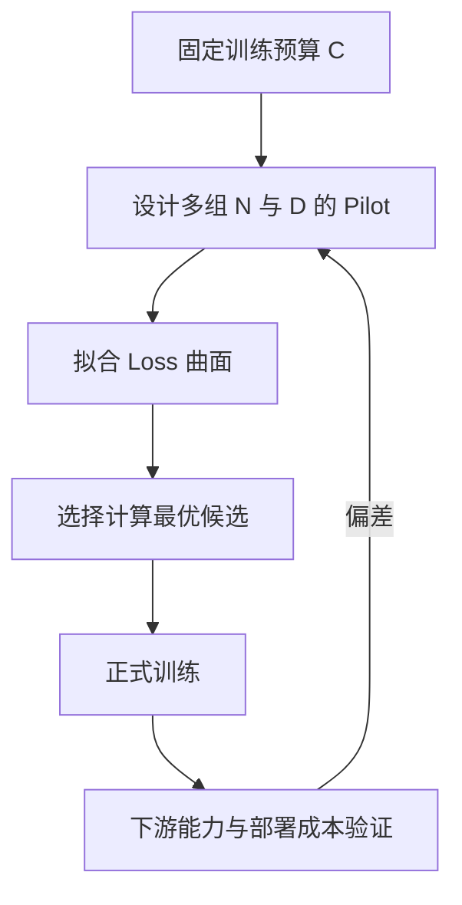

# 7. Scaling Law 与涌现：经验幂律、计算最优和指标争议

- 原文：[什么是 Scaling Law？大模型的「涌现能力」是怎么回事？](https://xiaolinnote.com/ai/llm/scaling_law_emergence.html)
- 一句话结论：Scaling Law 描述特定模型族、数据和计算区间内，Loss 随参数、数据与算力近似按幂律改善；它支持预算规划，不保证无限扩展，也不能推出一个通用“涌现参数阈值”。

## 1. 更完整的 Scaling Law

只写 $L\propto N^{-\alpha}$ 会漏掉不可约误差和数据限制。常见经验模型是：

$$
L(N,D)\approx L_\infty+\frac{A}{N^\alpha}+\frac{B}{D^\beta}
$$

$N$ 是参数量，$D$ 是训练 token，$L_\infty$ 是当前数据分布下的不可约项。训练计算可粗略写成：

$$
C\approx kND
$$

固定 $C$ 时，不能同时无限增大 $N,D$，需要在容量和训练充分度间分配预算。系数与指数必须通过同一模型族的小规模 Pilot Run 拟合，不能从别家公司论文直接复制。

## 2. Chinchilla 的正确理解

“每个参数约 20 token”是 Chinchilla 实验和假设下的 compute-optimal 经验结果，不是自然常数，也不是数据上限。数据质量、重复率、架构、Optimizer、目标和推理成本都会改变最优点。

后续“小参数 + 更多 token”常在优化**全生命周期成本**：训练多花一次算力，换取长期推理时更小的权重、更低显存和延迟。这与固定训练预算下的 Chinchilla 目标不同，并不矛盾。

网页列举的模型参数/token 数适合作案例，但具体数字应回到公开 Technical Report；闭源模型参数或未公开训练配方不能靠估计当事实。

## 3. 涌现与测量

“涌现”常指某能力在规模增加后，从接近随机迅速变成可用。可能来源包括：

- 任务要求多个子能力同时超过阈值，整体成功率是乘积。
- Exact Match、Pass/Fail 等离散指标把连续改进显示为跳变。
- Prompt、解码和评测格式与某一规模开始匹配。
- 模型表示确实出现新的计算回路或组合能力。

因此没有统一的“50B-100B 后必然涌现”。不同模型、数据、任务与指标临界点不同；小型现代模型也可能通过高质量数据、蒸馏和后训练获得早期大模型才有的能力。

## 4. 参考代码如何拟合

[llm_algorithms_reference.py](examples/llm_algorithms_reference.py) 的 `fit_power_law` 对

$$
\log L=\log A+\alpha\log N
$$

做一元最小二乘，返回系数、指数和预测函数。测试用 $(1,2),(4,1),(16,0.5)$ 恢复 $L=2N^{-0.5}$。

这是教学拟合：没有 $L_\infty$、数据变量、置信区间和外推风险。真实 Scaling 研究应做多变量回归、重复实验、残差分析，并只在观测范围附近预测。

当前项目没有训练多组基础模型，也没有 Scaling 实验。Day31 仅改变小模型 LoRA 配置，不能据此验证 Scaling Law。

## 5. 对工程选型的启发

- 模型选型要看训练是否充分，不只看参数量。
- 基础训练前用小规模曲线估算预算，避免一次豪赌。
- 推理量巨大时，过度训练较小模型可能有更低总成本。
- 下游能力未必与预训练 Loss 等比例变化，要同时测业务任务。
- “涌现”不能成为跳过小模型实测、直接采购最大模型的理由。

## 6. 模拟面试

**Q1：Scaling Law 是理论定律吗？**  
A：主要是特定观测范围内的经验规律；模型族、数据和训练方法变化后要重新拟合。

**Q2：Chinchilla 1:20 是数据上限吗？**  
A：不是，是固定训练计算假设下的经验最优配比；不同生命周期目标可选择更多数据。

**Q3：为什么小模型多训练可能更适合部署？**  
A：一次性训练成本增加，但每次推理读取的参数更少，长期 TCO 可能更低。

**Q4：涌现是否证明模型内部突然产生智能？**  
A：不能直接证明；能力跃迁可能同时包含真实机制变化和离散指标放大。

**Q5：怎样验证涌现不是指标假象？**  
A：同时使用连续部分得分、过程指标、多 Prompt、多模型规模和统计置信区间。

**Q6：当前仓库跑过 Scaling Law 吗？**  
A：没有，新增代码只演示单变量幂律拟合。

## 7. 复习清单

- 能写含 $L_\infty,N,D$ 的经验式。
- 能区分训练计算最优和全生命周期最优。
- 不背统一涌现阈值。
- 知道拟合只能谨慎外推。