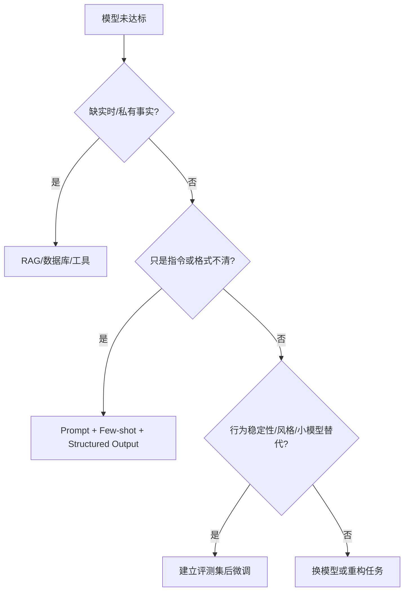

# 8. 大模型微调：更新方法与训练目标的两个正交维度

- 原文：[大模型微调的方案有哪些？](https://xiaolinnote.com/ai/llm/finetuning.html)
- 一句话结论：全量微调、LoRA、QLoRA回答“哪些权重以何种精度更新”；SFT、DPO回答“用什么数据和目标优化”。先判断需求是知识、行为还是实时事实，再决定是否微调。

## 1. 先判断是否需要微调

“微调永远是最后手段”也不必教条化。如果已有高质量行为数据、调用量足够大，训练小模型可能比长期调用大模型更经济。正确原则是先有基线与评测，再比较 Prompt、RAG、模型切换和微调的总成本。

经常变化的价格、库存、政策原文通常放外部数据源；稳定的输出风格、工具调用模式、领域表达和任务策略更适合参数化学习。

## 2. 维度一：更新哪些参数

| 方法 | 基础权重 | 可训练部分 | 主要特点 |
| --- | --- | --- | --- |
| Full FT | 高精度并更新 | 全部参数 | 上限高，训练与存储昂贵 |
| LoRA | 冻结 | 低秩 A/B | Adapter 小、可插拔/合并 |
| QLoRA | 4-bit 冻结基础权重 | 高精度 LoRA | 显著降低基础权重显存 |

QLoRA 不是在 INT4 上直接更新基础权重。通常基础权重以 NF4 等形式存储，计算时按块反量化到计算 dtype，梯度更新 LoRA Adapter；Double Quantization 进一步压缩 Scale，Paged Optimizer 处理内存峰值。

Full FT 的显存不能只用“权重 + 梯度 + 两个 Adam 状态”固定相加，Master Weights、dtype、ZeRO/FSDP、Activation 和 Checkpointing 都会改变结果。

## 3. 维度二：学习什么目标

- **Continued Pretraining**：领域原始文本上的 CLM，适合术语与分布适配。
- **SFT**：Prompt/Response 或 Messages 示范，学习指令行为。
- **DPO**：Prompt/Chosen/Rejected 偏好对，学习相对偏好。
- **Distillation**：模仿教师 logits、回答或推理产物。

任一目标都可以选择 Full FT 或 PEFT。例如 LoRA-SFT 与 LoRA-DPO 使用同一种参数更新形式，但 Loss 和数据不同。

## 4. 当前项目的真实微调

[run_day29_lora_qlora_notes.py](../run_day29_lora_qlora_notes.py) 生成 LoRA/QLoRA 量级笔记；其显存数字明确是粗估。

[run_day31_sft_lora_light.py](../run_day31_sft_lora_light.py) 实际配置：

- `AutoModelForCausalLM` 和 `AutoTokenizer`；
- `LoraConfig(r, alpha, dropout, target_modules="all-linear")`；
- 可选 `BitsAndBytesConfig(load_in_4bit=True, quant_type="nf4")`；
- `SFTTrainer`、Gradient Accumulation、Checkpointing；
- 无 CUDA 时 QLoRA 自动回退 LoRA。

它使用 SmolLM2-135M-Instruct 和后端指令数据，是教学级 LoRA-SFT。`target_modules="all-linear"` 简便但未按架构逐层筛选；`format_example` 也未使用原生 Chat Template。

[run_day32_sft_before_after_eval.py](../run_day32_sft_before_after_eval.py) 比较基础/Adapter，构成最小回归门禁。项目未做 Full FT、Continued Pretraining 或 DPO。

## 5. 选型必须先测数据

- 数据少且格式稳定：Prompt/Few-shot 基线。
- 有数千高质量示范、GPU 受限：LoRA/QLoRA SFT。
- 有可靠偏好对：SFT 后再 DPO。
- 领域语言分布差异大：考虑 Continued Pretraining 后 SFT。
- 任务与通用能力差异极大且资源充足：评估 Full FT。

任何方案都应保留基础模型、Tokenizer、通用能力和安全集的回归；Adapter 小不等于没有灾难性遗忘或行为退化。

## 6. 模拟面试

**Q1：LoRA 和 SFT 是并列方案吗？**  
A：不是。LoRA 是参数更新方式，SFT 是训练目标，可以用 LoRA 做 SFT。

**Q2：QLoRA 训练 INT4 基础权重吗？**  
A：通常基础权重冻结，低比特存储并在计算时反量化，训练的是 LoRA 参数。

**Q3：什么需求优先 RAG 而非微调？**  
A：需要可更新、可追溯的事实知识，如库存、合同和政策条款。

**Q4：何时 Full FT 值得考虑？**  
A：数据充分、任务分布变化大、资源充足且 PEFT 已证实达不到目标时。

**Q5：LoRA 是否天然没有能力回退？**  
A：不是，Adapter 更新仍可主导输出；需在通用与安全集回归。

**Q6：当前项目的 QLoRA 在 Mac CPU 会怎样？**  
A：代码检测无 CUDA 后回退 LoRA，因此不能声称在该环境跑过 NF4 QLoRA。

## 7. 复习清单

- 能画“更新方法 × 训练目标”矩阵。
- 能解释 QLoRA 的冻结、存储和计算 dtype。
- 先分知识问题与行为问题。
- 准确描述 Day31 是 LoRA-SFT 教学流程。