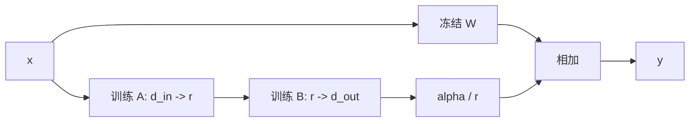

# 9. LoRA：低秩增量、可训练参数与部署模式

- 原文：[请讲一下 LoRA 技术，除了减少参数量，它还有哪些优点？](https://xiaolinnote.com/ai/llm/lora.html)
- 一句话结论：LoRA 冻结基础矩阵 $W$，用低秩 $BA$ 表达任务增量；它带来小 Adapter、版本隔离和可合并部署，但“零推理开销”“不遗忘”“可随意混合”都需要条件。

## 1. 数学结构

若基础权重 $W\in\mathbb{R}^{d_{out}\times d_{in}}$：

$$
W'=W+\Delta W,\qquad \Delta W=\frac{\alpha}{r}BA
$$

$$
A\in\mathbb{R}^{r\times d_{in}},\qquad B\in\mathbb{R}^{d_{out}\times r}
$$

可训练参数从 $d_{out}d_{in}$ 降为：

$$
r(d_{in}+d_{out})
$$

低秩假设是微调所需更新位于较低维子空间，不是对每个任务都严格成立。Rank 越大表达容量越强，但参数、过拟合与通信成本也增加。

## 2. 除了省参数的价值

1. **产物小**：一个 Base 可关联多个任务 Adapter，存储和发布独立。
2. **版本隔离**：基础权重不变，回滚只需切 Adapter。
3. **可合并**：离线计算 $W'$ 后，计算图与普通 Dense 权重一致。
4. **服务复用**：支持的推理引擎可在同一 Base 上动态 Batch 多个 Adapter。
5. **实验效率**：可快速比较 Rank、Target Modules 和数据版本。

但动态 Adapter 未合并时仍有额外矩阵乘、显存读取和调度开销；只有真正 Merge 后才能接近“零额外计算”。Merge 会生成一套完整权重，失去小文件热切换优势。

## 3. 遗忘与融合的边界

冻结 $W$ 保留原始参数，不保证输出行为不变。若 $\Delta W$ 很强、数据狭窄或学习率过高，通用能力仍可下降。停用 Adapter 可恢复 Base，但启用时仍需回归。

多个 LoRA 可形式上相加：

$$
W'=W+\sum_i \lambda_i\Delta W_i
$$

然而不同 Adapter 可能在同一方向冲突，简单加权不保证组合能力，需调系数并做联合评测。PEFT 的“同时激活”能力也依赖具体版本和 Adapter 类型。

## 4. 初始化与 Target Modules

常见 LoRA 将一个因子初始化为零，使初始 $\Delta W=0$，训练从 Base 行为开始。Target 常选 Attention 投影（q/k/v/o）和/或 MLP 线性层。只改 Q/V 更省，`all-linear` 容量更大。最佳组合取决于模型命名和任务，不能盲抄。

$\alpha/r$ 控制更新幅度，Dropout 只在训练 Adapter 分支时生效。Rank、Alpha、LR 与数据规模互相影响，不存在所有任务通用的 `r=8/16`。

## 5. 项目代码与公式实现

[run_day31_sft_lora_light.py](../run_day31_sft_lora_light.py) 用 `LoraConfig` 设置 `r=16`、`alpha=32`、`dropout=0.05`、`bias="none"`、`task_type="CAUSAL_LM"` 和 `all-linear`，训练后只保存 Adapter。它确实跑 LoRA 流程，但没有调用 `merge_and_unload()`、多 Adapter Serving 或 LoRA Mixing。

[llm_algorithms_reference.py](examples/llm_algorithms_reference.py) 中：

- `lora_parameter_count` 精确计算单矩阵 Adapter 参数。
- `merge_lora_weights` 计算 $W+(\alpha/r)BA$。
- 测试对 $2\times2$ 矩阵验证合并值。

参考实现不含梯度、Dropout、Optimizer 或模型层注入。

## 6. 模拟面试

**Q1：LoRA 为什么用两个矩阵而不是直接训 $\Delta W$？**  
A：低秩分解将参数从 $d_{out}d_{in}$ 降为 $r(d_{in}+d_{out})$，限制更新子空间。

**Q2：Alpha 为什么常除以 Rank？**  
A：让更新尺度在改变 Rank 时更可控；具体 Scaling 变体可能不同。

**Q3：LoRA 推理一定零开销吗？**  
A：合并权重后可无额外分支；动态未合并 Adapter 仍有计算和调度开销。

**Q4：冻结 Base 就不会灾难性遗忘吗？**  
A：可随时卸载恢复 Base，但启用 Adapter 时行为仍可能覆盖通用能力，必须回归。

**Q5：两个 LoRA 能直接相加吗？**  
A：数学上可相加，效果上可能干扰，需权重搜索和组合评测。

**Q6：项目部署过多 LoRA 热切换吗？**  
A：没有，Day31 保存单 Adapter，Day34 加载一个可选 Adapter。

## 7. 复习清单

- 能写 $W'=W+(\alpha/r)BA$ 和参数量。
- 能区分合并部署与动态 Adapter Serving。
- 不把冻结参数等同无行为回退。
- 能指出项目尚未做 Merge 和多 Adapter 服务。