# 大模型工程 1-22 总知识图谱

这张图将 22 个专题放进同一个生命周期：数据经过 Tokenizer 和 Transformer 形成基础模型，随后进入 SFT 与偏好对齐，再通过推理、Prompt、部署、评测和模型路由服务业务，最后由失败样本回流到数据和训练阶段。

读图约定：

- `[01]` 到 `[22]` 对应本目录的专题编号。
- 实线表示主要数据流、训练流或调用流。
- 虚线表示影响、约束、优化或反馈关系。
- 同一概念可能跨越多个阶段，例如 Tokenizer、量化、KV Cache 和评测。

## 总图

```mermaid
flowchart TB
    RAW["原始数据与业务需求<br/>文本 / 代码 / 对话 / 领域文档"]

    subgraph FOUNDATION["A. 基础、Tokenizer 与模型架构  [01-05, 19]"]
        direction LR
        F01A["LLM  [01]<br/>条件概率与 Next-Token Prediction<br/>Causal LM Cross-Entropy<br/>Zero-shot / Few-shot 通用迁移"]
        F01B["传统 NLP  [01]<br/>任务专用模型与显式流水线<br/>小数据 / 低延迟 / 高可控场景<br/>仍可优于通用大模型"]
        F05A["Tokenizer 流程  [05]<br/>Unicode 规范化 / 预切分<br/>BPE / WordPiece / Unigram<br/>SentencePiece / Byte Fallback"]
        F05B["Token 合同  [05]<br/>词表 ID / BOS / EOS / PAD<br/>Special Token / Chat Template<br/>上下文长度与 Token 成本"]
        F02A["Transformer Block  [02]<br/>Embedding -> Q/K/V Attention<br/>Residual + Norm<br/>FFN / MLP / SwiGLU"]
        F02B["架构变体  [02]<br/>Encoder: 双向 Attention<br/>Decoder: Causal Mask<br/>Encoder-Decoder: Cross-Attention"]
        F03A["Attention 结构  [03]<br/>MHA / GQA / MQA<br/>Query Head 与 KV Head 共享<br/>影响质量、带宽与 KV 大小"]
        F03B["FlashAttention  [03]<br/>分块计算 + Online Softmax<br/>减少 HBM 与 SRAM 数据搬运<br/>不改变精确 Dense Attention"]
        F04["位置编码  [04]<br/>Sinusoidal / RoPE / ALiBi<br/>绝对位置 / 相对相位 / 距离偏置<br/>长上下文外推不是无限的"]
        F19A["Sparse MoE  [19]<br/>Router Softmax -> Top-K Expert<br/>共享专家 / 专家输出加权<br/>总参数不等于激活参数"]
        F19B["MoE 工程问题  [19]<br/>Capacity / Token Drop<br/>负载均衡辅助损失<br/>Expert Parallel / All-to-All"]

        F01B -->|"能力互补，不是完全替代"| F01A
        F05A -->|"编码"| F05B
        F05B -->|"Token ID 进入 Embedding"| F02A
        F04 -->|"向表示或分数注入位置"| F02A
        F02A --> F02B
        F02A --> F03A
        F03A -->|"Kernel 可继续优化"| F03B
        F02A -->|"MoE 常替换 Dense FFN"| F19A
        F19A --> F19B
    end

    subgraph TRAINING["B. 预训练、微调与偏好对齐  [06-11]"]
        direction LR
        T06A["训练数据治理  [06]<br/>授权 / 去重 / 质量过滤<br/>PII 与安全清理 / 数据配比<br/>Train-Eval 隔离"]
        T06B["预训练  [06]<br/>大规模无标注 Token<br/>Causal Language Modeling<br/>分布式训练 / 混合精度 / Checkpoint"]
        T07A["Scaling Law  [07]<br/>参数 N / 数据 D / 算力 C<br/>Loss 幂律与不可约损失<br/>C 约等于 kND"]
        T07B["规模决策  [07]<br/>Pilot Run / Chinchilla 经验<br/>Compute-Optimal 与生命周期成本<br/>涌现可能受指标阈值影响"]
        BASE["Base Model<br/>通用语言与表示能力"]
        T08A["训练目标轴  [08]<br/>继续预训练 CPT / SFT<br/>DPO / Distillation<br/>决定模型学什么"]
        T08B["参数更新轴  [08]<br/>Full FT / LoRA / QLoRA<br/>与训练目标正交<br/>决定更新哪些权重"]
        T08C["先判断问题类型  [08]<br/>领域知识 -> CPT 或 RAG<br/>行为格式 -> SFT 或 DPO<br/>实时事实 -> RAG / Tool / Model Switch"]
        T06C["SFT  [06, 08]<br/>Instruction-Response / Chat Messages<br/>Assistant-Only Loss / 固定评测集<br/>学习任务格式与回答行为"]
        T09A["LoRA  [09]<br/>冻结 W，学习低秩 A/B<br/>Delta W = alpha/r * BA<br/>Rank / Alpha / Dropout / Target Module"]
        T09B["Adapter 生命周期  [09]<br/>独立版本 / 动态加载 / 合并权重<br/>小产物不代表零质量风险<br/>多个 Adapter 不能随意相加"]
        T15Q["QLoRA  [08, 15]<br/>NF4 量化冻结基础权重<br/>Double Quantization<br/>高精度计算并仅训练 LoRA"]
        T10A["反馈来源  [10]<br/>Human Feedback / RLAIF<br/>规则 / Reward Model / Verifier<br/>偏好标签也可能有噪声"]
        T10B["拒绝采样  [10]<br/>生成多个候选 -> 打分 -> 过滤<br/>优质候选回到 SFT<br/>通常不是 Policy-Gradient RL"]
        T11A["偏好对  [10, 11]<br/>Prompt + Chosen + Rejected<br/>来自人工、AI、规则或验证器"]
        T11B["DPO  [10, 11]<br/>Policy 与 Reference Log-Ratio<br/>离线直接优化 Chosen 偏好<br/>依赖偏好数据覆盖"]
        T11C["RLHF + PPO  [10, 11]<br/>Online Rollout -> Reward<br/>Critic / Advantage / Clip / KL<br/>可探索但系统复杂"]
        T10C["GRPO  [10]<br/>同 Prompt 生成一组响应<br/>规则或 Reward 打分<br/>组内标准化 Advantage"]
        ALIGNED["领域或对齐模型<br/>能力 + 行为 + 安全约束"]

        T06A --> T06B
        T07A -->|"预测规模与 Loss"| T07B
        T07B -->|"指导数据、参数与预算"| T06B
        T06B --> BASE
        BASE --> T08A
        T08C -->|"选择目标"| T08A
        T08A --> T06C
        T08B -->|"可作为 SFT 更新方式"| T09A
        T09A --> T09B
        T08B --> T15Q
        BASE -->|"冻结基础权重"| T09A
        BASE -->|"4-bit 加载"| T15Q
        T06C -->|"通常先获得可用行为"| T10A
        T10A --> T10B
        T10A --> T11A
        T10A --> T11C
        T10A --> T10C
        T11A --> T11B
        T10B -->|"再次监督训练"| T06C
        T06C --> ALIGNED
        T11B --> ALIGNED
        T11C --> ALIGNED
        T10C --> ALIGNED
        T09B -->|"产生可部署 Adapter"| ALIGNED
        T15Q -->|"产生量化基础权重加 Adapter"| ALIGNED
    end

    subgraph INFERENCE["C. 推理、解码、缓存与量化  [12-15]"]
        direction LR
        I14A["Prefill  [14]<br/>一次处理完整 Prompt<br/>生成各层历史 K/V<br/>长 Prompt 影响 TTFT"]
        I14B["KV Cache  [03, 14]<br/>单请求复用历史 Key/Value<br/>避免每步重算旧 Token<br/>以显存换 Decode 计算"]
        I14C["Decode  [14]<br/>每步输入新 Token<br/>读取并追加 KV Cache<br/>常受显存带宽限制"]
        I12A["模型输出  [12]<br/>Logits -> Softmax<br/>P(next token | prefix)<br/>累加序列 Log Probability"]
        I12B["解码策略  [12]<br/>Greedy / Beam Search / Sampling<br/>EOS / Length Penalty / Repetition<br/>Constrained Generation"]
        I13["采样控制  [13]<br/>Temperature 调整尖锐度<br/>Top-K 固定候选数<br/>Top-P 累计概率集合<br/>截断后重新归一化"]
        I12C["多候选与加速  [12, 17, 20]<br/>Self-Consistency 多样本投票<br/>Speculative Decode 草稿加验证<br/>后者优化执行而非搜索目标"]
        I14D["Prompt / Prefix Cache  [14]<br/>跨请求复用相同 Token 前缀<br/>Cache Key 包含模型与采样状态<br/>LRU / TTL / Tenant 隔离"]
        I14E["缓存与调度技术  [14, 20]<br/>PagedAttention / Paged KV<br/>Radix Prefix Cache<br/>Continuous Batching / Chunked Prefill"]
        I15A["量化维度  [15]<br/>Weight / Activation / KV / Optimizer<br/>对称或非对称 / Scale / Zero Point<br/>Per-Tensor / Channel / Group"]
        I15B["量化方案与格式  [15]<br/>INT8 / INT4 / GPTQ / AWQ / NF4<br/>GGUF / Safetensors / Kernel<br/>更小不保证一定更快"]

        I14A -->|"写入"| I14B
        I14B -->|"每步读取"| I14C
        I14C --> I12A
        I12A --> I12B
        I13 -->|"调整 Sampling 分布"| I12B
        I12B -->|"可生成多个候选"| I12C
        I14D -->|"命中后跳过重复 Prefill"| I14A
        I14B -->|"显存分页管理"| I14E
        I15A --> I15B
        I15B -->|"降低权重或缓存占用"| I14E
    end

    subgraph APPLICATION["D. Prompt、推理过程与可靠性治理  [16-18]"]
        direction LR
        P16A["Prompt 输入契约  [16]<br/>Role / Task / Context<br/>Evidence Boundary / Output Schema<br/>Few-shot Examples / 防注入边界"]
        P16B["Prompt 工程闭环  [16]<br/>结构化输出 + Parser 校验<br/>Version / Golden Set / 失败分类<br/>Retry / Canary / A-B / 压缩"]
        P17A["Chain-of-Thought  [17]<br/>Zero-shot / Few-shot CoT<br/>Scratchpad / Hidden Reasoning<br/>中间文字不一定忠实"]
        P17B["推理增强  [17]<br/>Self-Consistency<br/>Tool-Augmented Reasoning<br/>Process Supervision / External Verifier<br/>更多 Token 带来成本与延迟"]
        P18A["幻觉类型  [18]<br/>Factuality / Faithfulness<br/>Context Consistency / Execution Error<br/>流畅不代表正确"]
        P18B["幻觉成因  [18]<br/>训练数据与 Next-Token 目标<br/>知识过期 / 解码随机性<br/>检索、工具或上下文失败"]
        P18C["Grounding 与缓解  [18]<br/>RAG / Tool / Citation Validation<br/>Claim-Evidence Entailment<br/>拒答 / 澄清 / 人工复核"]
        P18D["不确定性治理  [18, 21]<br/>Confidence Calibration / ECE<br/>按风险分级阈值<br/>目标是测量和降低，不承诺归零"]

        P16A --> P16B
        P16A -->|"可要求显式步骤"| P17A
        P17A --> P17B
        P18B --> P18A
        P17B -->|"验证器降低部分错误"| P18C
        P16B -->|"Schema 只保证结构"| P18C
        P18C --> P18D
        P18A -->|"需要暴露不确定性"| P18D
    end

    subgraph DEPLOYMENT["E. 模型服务与部署框架  [20]"]
        direction LR
        D20A["工作负载画像  [20]<br/>GPU / CPU / Edge<br/>模型格式 / 上下文长度 / 并发<br/>共享前缀 / 量化 / 运维能力"]
        D20B["部署框架  [20]<br/>vLLM / SGLang / TGI<br/>llama.cpp / TensorRT-LLM<br/>必须按模型与硬件实测"]
        D20C["Serving 能力  [20]<br/>Continuous Batching / Paged KV<br/>Prefix Cache / Chunked Prefill<br/>Speculative Decode / Quantized Kernel"]
        D20D["Serving SLO  [20]<br/>TTFT / TPOT 或 ITL<br/>Throughput / Goodput<br/>错误率 / 可用性 / 峰值显存"]

        D20A -->|"筛选"| D20B
        D20B -->|"组合能力"| D20C
        D20C -->|"压测"| D20D
    end

    subgraph EVALUATION["F. 评测、模型选型与反馈回流  [21-22]"]
        direction LR
        E21A["三层评测  [21]<br/>Public Benchmark<br/>业务 Golden Set<br/>Shadow / Canary / Online A-B"]
        E21B["任务质量指标  [21]<br/>Accuracy / Precision / Recall / F1<br/>Pass@K / Exact Match<br/>RAG Hit@K / MRR / Citation<br/>Agent 成功率与 Tool 正确率"]
        E21C["系统与风险指标  [21]<br/>鲁棒性 / 安全 / Calibration<br/>Latency / Throughput / Cost<br/>人工修改率 / 拒答正确率"]
        E21D["评测可信度  [21]<br/>LLM-as-Judge 偏差<br/>人工标定 / 数据污染<br/>Paired Test / Bootstrap / 置信区间"]
        E22A["硬门禁  [22]<br/>合规 / 数据驻留 / 功能<br/>Context / Tool / SLO / Budget<br/>不满足者先淘汰"]
        E22B["多目标选型  [22]<br/>质量 / 延迟 / 吞吐 / 总成本<br/>硬件与运维 / Pareto Frontier<br/>Token 单价不等于总成本"]
        E22C["Model Routing  [22]<br/>Provider + Model + Version 身份<br/>Allowlist / Dynamic Route / Fallback<br/>缓存、重试和降级也计入成本"]
        E22D["失败样本回流  [21, 22]<br/>更新 Prompt / RAG / Tool<br/>补充 SFT 或 Preference Data<br/>调整阈值、路由与发布策略"]

        E21A --> E21B
        E21A --> E21C
        E21B --> E21D
        E21C --> E21D
        E21D -->|"提供可信比较"| E22A
        E22A --> E22B
        E22B --> E22C
        E21D --> E22D
    end

    RAW -->|"清洗后编码"| F05A
    F01A -->|"统一 Prompt 到 Generation 接口"| P16A
    F02B -->|"Decoder-only 常用于生成式 LLM"| T06B
    F03A -.->|"KV Head 数决定缓存大小"| I14B
    F03B -.->|"降低训练与 Prefill 的 IO 压力"| T06B
    F04 -.->|"Position ID 必须与缓存一致"| I14B
    F05B -.->|"训练与服务必须共用 Chat Template"| T06C
    F05B -.->|"Token 前缀是缓存匹配基础"| I14D
    F19B -.->|"通信和失衡影响真实延迟"| D20D
    T07B -.->|"规模预算约束候选模型"| E22A
    ALIGNED -->|"加载模型权重或 Adapter"| D20B
    ALIGNED -->|"执行推理"| I14A
    T15Q -.->|"NF4 是训练量化路径"| I15B
    P16A -->|"形成 Prompt"| I14A
    I12C -.->|"多样本投票实现 Self-Consistency"| P17B
    I13 -.->|"改变随机性但不保证事实正确"| P18B
    I14E -.->|"作为部署框架能力"| D20C
    I15B -.->|"格式与 Kernel 必须匹配框架"| D20B
    I12B --> OUTPUT["模型输出<br/>文本 / JSON / Tool Call"]
    OUTPUT -->|"检查事实、格式与业务效果"| P18A
    P18C -.->|"Groundedness 与引用进入指标"| E21B
    P18D -.->|"Calibration 与风险进入指标"| E21C
    D20D -->|"提供线上性能数据"| E21C
    P16B -.->|"Prompt 版本进入 Golden Set"| E21A
    E22C -->|"选择模型与部署路径"| D20A
    E22D -.->|"数据清洗与难例补充"| T06A
    E22D -.->|"构造 Chosen / Rejected"| T11A
    E22D -.->|"修订 Prompt"| P16B
    E22D -.->|"重新评估需求类型"| T08C

    classDef input fill:#fff6d9,stroke:#8a6d1d,color:#2d2715;
    classDef foundation fill:#eaf3ff,stroke:#34699a,color:#13293d;
    classDef training fill:#eaf8ee,stroke:#3f7d4e,color:#173c22;
    classDef inference fill:#fff1e6,stroke:#a65f26,color:#4a2811;
    classDef application fill:#f4edff,stroke:#7451a6,color:#2f1f49;
    classDef deployment fill:#e9f7f7,stroke:#347d7d,color:#153838;
    classDef evaluation fill:#fcecef,stroke:#a64c62,color:#4a1e2a;
    classDef core fill:#fff4bf,stroke:#8b7500,color:#302900,stroke-width:2px;

    class RAW,OUTPUT input;
    class F01A,F01B,F05A,F05B,F02A,F02B,F03A,F03B,F04,F19A,F19B foundation;
    class T06A,T06B,T07A,T07B,T08A,T08B,T08C,T06C,T09A,T09B,T15Q,T10A,T10B,T11A,T11B,T11C,T10C training;
    class I14A,I14B,I14C,I12A,I12B,I13,I12C,I14D,I14E,I15A,I15B inference;
    class P16A,P16B,P17A,P17B,P18A,P18B,P18C,P18D application;
    class D20A,D20B,D20C,D20D deployment;
    class E21A,E21B,E21C,E21D,E22A,E22B,E22C,E22D evaluation;
    class BASE,ALIGNED core;
```

## 四条复习主线

1. **模型怎么形成**：`[05] Tokenizer -> [02-04,19] Transformer 架构 -> [06-07] 预训练与规模规律 -> Base Model`。
2. **模型怎么变得可用**：`Base Model -> [08-09] SFT/LoRA/QLoRA -> [10-11] DPO/PPO/GRPO -> 对齐模型`。
3. **模型怎么生成得快**：`[14] Prefill/KV Cache -> [12-13] 解码与采样 -> [15] 量化 -> [20] Serving 框架`。
4. **模型怎么安全上线**：`[16-18] Prompt/验证/幻觉治理 -> [21] 离线与线上评测 -> [22] 门禁、选型和路由 -> 失败样本回流`。

## 最容易混淆的关系

| 概念 | 正确关系 |
| --- | --- |
| SFT 与 LoRA | SFT 是训练目标，LoRA 是参数更新方式；可以做 Full-Parameter SFT、LoRA SFT 或 QLoRA SFT。 |
| DPO 与 PPO | DPO 使用固定 Chosen/Rejected 离线优化；PPO 通常在线 Rollout，并依赖 Reward、Advantage、Critic 和 KL 约束。 |
| GQA 与 FlashAttention | GQA 减少 KV Head，是结构优化；FlashAttention 减少数据搬运，是 Kernel/IO 优化，两者可以叠加。 |
| KV Cache 与 Prefix Cache | KV Cache 在单次请求内复用历史 K/V；Prefix Cache 在不同请求间复用相同 Token 前缀。 |
| PagedAttention 与 Prefix Cache | PagedAttention 解决 KV 内存分页管理；Prefix Cache 解决跨请求前缀复用，可以同时使用。 |
| QLoRA 与 INT4 推理 | QLoRA 用 NF4 存放冻结基础权重并训练 LoRA；GPTQ/AWQ/普通 INT4 更多是推理部署路径。 |
| CoT 与正确性 | CoT 提供额外计算 Token，但文字解释不一定忠实，也不能替代工具、证据和验证器。 |
| RAG 与幻觉 | RAG 提供可依据的上下文，但检索错误、引用不蕴含结论或模型忽略证据时仍会幻觉。 |
| MoE 参数量 | 总参数描述容量和存储，激活参数影响单 Token 理论计算；All-to-All 和负载不均仍可能增加延迟。 |
| Benchmark 与模型选型 | Benchmark 只是能力切面，生产选型还需要业务 Golden Set、SLO、成本、安全、合规和线上反馈。 |

## 专题编号索引

| 编号 | 专题 |
| --- | --- |
| 01 | [LLM 与传统 NLP](1_what_is_llm_and_traditional_nlp.md) |
| 02 | [Transformer 架构](2_transformer_encoder_decoder_attention.md) |
| 03 | [MHA、MQA、GQA 与 FlashAttention](3_mha_mqa_gqa_flash_attention.md) |
| 04 | [Sinusoidal、RoPE 与 ALiBi](4_position_encoding_sinusoidal_rope_alibi.md) |
| 05 | [Tokenizer 工程](5_tokenizer_bpe_sentencepiece_engineering.md) |
| 06 | [预训练、SFT 与对齐](6_llm_training_pretraining_sft_alignment.md) |
| 07 | [Scaling Law 与涌现](7_scaling_law_and_emergent_abilities.md) |
| 08 | [Full FT、LoRA、QLoRA、SFT 与 DPO](8_finetuning_full_lora_qlora_sft_dpo.md) |
| 09 | [LoRA 低秩更新与部署](9_lora_low_rank_adaptation_and_deployment.md) |
| 10 | [Post-Training、RLHF、DPO、GRPO 与拒绝采样](10_post_training_rlhf_dpo_grpo_rejection_sampling.md) |
| 11 | [DPO 与 PPO](11_dpo_vs_ppo_preference_alignment.md) |
| 12 | [Greedy、Beam Search 与 Sampling](12_decoding_greedy_beam_sampling.md) |
| 13 | [Temperature、Top-P 与 Top-K](13_temperature_top_p_top_k_sampling.md) |
| 14 | [KV Cache 与 Prompt Cache](14_kv_cache_and_prompt_caching.md) |
| 15 | [INT8、INT4、GPTQ、AWQ 与 NF4](15_quantization_int8_int4_awq_gptq_nf4.md) |
| 16 | [Prompt Engineering](16_prompt_engineering_testing_and_iteration.md) |
| 17 | [Chain-of-Thought 与 Self-Consistency](17_chain_of_thought_and_self_consistency.md) |
| 18 | [幻觉、Grounding 与校准](18_hallucination_causes_mitigation_grounding.md) |
| 19 | [MoE、Router 与负载均衡](19_moe_router_experts_load_balancing.md) |
| 20 | [vLLM、SGLang、TGI、llama.cpp 与 TensorRT-LLM](20_deployment_vllm_tgi_llamacpp_sglang.md) |
| 21 | [Benchmark、业务指标与线上评测](21_llm_evaluation_benchmarks_business_metrics.md) |
| 22 | [模型选型、成本、合规与路由](22_model_selection_routing_cost_compliance.md) |

这是一张概念关系图，不表示仓库已经生产实现全部技术。仓库中的 Attention、DPO、GRPO、MoE 等部分包含教学参考实现；实际能力边界以各专题的“当前项目”章节为准。