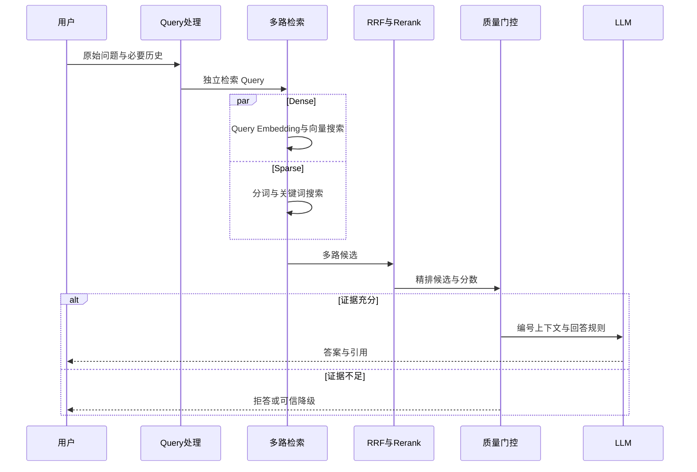

# 10. RAG 在线工作流：从 Query 到可溯源答案

- 原文：[给 RAG 一个输入，系统怎样工作？](https://xiaolinnote.com/ai/rag/10_online_workflow.html)
- 主题定位：拆开“检索加生成”中每个在线决策点。
- 一句话结论：生产在线链路是 Query 处理、同空间 Embedding、多路召回、融合精排、质量门控、Prompt、生成与核查，不是两次 API 调用。

## 1. 六阶段链路

1. Query Rewrite 消除口语、指代和上下文依赖，但必须保留原意。
2. Query Embedding 必须与文档索引使用同模型和预处理。
3. Dense 与 Sparse 并行粗召，结果按 chunk ID 去重。
4. RRF 融合不可比分数，Rerank 对小候选集精判。
5. 门控决定生成、混合外部结果或拒答。
6. Prompt 给证据编号和“不足则拒答”规则，生成后校验引用。

## 2. 项目代码映射

- [run_day17_query_rewrite_comparison.py](../run_day17_query_rewrite_comparison.py)：`rewrite_query` 和 `compute_mode_summary` 对比原 Query 与直接改写。
- [run_day9_local_vector_search.py](../run_day9_local_vector_search.py)：Query 向量归一化与 FAISS Top-K。
- [run_day18_hybrid_retrieval_comparison.py](../run_day18_hybrid_retrieval_comparison.py)：`retrieve_keyword_hits`、`retrieve_vector_hits`、`fuse_candidates_rrf` 完成两路实验。
- [run_day13_reranker_comparison.py](../run_day13_reranker_comparison.py)：`rerank_hits` 做启发式精排对比。
- [run_day11_kb_qa_with_citations.py](../run_day11_kb_qa_with_citations.py)：`build_user_text`、`answer_with_retry`、`validate_answer_with_citations` 完成上下文、生成与校验。

重要边界：Day17 只实现直接 LLM 改写；没有 HyDE、Step-back、多 Query。Day18 的关键词路线依据词频/IDF 统计，但应以代码实际实现表述，不自动等同外部搜索引擎的完整 BM25。Day13 不是神经 Cross-encoder。

## 3. 补充实现

[rag_capabilities_reference.py](examples/rag_capabilities_reference.py) 提供标准 BM25 公式的 `BM25Index`、`reciprocal_rank_fusion`、三级 `retrieval_gate`、`CorrectiveRAG` 和引用声明校验。

BM25 单词项的核心包含 IDF、TF 饱和与文档长度归一化：

$$
score(q,d)=\sum_{t\in q}IDF(t)\frac{tf(t,d)(k_1+1)}{tf(t,d)+k_1(1-b+b\frac{|d|}{avgdl})}
$$

参考实现适合小语料教学，中文按单字/字母数字 token 基线分词，生产应使用领域分词、倒排索引和并发检索后端。

## 4. 延迟与稳定性

Dense 与 Sparse 应并行，总召回延迟接近较慢一路而非两路之和。高频 Query 可缓存改写和检索结果，但缓存键应包含索引版本、权限范围和检索配置，避免越权或旧答案。

阶段打点应至少包括 rewrite、embedding、dense、sparse、fusion、rerank、generation、validation。只看端到端总延迟无法定位优化点。

## 5. 模拟面试

**Q1：为什么 Query Embedding 必须和建库模型一致？**  
A：两边必须在同一坐标空间；不同模型的维度和语义几何不兼容。

**Q2：为什么 Dense 与 Sparse 都要跑？**  
A：Dense 擅长语义改写，Sparse 擅长型号、数字和专有词，盲区互补。

**Q3：为什么先 RRF 再 Rerank？**  
A：RRF 低成本合并各路候选，Rerank 再对有限集合做高成本精判。

**Q4：门控阈值如何确定？**  
A：用知识库内/外的标注样本观察相关分分布，按误答和误拒成本选择切点并线上监控。

**Q5：当前项目实现了完整生产在线链吗？**  
A：实现了主要实验组件，但未统一为服务，也缺权限、并发、真实 Cross-encoder、外部降级和生产监控。

## 6. 复习清单

- 能按顺序讲清六阶段在线链。
- 能解释同空间 Embedding、RRF、Rerank、门控的必要性。
- 能指出 Day17、Day18、Day13 的真实边界。
- 能设计分阶段延迟指标和安全缓存键。