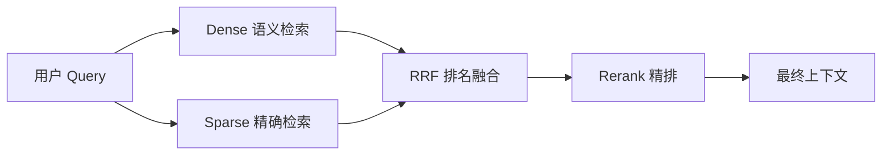

# 11. 向量检索与关键词检索：Dense 和 Sparse 的互补边界

- 原文：[请介绍向量检索和关键词检索的区别](https://xiaolinnote.com/ai/rag/11_retrieval_types.html)
- 主题定位：理解语义匹配与精确词匹配为什么不能互相替代。
- 一句话结论：Dense 解决“意思相近”，Sparse 解决“字面精确”，生产 RAG 通常并行召回后用 RRF 融合。

## 1. 两类相关性

关键词检索依赖倒排索引和词项统计。BM25 关注词在当前文档中的频率、全库稀缺度和文档长度，特别适合型号、版本、错误码、人名和数字。

向量检索将 Query 和 Document 放入同一语义空间，适合“退货”和“申请售后”这类词面不同但语义接近的表达。

| 对比 | Sparse / BM25 | Dense / Embedding |
| --- | --- | --- |
| 信号 | 词项重叠 | 语义向量距离 |
| 索引 | 倒排索引 | Flat 或 ANN |
| 强项 | 型号、代码、数字、专名 | 同义、改写、自然语言 |
| 弱项 | 无词面重叠时漏召 | 精确词与细粒度否定可能混淆 |
| 解释性 | 可查看命中词和权重 | 需要额外分析向量/模型 |

## 2. BM25 关键机制

$$
score(q,d)=\sum_{t\in q}IDF(t)\frac{tf(t,d)(k_1+1)}{tf(t,d)+k_1(1-b+b\frac{|d|}{avgdl})}
$$

TF 饱和避免重复堆词无限加分；$b$ 控制文档长度归一化。中文检索的上限很大程度取决于分词、同义词、停用词和专有词典。

## 3. 项目代码映射

- [run_day9_local_vector_search.py](../run_day9_local_vector_search.py) 用归一化向量和 `IndexFlatIP` 实现 Dense 精确搜索。
- [run_day18_hybrid_retrieval_comparison.py](../run_day18_hybrid_retrieval_comparison.py) 的 `build_keyword_stats`、`retrieve_keyword_hits` 建立关键词统计路线，`fuse_candidates_rrf` 融合两路。

必须准确描述：Day18 的关键词路线使用自定义词频、IDF、覆盖等分数，承担 Sparse 基线角色，但不是完整 BM25Okapi 公式实现。

[rag_capabilities_reference.py](examples/rag_capabilities_reference.py) 的 `BM25Index` 才显式实现 $k_1$、$b$、长度归一化与 TF 饱和，并有“RTX 4090”固定样本测试。

## 4. 工程设计

两路应并行执行并统一 `chunk_id`。不要直接相加余弦分和 BM25 分，因为两种分数的尺度与分布不同；RRF 用名次规避量纲问题。权限、租户和时间过滤应在每一路召回前一致应用。

混合检索并非无条件优于单路。若语料极小或 Query 全是自然语言概念，Sparse 增益可能有限；应通过 per-query 分桶分析精确词型问题的收益。

## 5. 常见误区

- 向量检索“更高级”不等于对所有 Query 更好。
- BM25 不理解语义，但同义词词典和 Query 扩展可缓解部分问题。
- Top-K 加大不能修复检索信号本身不敏感。
- 后过滤可能耗尽 Top-K，应优先让两路在合法子集内检索。

## 6. 模拟面试

**Q1：BM25 为什么擅长产品型号？**  
A：精确词面命中且稀有词 IDF 高，不需要模型理解型号语义。

**Q2：Dense 为什么能处理同义表达？**  
A：Embedding 训练让语义相近表达在向量空间靠近，即使没有共同词。

**Q3：为什么不能直接相加两路分数？**  
A：余弦与 BM25 的量纲和分布不同，固定加权难以稳定迁移。

**Q4：Day18 是标准 BM25 吗？**  
A：不是，它是自定义关键词统计基线；标准 BM25 公式在独立参考模块中。

**Q5：混合检索怎样验证收益？**  
A：按 Query 类型比较 Dense、Sparse、Hybrid 的 Hit@K/MRR，并同时记录延迟和候选噪音。

## 7. 复习清单

- 能从信号、索引、强弱项比较 Dense/Sparse。
- 会解释 BM25 三个关键项。
- 能说明 RRF 的必要性。
- 准确区分 Day18 与标准 BM25。