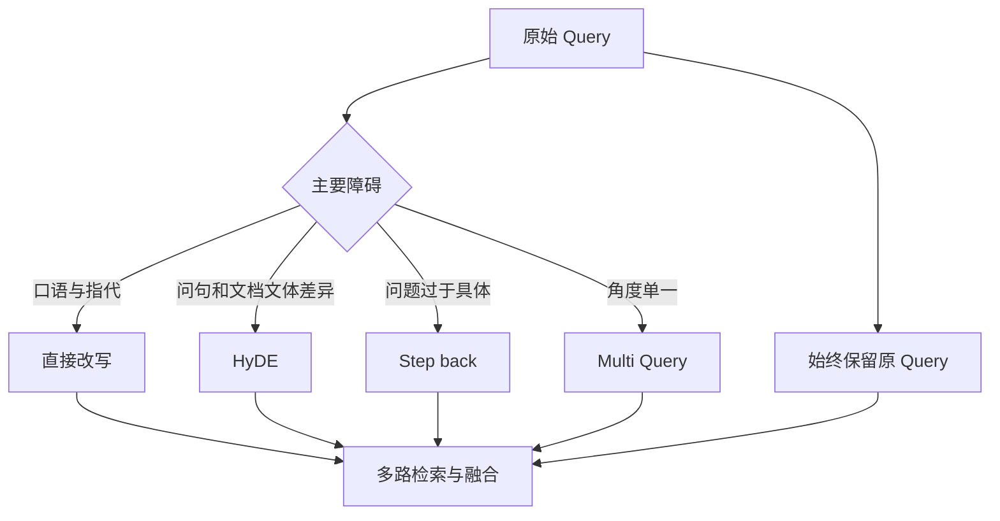

# 12. Query Rewrite：直接改写、HyDE、Step-back 与 Multi-Query

- 原文：[如何润色用户的 Query？目的是什么？](https://xiaolinnote.com/ai/rag/12_query_rewrite.html)
- 主题定位：针对不同类型的“用户表达与文档表达鸿沟”选择改写方法。
- 一句话结论：改写不是文字润色，而是检索策略；必须保留原始意图、设置失败回退，并用检索指标验证。

## 1. 四种方法解决不同问题

1. **直接改写**：补全指代、缩写和对话上下文，将口语变成独立问题。
2. **HyDE**：先生成假设性文档/答案，再用其向量检索，缓解问句与陈述文体差异。
3. **Step-back**：将过于具体的问题抽象为背景问题，先检索通用原理。
4. **Multi-Query**：从多个角度生成 3 到 5 个 Query，分别召回后融合。

## 2. 为什么要保留原 Query

改写模型可能丢掉数字、否定词、时间范围或产品版本。稳健做法是原 Query 始终参与召回，改写版本只增加覆盖，不替代用户原意。改写结果还要做长度、空值、敏感信息和语义漂移校验。

HyDE 的假设答案只作为检索代理，不能当事实直接回答。Step-back 应同时检索原问题与背景问题，否则答案可能只讲原理不解决具体问题。

## 3. 项目代码映射

[run_day17_query_rewrite_comparison.py](../run_day17_query_rewrite_comparison.py) 的 `rewrite_query` 调用 LLM 生成一个直接改写版本，`compute_mode_summary` 比较 raw/rewrite 检索表现，并记录失败回退。

当前项目没有 HyDE、Step-back 或 Multi-Query；也没有多轮对话指代解析服务。因此第 10 篇在线主链中的高级方法属于理论演进，不是已实现事实。

[rag_capabilities_reference.py](examples/rag_capabilities_reference.py) 的 `run_agentic_rag` 可注入 planner 生成下一轮 Query，但它演示动态检索控制，并非专门的 HyDE 生成器。

## 4. 评估设计

对每种策略记录：

- 原 Query 与改写 Query。
- 正确 chunk 首次出现名次。
- Hit@K、MRR、平均 Query 数和 LLM token。
- 漂移率：改写后关键实体、数字、否定是否保留。
- P95 延迟和失败回退率。

只有端到端答案提升却检索指标下降时，要警惕评测偶然性或模型凭参数回答。

## 5. 工程取舍

- Multi-Query 增加召回和成本，应并行检索并限制变体数量。
- HyDE 在领域明确时有效，错误假设也可能把方向带偏。
- 多轮改写只带必要历史，避免把整段对话引入噪音和隐私泄露。
- 可按 Query 分类器选择策略，而不是所有请求都调用最昂贵方案。

## 6. 模拟面试

**Q1：Query Rewrite 的核心目的是什么？**  
A：缩小用户表达与知识库表达之间的检索鸿沟，提高正确 chunk 的召回与排名。

**Q2：HyDE 为什么用可能错误的答案检索？**  
A：它只利用答案式文本与文档文体更接近的向量特征，不把假设内容当最终事实。

**Q3：Step-back 适合什么问题？**  
A：具体问题没有直接文档，但知识库有上位概念或原理时。

**Q4：为什么保留原 Query？**  
A：改写会漂移或丢细节，原 Query 提供保底检索信号。

**Q5：当前项目实现了哪些方法？**  
A：只实现单次直接 LLM 改写对比；另外三种仍未接入。

## 7. 复习清单

- 能按问题类型匹配四种策略。
- 知道 HyDE 不是答案生成捷径。
- 会设计漂移、质量、延迟和成本指标。
- 准确说出 Day17 的实现边界。