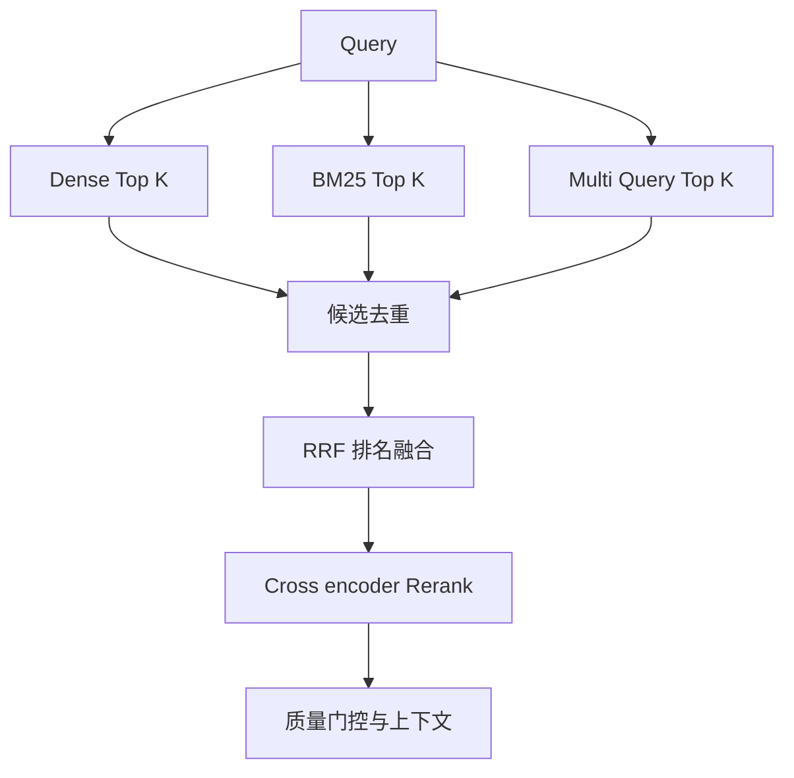

# 13. 多路召回：Dense、Sparse、Multi-Query 与 RRF

- 原文：[什么是多路召回？具体怎么做？](https://xiaolinnote.com/ai/rag/13_multi_retrieval.html)
- 主题定位：用不同检索信号互补盲区，再以统一排名形成候选池。
- 一句话结论：多路召回优化的是覆盖率，RRF 负责无量纲融合，最终精度仍需 Rerank 和质量门控。

## 1. 典型三路

- Dense：召回语义相近、词面不同的内容。
- Sparse/BM25：召回型号、数字、专名和代码符号。
- Multi-Query Dense：从多个表达角度扩大覆盖。

## 2. RRF 公式与直觉

$$
RRF(d)=\sum_{r\in routes}\frac{1}{k+rank_r(d)}
$$

$k$ 常取 60 只是经验默认值，不是数学最优常数。文档在多路均靠前会累积更高分；只在一路命中也能保留。RRF 不看原始分，避免余弦、BM25 和模型分数不可比。

稳定排序还要规定同分处理，例如按 `chunk_id`，否则离线结果可能因容器迭代顺序抖动。

## 3. 项目代码映射

[run_day18_hybrid_retrieval_comparison.py](../run_day18_hybrid_retrieval_comparison.py) 是核心锚点：

- `build_keyword_stats` 构造关键词统计。
- `retrieve_keyword_hits` 与 `retrieve_vector_hits` 分别召回。
- `fuse_candidates_rrf` 按名次融合并去重。
- 汇总逻辑比较 vector、keyword、hybrid 模式。

Day18 实现两路召回，不包含 Multi-Query。关键词路是自定义统计评分，不是标准 BM25。真正 BM25 和通用 `reciprocal_rank_fusion` 位于 [参考实现](examples/rag_capabilities_reference.py)。

## 4. 候选预算

每一路 Top-K 不应机械相同。若 Sparse 对专名 Query 很强，可小 K 高精度；Dense 通常需稍大 K 保覆盖。融合后候选数也要有上限，否则 Rerank 成本为 $O(C)$，其中 $C$ 为去重候选量。

多路并发时要传播统一超时和取消信号。某一路超时可以降级，但要记录“部分召回”状态，避免质量指标与完整模式混淆。

## 5. 常见误区

- 多路召回不等于把每路原始分数相加。
- RRF 是候选融合，不是语义精排模型。
- 多 Query 的多个结果必须按稳定 ID 去重。
- 增加路线会提高覆盖，也会增加延迟、token 和噪音。

## 6. 模拟面试

**Q1：多路召回解决什么问题？**  
A：没有单一检索信号能覆盖语义改写、精确词和多角度表达，多路用互补信号提高召回。

**Q2：RRF 为什么适合融合？**  
A：它只依赖排名，不要求校准各路不可比的原始分数。

**Q3：RRF 后为什么还要 Rerank？**  
A：RRF 只反映各路相对名次，没有深度判断 Query 与 chunk 的联合语义。

**Q4：$k=60$ 可以不调吗？**  
A：可作为起点，但要在业务集上联合路线权重、候选 K 和 Rerank 评估。

**Q5：Day18 覆盖了三路吗？**  
A：没有，只覆盖向量与自定义关键词两路及 RRF，Multi-Query 尚未实现。

## 7. 复习清单

- 会写 RRF 公式并解释 $k$。
- 能说明 RRF 与 Rerank 的职责差异。
- 知道候选去重、预算、超时的重要性。
- 准确描述 Day18 两路实现。