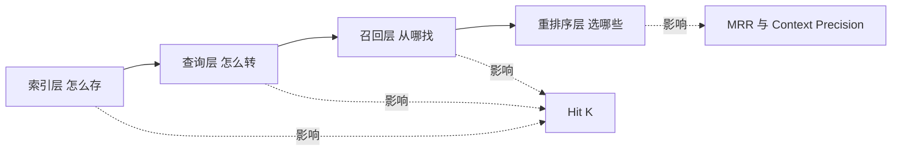

# 14. RAG 检索优化：索引、查询、召回、重排序四层框架

- 原文：[RAG 检索优化策略有哪些？](https://xiaolinnote.com/ai/rag/14_retrieval_opt.html)
- 主题定位：把零散技巧组织成可诊断、可验证的优化路径。
- 一句话结论：先用指标定位哪一层失效，再做最小改动；典型组合是 Small-to-Big 索引、Dense+Sparse、RRF 和 Rerank。

## 1. 四层分别解决什么

1. **索引层**：切块、父子、摘要、多粒度，解决检索精度与上下文完整性的矛盾。
2. **查询层**：改写、HyDE、Step-back、Multi-Query，解决表达鸿沟。
3. **召回层**：Dense、Sparse、图等多路互补，解决漏召。
4. **重排序层**：Cross-encoder 从候选中剔除噪音，控制进入 Prompt 的内容。

## 2. 从指标反推故障层

- Hit@K 低：先查解析、切块、Embedding、Query 和召回路线。
- Hit@K 高但 MRR 低：正确内容已召回但排序靠后，优先查融合和 Rerank。
- 检索指标高但 Faithfulness 低：查 Prompt、引用和生成后核验。
- 延迟高：按 rewrite、各路检索、rerank、generate 分段，不要盲目删模块。

## 3. 项目演进映射

- 索引：[run_day8_chunking_experiment.py](../run_day8_chunking_experiment.py)、[run_day12_chunking_strategy_tuning.py](../run_day12_chunking_strategy_tuning.py)。
- 查询：[run_day17_query_rewrite_comparison.py](../run_day17_query_rewrite_comparison.py)。
- 召回：[run_day18_hybrid_retrieval_comparison.py](../run_day18_hybrid_retrieval_comparison.py)。
- 重排序：[run_day13_reranker_comparison.py](../run_day13_reranker_comparison.py)。
- 评估与门禁：[run_day16_offline_eval.py](../run_day16_offline_eval.py)、[run_day21_rag_v2_release.py](../run_day21_rag_v2_release.py)。

项目很适合展示逐层演进，但索引层仍只有固定窗口，查询层只有直接改写，Rerank 是启发式，不是生产 Cross-encoder。

## 4. 参考实现补齐

[rag_capabilities_reference.py](examples/rag_capabilities_reference.py) 增加 Parent-Child、句子窗口、BM25、通用 RRF、质量门控和 MRR，使四层有离线可运行骨架。

一个保守升级顺序：

1. 固定评测集和 Flat 基准。
2. 先加 Dense+BM25+RRF，观察 Hit@K。
3. 再加 Rerank，观察 MRR/Context Precision。
4. 边界类问题仍漏召时引入 Parent-Child。
5. 只有口语/指代型 Query 明显失败时加 Rewrite。

这样每次只改变一个主变量，归因更清晰。

## 5. 工程误区

- 一开始把所有高级模块全开，成本增加且无法归因。
- 只优化平均分，不看 Query 类型和长尾失败样本。
- 用更强 LLM 掩盖检索失败，离线指标可能虚高。
- Rerank Top-N 和最终 Top-K 是两个不同预算。

## 6. 模拟面试

**Q1：检索差时第一步做什么？**  
A：复现失败样本并看 Hit@K/MRR，先定位是没召回还是排得后。

**Q2：Small-to-Big 属于哪一层？**  
A：索引层，小块检索、大块返回，解决粒度矛盾。

**Q3：Multi-Query 和多路召回关系是什么？**  
A：Multi-Query 是查询扩展，也形成额外召回路径；结果仍需统一去重融合。

**Q4：Hit@K 高、答案差怎么查？**  
A：检查相关 chunk 名次、最终是否进入 Prompt、引用与 Faithfulness，再判断 Rerank 或生成层问题。

**Q5：项目哪层最完整？**  
A：学习实验覆盖四层主干和发布评估，但每层都仍是小规模基线，不是生产实现。

## 7. 复习清单

- 能说清四层的输入、输出和指标。
- 会从 Hit@K/MRR 定位问题。
- 能给出渐进升级顺序。
- 不用“换模型”回答所有检索问题。