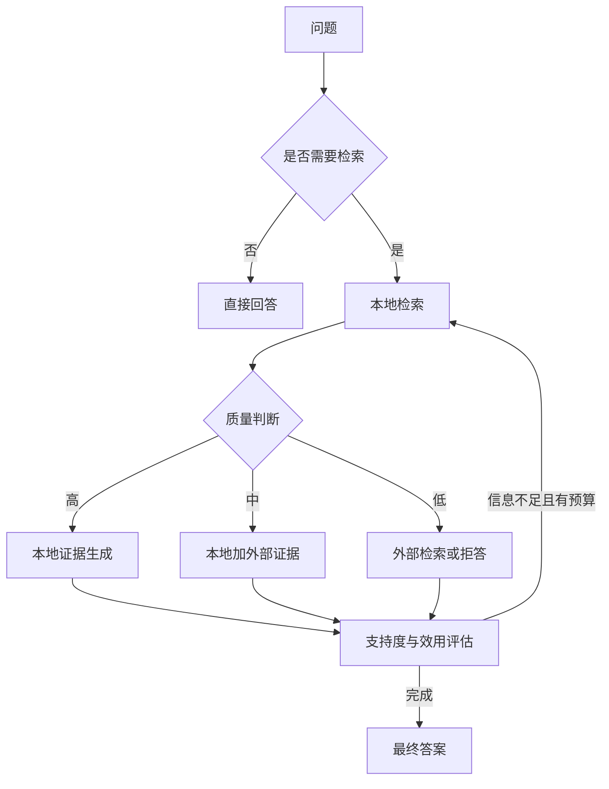

# 15. 高级 RAG 范式：Self-RAG、CRAG、GraphRAG 与 Agentic RAG

- 原文：[了解哪些更复杂的 RAG 范式？](https://xiaolinnote.com/ai/rag/15_advanced_paradigms.html)
- 主题定位：从固定流水线演进到按质量和任务动态决策。
- 一句话结论：高级范式解决的是流程决策、纠错、全局关系和多轮检索，不只是给朴素 RAG 多加几个组件。

## 1. 三层演进

Naive RAG 是固定“检索一次再生成”。Advanced RAG 在检索前后增加改写、多路和精排。Modular RAG 将步骤变成可替换模块和条件分支。

## 2. 四种高级范式

**Self-RAG** 使用检索、相关性、支持度、效用等 reflection token，让专门训练的模型决定是否检索并评价答案。仅用普通 LLM Prompt 模拟判断不等同论文 Self-RAG。

**CRAG** 在检索后评价质量：高分走本地，低分使用可信外部搜索或拒答，中间分合并两者。重点是纠错和降级。

**GraphRAG** 从文档抽取实体关系、做社区发现和层次摘要，支持局部实体查询与全局主题查询。它不等于“有一张简单知识图谱”。

**Agentic RAG** 在循环中根据中间证据决定下一次搜什么、何时结束，并必须设置轮数、成本、去重和停止条件。

## 3. 项目与参考实现

Day8-Day21 属于逐步增强的 Advanced RAG：改写、混合召回、重排、引用、缓存与发布门禁。项目没有专门 Self-RAG 模型、网络搜索、社区发现或运行时 Agent 检索循环。

[rag_capabilities_reference.py](examples/rag_capabilities_reference.py) 提供：

- `retrieval_gate` 与 `CorrectiveRAG`：可注入本地/fallback 检索器的 CRAG 教学骨架。
- `run_agentic_rag`：有最大轮数、Query 防重复、chunk 去重的 Agentic 循环。
- `KnowledgeGraph`：简单有界 BFS，不是 GraphRAG 社区摘要。

[测试](../tests/test_rag_capabilities_reference.py) 验证低质量路由到 fallback 和两轮检索按 ID 去重。

## 4. 选择原则

- 大多数企业问答先做好 Advanced RAG，收益/复杂度更稳。
- 知识库覆盖不全且允许外部来源时考虑 CRAG。
- 多实体、多跳、全局主题问题占比较高时评估图增强。
- 问题需要动态分解且价值覆盖额外成本时才上 Agentic RAG。
- Self-RAG 需要模型和训练条件，不应只因名字先进而选择。

## 5. 风险与治理

动态流程增加不可预测成本。应限制最大检索轮数、每轮候选、总 token、外部域名、超时和重复 Query。任何 fallback 都必须带来源标签，避免把外部网络内容伪装成内部权威知识。

## 6. 模拟面试

**Q1：Self-RAG 和普通 LLM 自检有什么区别？**  
A：论文 Self-RAG 训练了特殊 reflection token 和决策行为，普通 Prompt 模拟没有同等训练保证。

**Q2：CRAG 的三级路由是什么？**  
A：相关则本地生成，模糊则本地与外部结合，不相关则外部检索或拒答。

**Q3：GraphRAG 的核心不只是图在哪里？**  
A：实体关系图之外还有社区发现、层次摘要以及局部/全局查询策略。

**Q4：Agentic RAG 如何防死循环？**  
A：最大轮数、Query 去重、无新证据停止、成本预算和超时。

**Q5：当前项目实现了哪种范式？**  
A：原 Day 链是 Advanced RAG 实验；独立参考层有 CRAG/Agentic 骨架，但未接入真实后端。

## 7. 复习清单

- 能区分 Naive、Advanced、Modular。
- 能说出四种高级范式各自解决的痛点。
- 不把 Prompt 自检称为完整 Self-RAG。
- 知道参考实现与真实生产系统的边界。