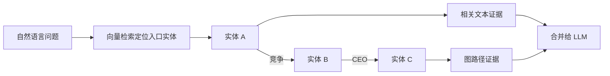

# 16. 图数据库增强向量检索：实体定位与多跳遍历

- 原文：[什么场景选择图数据库增强向量检索？](https://xiaolinnote.com/ai/rag/16_graph_db.html)
- 主题定位：识别答案位于“关系路径”而非单个文档时的检索方式。
- 一句话结论：向量检索适合定位语义入口，图遍历适合沿明确关系做多跳推理；二者互补而非替代。

## 1. 单跳片段与多跳关系

“退款流程是什么”通常能在一个 chunk 中回答；“A 公司竞争对手的 CEO 是谁”需要先找竞争对手，再沿 CEO 关系到人物。后者答案位于路径而非一段文本。

图的基本元素是节点、带类型的边和属性。查询时要限制关系类型、方向和最大 hop，避免高连接节点导致组合爆炸。

## 2. 适用场景

- 企业股权、投资、任职和竞争关系。
- 疾病、症状、药物、靶点和相互作用。
- 代码调用、模块依赖和漏洞传播路径。
- 供应链上下游和批次溯源。

若大多数问题只是查说明文本，引入实体抽取、关系抽取、图存储和同步会过度设计。

## 3. 构建和查询链路

1. 从文档抽取实体、关系及来源 chunk。
2. 做实体消歧与别名归一，避免同一公司多个节点。
3. 每条边保存来源、时间和置信度。
4. Query 先做实体链接，再生成受约束图查询。
5. 路径结果与原文证据合并，LLM 不应只看到裸关系。

图事实也会过期，动态更新必须同步删除旧边和重建受影响关系。

## 4. 项目和参考实现

现有 Day8-Day21 没有图数据库、实体抽取、Cypher 或图检索。不能把 [run_day18_hybrid_retrieval_comparison.py](../run_day18_hybrid_retrieval_comparison.py) 的多路召回称为多跳推理。

[rag_capabilities_reference.py](examples/rag_capabilities_reference.py) 的 `Edge` 和 `KnowledgeGraph.traverse` 用邻接表与 BFS 演示有界多跳；`relations` 白名单限制可走边类型，`max_hops` 限制深度。

复杂度近似随分支因子 $b$ 和深度 $h$ 增长为 $O(b^h)$，实际必须做去重、剪枝、权限过滤和结果预算。参考实现不是 Neo4j，也没有实体链接、持久化或 GraphRAG 社区发现。

## 5. 风险

- LLM 抽取错误会把错误关系结构化并放大。
- 同名实体未消歧会连接错误路径。
- 边没有来源和时间，无法审计或处理过期关系。
- Text-to-Cypher 必须使用只读账户、Schema 白名单和查询预算。

## 6. 模拟面试

**Q1：为什么多做几次向量检索不等于图遍历？**  
A：向量检索没有显式边和方向，不知道下一跳应沿哪种关系走。

**Q2：向量与图如何组合？**  
A：向量定位自然语言对应的入口实体/文档，图沿关系扩展，最后合并路径和原文证据。

**Q3：什么场景不值得上图？**  
A：问题主要是单段说明、实体关系稀少，Dense+Sparse+Rerank 已足够时。

**Q4：怎样保证图答案可溯源？**  
A：每个节点/边保存来源 chunk、版本、时间和置信度，答案引用路径与原文。

**Q5：参考实现等于 GraphRAG 吗？**  
A：不等于，它只是内存图 BFS，没有社区发现、层次摘要和全局查询。

## 7. 复习清单

- 能识别单跳与多跳问题。
- 能讲向量入口、图遍历、证据合并三步。
- 知道实体消歧、来源和权限风险。
- 不把简单 BFS 夸大为 GraphRAG。