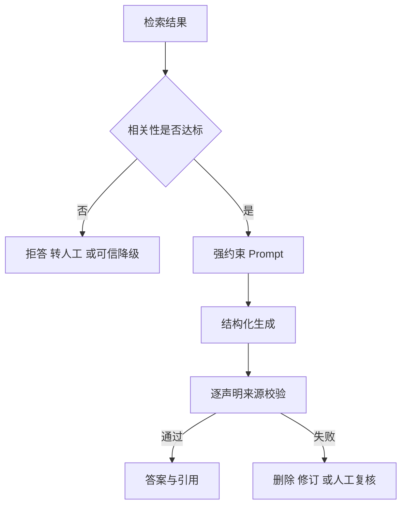

# 17. RAG 幻觉治理：Prompt、门控、核查与结构化引用

- 原文：[如何规避 RAG 系统中大模型的幻觉？](https://xiaolinnote.com/ai/rag/17_hallucination.html)
- 主题定位：分别治理检索层无证据和生成层超出证据两类故障。
- 一句话结论：最低成本的可靠组合是强约束 Prompt 加检索质量门控；高风险场景再加逐声明核查和结构化来源。

## 1. 两类幻觉与四层防线

1. Prompt 只允许基于资料回答，并提供明确“不知道”出口。
2. 门控使用经过业务标定的相关分，低分不进入生成。
3. 生成后把答案拆成声明，检查每条是否有证据支持。
4. 结构化输出要求 `claim`、`source_ids`、可选置信度，程序校验来源 ID。

## 2. 阈值不是固定经验值

网页给出的 0.3 到 0.6 只能作为示意。应准备知识库内正样本和知识库外负样本，扫描阈值 $t$，比较误答率和误拒率。金融、医疗通常让误答成本高于误拒成本，因此阈值更保守。

门控输入最好用校准后的 Rerank 分，而不是不同 Query 不可比的原始向量相似度。

## 3. 项目代码映射

- [run_day11_kb_qa_with_citations.py](../run_day11_kb_qa_with_citations.py)：`parse_citations`、`validate_answer_with_citations`、`answer_with_retry` 验证格式、编号和引文。
- [run_day16_offline_eval.py](../run_day16_offline_eval.py)：评估引用正确率和不可回答样本拒答。
- [run_day21_rag_v2_release.py](../run_day21_rag_v2_release.py)：将拒答、引用等质量指标作为版本门禁。

当前引用校验偏向格式和关键字/引文匹配，未做逐自然语言声明的 NLI 事实蕴含判断。

## 4. 参考实现

[rag_capabilities_reference.py](examples/rag_capabilities_reference.py) 的 `retrieval_gate` 实现 local/mixed/fallback；`Claim` 与 `validate_claim_sources` 检查来源存在，并要求声明 token 至少一半被证据覆盖。

这个覆盖率规则是可解释的离线基线，但不是语义忠实度判定：同词不同义、否定、数值比较都可能误判。生产可在其后增加 NLI/LLM Judge，并保留确定性 ID 检查作为第一道防线。

## 5. 安全细节

- 检索文档本身可能含 Prompt Injection，应将资料标记为不可信数据，禁止其覆盖系统指令。
- `source_ids` 必须来自本次用户有权访问的候选集，不能只检查全库存在。
- 引文应指向原始文档版本，防止内容更新后引用漂移。
- 重试必须有次数上限；反复生成不是可靠校验策略。

## 6. 模拟面试

**Q1：RAG 为什么仍会幻觉？**  
A：可能没召回正确证据，也可能模型在正确证据上添加无依据推断。

**Q2：为什么只加一句“根据资料回答”不够？**  
A：它无法阻止低质量检索进入生成，也不能程序化验证每个声明。

**Q3：门控阈值怎么定？**  
A：用知识库内外标注样本按业务误答/误拒成本标定，并持续监控漂移。

**Q4：结构化引用有什么价值？**  
A：迫使模型显式关联证据，并允许程序检查 ID、权限、原文和版本。

**Q5：词项覆盖能替代 Faithfulness Judge 吗？**  
A：不能，它只是低成本基线，无法可靠处理否定、数值和语义蕴含。

## 7. 复习清单

- 能区分两类幻觉和四层防线。
- 知道阈值需业务标定。
- 会说明当前引用校验的能力边界。
- 能指出 Prompt Injection 与引用权限风险。