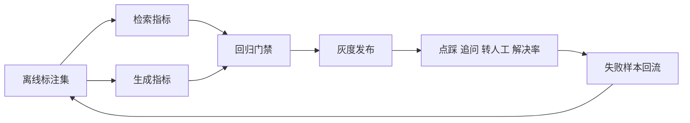

# 18. RAG 效果量化：检索、生成与线上业务闭环

- 原文：[怎么量化你的 RAG 效果？](https://xiaolinnote.com/ai/rag/18_evaluation.html)
- 主题定位：用分层指标定位故障，并把离线改进连接到线上结果。
- 一句话结论：Hit@K 回答“找到没有”，MRR 回答“排得多前”；生成层再看 Faithfulness、Relevancy 和上下文质量，最终由线上解决率验收。

## 1. 检索层指标

对第 $i$ 个 Query，前 $K$ 个结果为 $R_i^K$，相关集合为 $G_i$：

$$
Hit@K=\frac{1}{N}\sum_{i=1}^{N}\mathbf{1}(R_i^K\cap G_i\ne\varnothing)
$$

$$
MRR=\frac{1}{N}\sum_{i=1}^{N}\frac{1}{rank_i}
$$

若没有相关结果，倒数排名记为 0。Hit@K 不关心相关项在第 1 还是第 K；MRR 对靠前结果奖励更高。二者不能互相替代。

## 2. 生成和上下文指标

- Faithfulness：答案声明是否由上下文支持。
- Answer Relevancy：答案是否回应用户问题。
- Context Recall：回答所需事实有多少被上下文覆盖。
- Context Precision：相关上下文是否靠前、无关内容是否过多。

RAGAs 使用 LLM-as-a-Judge 自动化这些指标，但评审模型也有偏差、成本和非确定性。核心集应保留人工校准样本，Judge Prompt 和模型版本必须固定记录。

## 3. 项目代码映射

[run_day16_offline_eval.py](../run_day16_offline_eval.py) 使用 [day15_evalset_qa.json](../inputs/day15_evalset_qa.json) 的可回答/不可回答样本，`compute_summary` 汇总命中、引用和拒答指标。

[run_day20_latency_cost_analysis.py](../run_day20_latency_cost_analysis.py) 加入 P50/P95 等效率指标；[run_day21_rag_v2_release.py](../run_day21_rag_v2_release.py) 的 `gate_line`、`bool_gate` 将效果、延迟、成本组合成 GO/NO-GO。

当前 Day16 用 golden keywords 判断证据，不是严格 chunk ID 标注，也没有 RAGAs。关键词命中可能产生同词误判，适合作为学习基线。

## 4. 参考实现

[rag_capabilities_reference.py](examples/rag_capabilities_reference.py) 的 `hit_rate_at_k` 和 `mean_reciprocal_rank` 直接接受排序 ID 和相关集合；[测试](../tests/test_rag_capabilities_reference.py) 用同一组排名验证 Hit@2 为 $2/3$、MRR 为 $0.5$，明确二者差异。

## 5. 测试集治理

- 按用户流量分层采样，覆盖高频、长尾、不可回答、权限和时间敏感问题。
- 拆分开发集和冻结回归集，避免反复调参过拟合。
- 每个失败样本标注故障层和正确证据。
- 知识更新后同步更新期望答案和文档版本。
- 报总体分时同时报告各类别分数和置信区间。

## 6. 模拟面试

**Q1：Hit@5 高但 MRR 低意味着什么？**  
A：正确内容大多能召回，但通常排在后面，需优化融合或 Rerank。

**Q2：Faithfulness 高就代表答案好吗？**  
A：不一定，答案可以完全有据但答非所问，因此还要看 Answer Relevancy。

**Q3：为什么要有不可回答样本？**  
A：只测正样本会鼓励系统任何问题都回答，无法评估门控和拒答安全性。

**Q4：RAGAs 有什么限制？**  
A：Judge 有成本、偏差、漂移和非确定性，需要人工校准与版本固定。

**Q5：线上最终看什么？**  
A：点踩、重复追问、转人工、空回答和会话解决率，并将失败回流离线集。

## 7. 复习清单

- 会写 Hit@K、MRR 公式并举例。
- 能区分 Faithfulness 与 Relevancy。
- 知道 Day16 是关键词基线而非 RAGAs。
- 能设计离线到线上的评估闭环。