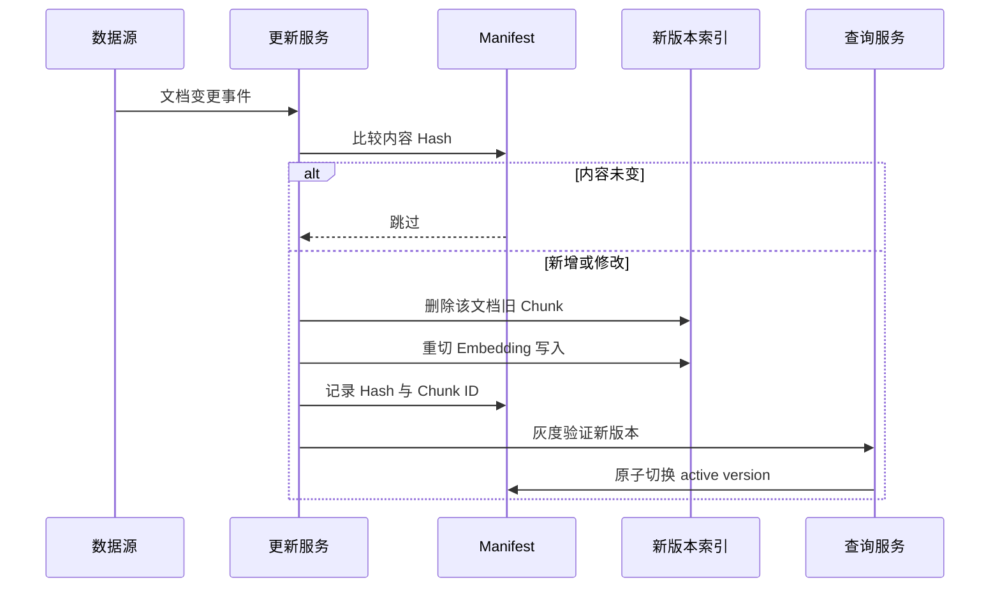

# 19. 知识库动态更新：Hash、先删后增与蓝绿版本

- 原文：[RAG 知识库如何动态持续更新？](https://xiaolinnote.com/ai/rag/19_dynamic_update.html)
- 主题定位：维护原文、chunk、向量和索引版本的一致性。
- 一句话结论：修改文档时可靠基线是按文档先删旧 chunk 再重切入库；用内容 hash 跳过未变文档，用蓝绿版本降低发布和回滚风险。

## 1. 为什么不是普通 UPDATE

文档与 chunk 是一对多。文档中插入一句话可能改变后续所有窗口边界，旧 chunk 与新 chunk 无法稳定一一对应。因此对“修改”做局部 patch 容易残留过期片段。

## 2. 三种变更

- 新增：完整解析、切块、Embedding、写入。
- 修改：删除该 `document_id` 的所有旧 chunk，再完整重建。
- 删除：删除 chunk、原文、缓存和图关系，防止“僵尸知识”。

chunk metadata 至少保存 `document_id`、`chunk_id`、内容 hash、索引版本、Embedding 模型版本和权限范围。

## 3. 变更感知

Polling 简单但有延迟和扫描成本；Webhook 适合支持回调的数据源；消息队列适合高吞吐、重试和削峰。事件驱动也必须做幂等，因为消息可能重复投递。

SHA-256 可检测内容变化：

$$
h=SHA256(normalized\_content)
$$

必须固定 normalization 规则，否则换行或无意义格式变化会造成重建风暴；但过度归一化也可能漏掉有意义变化。

## 4. 项目与参考实现

Day8-Day21 每次基于静态语料构建/读取实验索引，没有文档级增量更新、Webhook/Kafka 或蓝绿切换。[run_day19_cache_dedup_comparison.py](../run_day19_cache_dedup_comparison.py) 的缓存去重解决重复计算，不等同知识库更新。

[rag_capabilities_reference.py](examples/rag_capabilities_reference.py) 的 `IncrementalIndexManifest`：

- `content_hash` 计算 SHA-256。
- `needs_update` 跳过未变文档。
- `record/delete` 维护文档到 chunk ID 的关系。
- `activate` 切换 active version。

它是内存教学实现，没有事务、磁盘持久化、并发锁或真实向量库原子操作。

## 5. 蓝绿发布

新版本索引完整构建后，用冻结测试集比较 Hit@K、MRR、引用、延迟和规模。通过后只切换查询过滤/别名；失败可秒级切回旧版本。切换前不能清理旧版本，切换后也应保留回滚窗口。

若更换 Embedding 模型或 Chunking 策略，新旧向量空间/ID 全面变化，应全量构建新版本，不要混写同一索引。

## 6. 模拟面试

**Q1：为什么修改文档要先删后增？**  
A：内容变化会移动 chunk 边界，旧新块难以可靠局部对应，整文档重建更一致。

**Q2：Hash 解决什么问题？**  
A：快速识别内容是否实际变化，避免对未变文档重复解析和 Embedding。

**Q3：事件驱动为什么仍要幂等？**  
A：队列/Webhook 可能重试和重复投递，同一事件必须得到相同最终状态。

**Q4：什么时候必须全量重建？**  
A：Embedding 模型、维度、归一化或 Chunking 规则整体变化，或索引一致性无法保证时。

**Q5：蓝绿知识库如何回滚？**  
A：保留旧索引版本，通过原子别名/过滤切换 active version，而不是现场重写数据。

## 7. 复习清单

- 能说明文档到 chunk 的一对多关系。
- 记住新增、修改、删除三条路径。
- 会解释 Hash、幂等、蓝绿和回滚。
- 不把 Day19 缓存实验误称动态索引。