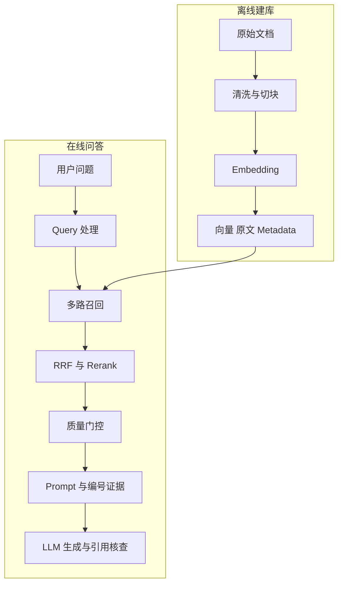

# 1. 什么是 RAG：完整离线与在线工作流

- 原文：[什么是 RAG？详细描述一个完整 RAG 系统的详细工作流程？](https://xiaolinnote.com/ai/rag/1_whatisrag.html)
- 主题定位：建立后续 19 篇的总地图。
- 一句话结论：RAG 不改模型参数，而是在推理前检索外部证据；系统必须同时建设离线知识加工链和在线检索生成链。

## 1. 核心理论

RAG 是 Retrieval-Augmented Generation。它把“模型会不会组织语言”和“系统有没有最新、私有、可追溯知识”解耦。知识放在外部索引中，问题到来时只取少量相关片段进入上下文。

离线阶段负责把原始文档变成可检索记录：

1. 加载与清洗文档，保留标题、页码、权限等 metadata。
2. 将长文档切成语义相对独立的 chunk。
3. 用同一个 Embedding 模型编码 chunk。
4. 保存向量、原文和 metadata，并记录模型与索引版本。

在线阶段负责在延迟预算内找到证据并生成答案：

1. 规范化或改写 Query。
2. Dense、Sparse 等多路粗召回。
3. RRF 融合和 Rerank 精排。
4. 质量门控，低质量结果拒答或降级。
5. 组装带编号的上下文，生成并验证引用。

## 2. 项目代码映射

- [run_day8_chunking_experiment.py](../run_day8_chunking_experiment.py)：`tokenize_words`、`build_chunks` 建立固定窗口切块基线。
- [run_day9_local_vector_search.py](../run_day9_local_vector_search.py)：`l2_normalize` 与 `faiss.IndexFlatIP` 完成向量入库和 Top-K 检索。
- [run_day10_kb_qa_v1.py](../run_day10_kb_qa_v1.py)：`retrieve_hits`、`build_user_text`、`chat_once` 串起基础检索生成。
- [run_day11_kb_qa_with_citations.py](../run_day11_kb_qa_with_citations.py)：`validate_answer_with_citations`、`answer_with_retry` 增加溯源与重试。
- [run_day13_reranker_comparison.py](../run_day13_reranker_comparison.py)：`rerank_hits` 演示候选重排。
- [run_day17_query_rewrite_comparison.py](../run_day17_query_rewrite_comparison.py) 与 [run_day18_hybrid_retrieval_comparison.py](../run_day18_hybrid_retrieval_comparison.py)：补上改写和混合召回实验。

关键细节是 Day9 先 L2 归一化，再用内积：

$$
\hat{x}=\frac{x}{\|x\|_2},\qquad \hat{q}^{T}\hat{x}=\cos(q,x)
$$

因此 `IndexFlatIP` 返回的是归一化向量的余弦相似度排序。它是精确遍历，不是 HNSW/IVF 近似索引。

## 3. 当前边界与补充实现

项目已能逐阶段演示完整主链，但各 Day 脚本是实验组合，不是一个常驻服务；没有权限过滤、并发隔离、可观测追踪或在线索引更新。

[rag_capabilities_reference.py](examples/rag_capabilities_reference.py) 补充 `CorrectiveRAG`、`run_agentic_rag`、`IncrementalIndexManifest` 等控制与治理能力。它通过依赖注入离线运行，但未连接真实搜索 API、消息队列或向量数据库。

## 4. 工程取舍与误区

- 误区：RAG 等于向量搜索。生成、证据约束、门控和评估同样属于系统。
- 误区：把整个知识库塞进长上下文。成本、注意力稀释和权限风险不会消失。
- 取舍：粗召回扩大覆盖，精排降低噪音；不能只追求单一 Top-K。
- 取舍：知识更新容易不等于一致性容易，必须管理文档到 chunk 的一对多关系。

## 5. 模拟面试

**Q1：RAG 为什么分离线和在线阶段？**  
A：Embedding 文档、建索引成本高但可复用，应离线完成；Query 检索和生成与每次请求相关，必须在线执行。

**Q2：RAG 会修改 LLM 参数吗？**  
A：标准 RAG 不修改参数，只在推理上下文注入证据；它可以和微调组合，但二者机制不同。

**Q3：为什么要切块而不是整篇向量化？**  
A：模型有长度上限，且整篇向量会混合多个主题，使局部事实的语义信号被稀释。

**Q4：粗排和精排为什么不能只留一个？**  
A：Bi-encoder 粗排可预计算文档向量，适合大规模召回；Cross-encoder 精排更准但需逐对计算，只适合小候选集。

**Q5：怎样证明系统真的在用证据？**  
A：要求结构化引用，程序校验来源存在和引文匹配，再用 Faithfulness 等指标持续评估。

## 6. 复习清单

- 能按离线四步和在线六步完整复述流程。
- 能解释归一化内积与余弦相似度关系。
- 能指出当前项目是学习流水线而非生产服务。
- 能说明检索、生成、引用、评估各自的失败模式。