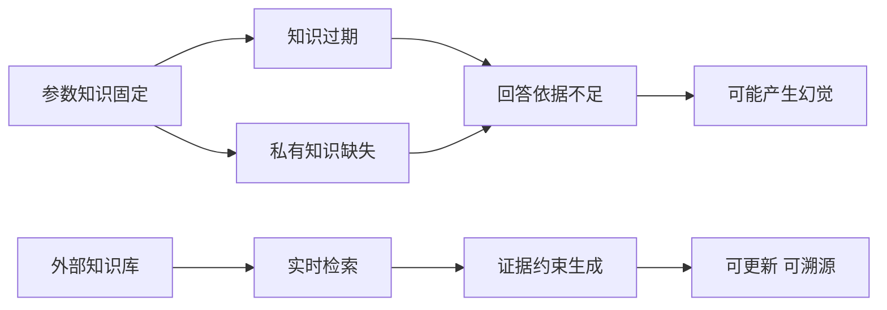

# 2. RAG 解决什么问题：知识时效、私有数据与幻觉

- 原文：[大模型的 RAG 主要用来解决什么问题？](https://xiaolinnote.com/ai/rag/2_rag_problems.html)
- 主题定位：从问题而不是组件理解 RAG。
- 一句话结论：RAG 的直接价值是补充过期和私有知识并提供证据，降低幻觉只是结果之一，不是绝对保证。

## 1. 三类问题及共同根因

LLM 的训练目标是预测下一个 token，参数在训练结束后不会自动吸收业务变化。由此产生：

1. **知识过期**：训练截止时间之后的信息不在参数中。
2. **知识空白**：企业文档、合同和内部制度从未进入训练集。
3. **缺少依据的生成**：模型即使信息不足仍倾向产生连贯文本。

RAG 将知识从参数层移到数据层，使更新和模型发布解耦，并把回答关联到具体 chunk。

## 2. RAG 不是幻觉消除器

RAG 仍有两类故障：检索未找到正确证据；检索找到了，但模型误读或添加了无依据内容。可靠系统需要同时控制检索层与生成层。

检索层重点看 Hit@K、MRR 和负样本拒答；生成层重点看引用有效性、忠实度和答案相关性。把两层混成一个“答案对不对”指标，会让故障无法定位。

## 3. 项目代码映射

- [run_day10_kb_qa_v1.py](../run_day10_kb_qa_v1.py) 的 `build_user_text` 将检索片段明确放入用户消息。
- [run_day11_kb_qa_with_citations.py](../run_day11_kb_qa_with_citations.py) 的 `parse_citations` 与 `validate_answer_with_citations` 检查引用编号和引文。
- [run_day16_offline_eval.py](../run_day16_offline_eval.py) 的 `hits_match_keywords`、`citation_chunks_match_keywords` 分别观察检索与引用结果，并包含可回答和不可回答样本。
- [run_day21_rag_v2_release.py](../run_day21_rag_v2_release.py) 用门禁而不是主观印象决定版本是否可发布。

Day11 的重试不是“让模型再答一次”这么简单：校验器先返回失败原因，下一次生成才有明确修正目标。否则重复采样可能得到同类错误。

## 4. 参考实现与边界

[rag_capabilities_reference.py](examples/rag_capabilities_reference.py) 中：

- `retrieval_gate` 根据最佳相关分走本地、混合或 fallback。
- `validate_claim_sources` 检查来源 ID 和声明词项覆盖率。
- `CorrectiveRAG` 演示低质量检索的可注入降级路线。

这些是确定性的离线骨架，不等价于完整语义事实核查。生产环境仍需领域阈值标定、NLI/LLM Judge、权限控制和人工升级通道。

## 5. 工程误区

- “有 RAG 就不会幻觉”错误；无关 context 也会诱导错误回答。
- “模型说不知道就是失败”错误；高风险领域的正确拒答优于自信误答。
- “把 Top-K 调大就能补召回”错误；噪音会增加成本并造成 Lost in the Middle。
- “知识库更新即刻正确”错误；旧 chunk 残留、索引版本错配都会制造过期答案。

## 6. 模拟面试

**Q1：RAG 主要解决哪三个问题？**  
A：知识时效性、私有知识覆盖和信息不足引发的幻觉，并带来可溯源性。

**Q2：为什么说幻觉是知识缺失的副产品但不只由知识缺失造成？**  
A：缺少依据会迫使模型补全；即便有依据，指令遵循失败和错误推断仍会造成生成层幻觉。

**Q3：检索没命中时应该怎么做？**  
A：先用经过标定的质量门控识别，再按业务选择拒答、转人工或可信外部检索，不能直接生成。

**Q4：如何区分检索问题和生成问题？**  
A：单独检查正确 chunk 是否进入 Top-K；若已进入而答案仍错，再查引用和 Faithfulness。

**Q5：引用为什么不是装饰？**  
A：引用为用户核验、自动校验、错误定位和知识治理提供稳定关联键。

## 7. 复习清单

- 能说明三类问题的共同根因。
- 能区分检索层与生成层幻觉。
- 能说明拒答、降级、引用校验的职责。
- 不承诺 RAG 能完全消灭幻觉。