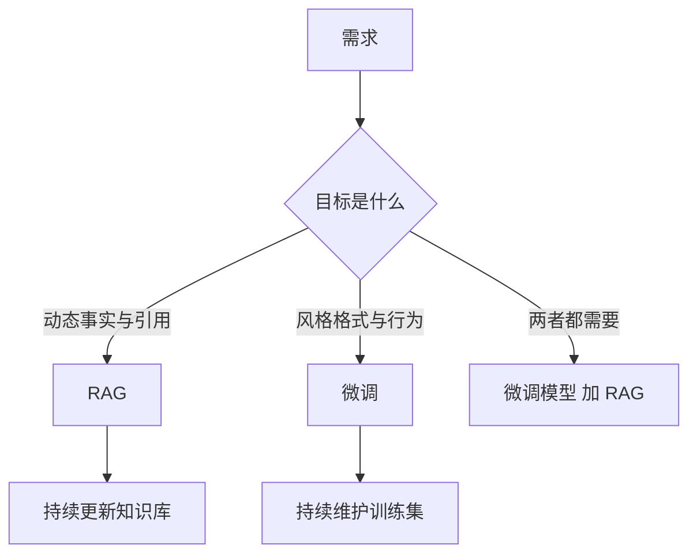

# 3. RAG 与微调：不是二选一的知识与行为方案

- 原文：[相比直接微调 LLM，RAG 解决了什么问题？](https://xiaolinnote.com/ai/rag/3_rag_vs_finetune.html)
- 主题定位：根据变化频率、可溯源性和行为目标做架构选型。
- 一句话结论：RAG 更擅长决定“说什么”，微调更擅长稳定“怎么说和怎么做”，复杂系统可以组合。

## 1. 本质差异

微调通过训练更新权重，改变模型的概率分布；RAG 不改变权重，只在当前请求中提供外部上下文。

| 维度 | RAG | 微调 |
| --- | --- | --- |
| 知识位置 | 外部存储 | 模型参数 |
| 更新方式 | 重建受影响索引 | 重新准备数据并训练 |
| 溯源 | 可关联 chunk | 很难定位参数来源 |
| 在线成本 | 多一次检索和上下文 | 通常无检索延迟 |
| 主要用途 | 动态事实、私有知识 | 风格、格式、稳定行为、领域模式 |

## 2. 选型问题树

知识是否每周甚至每天变化？答案是否必须给出来源？数据是否可以进入训练流程？错误能否通过替换文档快速修复？这些问题偏向 RAG。

若需求是固定 JSON 格式、品牌语气、工具调用习惯或深层专业推理，且有高质量监督数据，微调更合适。不要用 RAG 反复提示一个模型学习稳定格式，也不要用微调记忆每天变化的价格和政策。

## 3. 项目代码映射

当前 Day8-Day21 完全走 RAG 路线：

- [run_day9_local_vector_search.py](../run_day9_local_vector_search.py) 将知识编码到 FAISS 索引，而非模型参数。
- [run_day10_kb_qa_v1.py](../run_day10_kb_qa_v1.py) 的 `build_user_text` 在每次请求注入检索结果。
- [run_day11_kb_qa_with_citations.py](../run_day11_kb_qa_with_citations.py) 将答案和 chunk 建立可核验联系。
- [run_day21_rag_v2_release.py](../run_day21_rag_v2_release.py) 对检索方案版本做质量门禁。

项目没有训练脚本、LoRA 配置、监督微调集或模型权重产物，因此不能声称实践了微调。它适合解释 RAG 的更新和溯源优势，不适合据此比较真实训练成本。

## 4. 组合架构

一种常见组合是先用 SFT 让模型学会企业回答结构和工具协议，再用 RAG 注入当前政策。评估也要拆开：固定行为用格式通过率、工具调用成功率；知识能力用 Hit@K、Faithfulness、业务解决率。

组合并不自动更好。微调后的模型可能过度依赖参数记忆而忽略检索证据，需要在数据和 Prompt 中训练/约束“证据优先”。

## 5. 工程误区

- 微调不是可靠数据库，无法保证精确复述每条新事实。
- RAG 不能凭空提升基础模型的推理算法能力。
- “微调后延迟一定低”忽略了模型尺寸、部署和吞吐变化。
- “RAG 成本低”只适用于合理规模；解析、Embedding、向量库、Judge 都有成本。

## 6. 模拟面试

**Q1：为什么知识库问答通常先选 RAG？**  
A：知识变化快且要引用，更新外部索引比重新训练更快、更可控。

**Q2：什么需求更适合微调？**  
A：稳定输出格式、品牌语气、工具调用策略和有监督数据支撑的行为模式。

**Q3：RAG 能代替领域微调吗？**  
A：不能。RAG 提供资料，但复杂领域推理能力和稳定行为可能仍需微调或更强基础模型。

**Q4：两者怎样组合？**  
A：微调负责行为接口，RAG 负责动态知识；生成时明确外部证据优先，并分别评估两层。

**Q5：项目为什么不能宣称做过微调对比？**  
A：仓库只有 RAG 实验脚本，没有训练数据管线、训练配置、权重和对照结果。

## 7. 复习清单

- 能从参数更新与推理注入解释本质差异。
- 能给出选择 RAG、微调、组合的具体场景。
- 能识别当前仓库的证据边界。
- 能设计组合方案的分层指标。