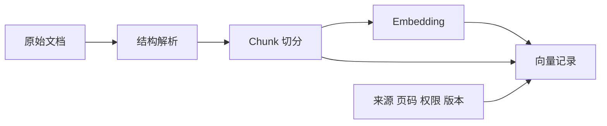

# 4. 文档如何存储：Chunking 粒度与策略

- 原文：[RAG 中的文档是怎么存的？](https://xiaolinnote.com/ai/rag/4_chunking.html)
- 主题定位：理解检索粒度和生成上下文之间的核心矛盾。
- 一句话结论：向量、原文、metadata 必须共同存储；切块没有固定最优值，应按文档结构和业务评测选择。

## 1. 一条检索记录包含什么

每个 chunk 至少包含：用于近邻搜索的向量、交给 LLM 阅读的原文、用于过滤和溯源的 metadata。向量不能还原可靠原文，原文也不能高效完成语义近邻搜索。

## 2. 粒度矛盾

大 chunk 上下文完整，但一个向量混合多个主题；小 chunk 语义聚焦，却可能失去定义、主语和前后条件。500 到 1000 token 只能作为文章建议的起点，不是当前项目的验证结论。

常见策略：

- 固定窗口加 overlap：简单稳定，适合作为基线。
- 句子/段落/标题边界：避免从语义单元中间截断。
- 代码按函数或类、表格保留表头和整块关系。
- Parent-Child：小块建立索引，命中后返回大父块。
- Late Chunking：长上下文模型先编码全文 token，再按边界池化；模型和显存要求更高。

## 3. 项目代码映射

[run_day8_chunking_experiment.py](../run_day8_chunking_experiment.py) 的 `build_chunks` 使用 `chunk_size` 和 `overlap` 构造滑动窗口；`lexical_cohesion` 与 `embedding_probe` 从词汇连贯性和向量探针观察切分影响。

[run_day12_chunking_strategy_tuning.py](../run_day12_chunking_strategy_tuning.py) 的 `score_quality`、`score_cost`、`choose_recommendations` 将多组参数转成质量/成本对比，而不是凭经验只选一个大小。

固定窗口步长为：

$$
step = chunk\_size-overlap
$$

必须满足 $0 \le overlap < chunk\_size$，否则窗口无法向前推进或产生极端重复。

## 4. 高级参考实现

[rag_capabilities_reference.py](examples/rag_capabilities_reference.py) 提供：

- `semantic_chunks`：完整句子装箱。
- `build_parent_child_index`：建立 `parent_id` 关系，`expand` 去重还原父块。
- `build_sentence_windows`：句子用于命中，`window_text` 用于生成。

[测试](../tests/test_rag_capabilities_reference.py) 验证句末不被截断、多个子块还原到同一父块、句子窗口包含前后句。它仍是纯文本教学实现，没有 Markdown 标题解析、Python AST、表格抽取或真正 token tokenizer。

## 5. 选型与误区

- 先按文档类型分流，再谈统一 chunk 大小。
- overlap 增加召回保护，也增加索引量、重复召回和上下文浪费。
- Parent-Child 的父块无需全部建立向量索引，但必须有可靠 KV/文档存储。
- 不要只优化“切得好看”，最终要用业务 Query 的 Hit@K 和成本验证。

## 6. 模拟面试

**Q1：为什么不能整篇文档存一个向量？**  
A：可能超长，且多个主题压缩到一个向量会稀释局部语义。

**Q2：chunk 越小越好吗？**  
A：不是。过小会丢失主语和条件，召回结果即使相关也不足以回答。

**Q3：Parent-Child 如何兼顾精度和完整性？**  
A：子块语义集中用于检索，命中后通过 `parent_id` 返回较大父块给 LLM。

**Q4：代码和表格为什么要专项处理？**  
A：函数/类和表头/行列关系是语义结构，通用字符窗口会破坏它们。

**Q5：怎样选择 chunk 参数？**  
A：建立业务标注集，网格比较 Hit@K、MRR、重复率、上下文 token 和端到端质量。

## 7. 复习清单

- 记住向量、原文、metadata 三部分。
- 能比较固定、语义、父子、Late Chunking。
- 能解释 overlap 的收益和成本。
- 知道当前项目高级实现仍缺结构化解析器。