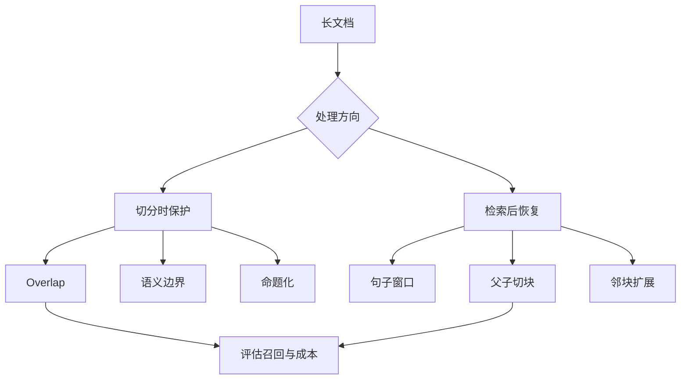

# 5. 如何规避语义被切断：切分与检索后的上下文恢复

- 原文：[怎么规避语义被切割掉的问题？](https://xiaolinnote.com/ai/rag/5_semantic_cuts.html)
- 主题定位：从“切时保护”和“命中后补回”两条路线治理语义截断。
- 一句话结论：overlap 只是基础兜底，质量要求高时应结合语义边界、句子窗口、父子切块或 Contextual Retrieval。

## 1. 问题本质

语义截断并不意味着字符丢失，而是完整事实被拆成两个弱信号，任何一半都可能不足以进入 Top-K。解决方案分两组：

- **切分前/切分时保护**：overlap、句子/段落边界、命题化切分。
- **检索后恢复**：句子窗口、Parent-Child、邻块扩展。

## 2. 六类方案

1. overlap 一般从窗口的 10% 到 20% 做实验，过大产生大量重复。
2. 语义边界以完整句/段为原子，但 chunk 长度会不均匀。
3. 句子窗口将单句向量化，命中后返回前后 $N$ 句。
4. Parent-Child 预先维护小块到大块的关联。
5. 命题化用 LLM 将复合句改写为自包含事实，质量高但有成本和失真风险。
6. Contextual Retrieval 在 Embedding/BM25 前为每个 chunk 添加文档背景；背景只用于检索时，应保留原文用于引用。

## 3. 项目代码映射

[run_day8_chunking_experiment.py](../run_day8_chunking_experiment.py) 已实现固定窗口 overlap，并通过实验报告观察重复与连贯性。

[run_day12_chunking_strategy_tuning.py](../run_day12_chunking_strategy_tuning.py) 能比较不同 `chunk_size/overlap`，但没有真正语义切分、句子窗口或父子索引。

[run_day11_kb_qa_with_citations.py](../run_day11_kb_qa_with_citations.py) 要求引文来自原始 chunk，提醒我们：任何上下文化改写都不能覆盖用于审计的原文。

## 4. 可运行补充

[rag_capabilities_reference.py](examples/rag_capabilities_reference.py) 的 `split_sentences`、`semantic_chunks`、`build_sentence_windows`、`build_parent_child_index` 提供离线实现。

句子窗口中，命中索引 $i$、窗口半径 $w$ 时，返回区间为：

$$
[\max(0,i-w),\min(n,i+w+1))
$$

这避免数组越界，并保证窗口包含命中句本身。当前实现按标点切句，不处理缩写、小数点、复杂 Markdown，生产中应替换成语言/版式感知解析器。

## 5. 工程取舍

- 句子窗口记录数多，但运行时无需父块 KV 查询。
- Parent-Child 存储关系更复杂，却能精确控制生成上下文。
- Contextual Retrieval 需缓存完整文档前缀，且要评估生成背景是否引入错误事实。
- 邻块扩展要去重和合并连续窗口，否则多个相邻命中会重复塞入同一段。

## 6. 模拟面试

**Q1：overlap 为什么不能彻底解决语义截断？**  
A：它只复制边界字符，无法保证一个跨多句或依赖章节背景的语义单元自包含。

**Q2：句子窗口与父子切块有什么差异？**  
A：前者运行时按句子位置动态扩展；后者预先存好子到父的映射，父块大小更可控。

**Q3：Contextual Retrieval 做了什么？**  
A：为孤立 chunk 生成简短文档背景，与 chunk 一起建立 Dense 和 Sparse 索引，提高可检索性。

**Q4：为什么上下文化文本不能直接作为唯一引用原文？**  
A：背景由模型生成，可能不是原文事实；审计必须回到未改写的来源内容。

**Q5：如何评估方案是否值得？**  
A：对边界型问题单独建立测试集，比较 Hit@K、MRR、索引量、重复率、token 和延迟。

## 7. 复习清单

- 能从切分时保护和检索后恢复分类方案。
- 会写句子窗口的边界公式。
- 能比较 Parent-Child 与句子窗口。
- 知道上下文化内容和引用原文要分开保存。