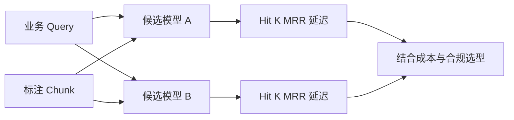

# 6. Embedding：语义空间、模型选型与业务评估

- 原文：[在 RAG 中 Embedding 究竟是什么？](https://xiaolinnote.com/ai/rag/6_embedding.html)
- 主题定位：理解语义检索的数学基础和选型证据。
- 一句话结论：Embedding 选型不能只看排行榜，必须在本业务 Query 与正确 chunk 对上比较 Hit@K、延迟、维度和合规性。

## 1. 从文本到语义坐标

Embedding 模型把可变长度文本映射为固定维向量。余弦相似度忽略模长，只比较方向：

$$
\cos(q,d)=\frac{q\cdot d}{\|q\|_2\|d\|_2}
$$

向量经过 L2 归一化后，内积等于余弦相似度。注意“相似”由训练数据和目标定义，不是真理；领域缩写、数字和否定关系可能表现较差。

## 2. 选型维度

- 语言和领域：中文、多语言、代码、医疗等数据分布不同。
- 输入长度：必须覆盖切块上限，超长会截断或报错。
- 维度：存储近似为 $N\times d\times bytes$，维度越高不保证业务效果越好。
- 部署与合规：API 省运维，本地模型控制数据但需 GPU/吞吐规划。
- Query/Document 指令：某些模型要求不同前缀，漏用会降低效果。
- 版本一致性：建库与查询必须使用同一模型、维度、归一化方式。

## 3. 项目代码映射

[run_day9_local_vector_search.py](../run_day9_local_vector_search.py) 负责调用 Embedding、`l2_normalize`、构建 `faiss.IndexFlatIP` 并保存索引。它展示了余弦搜索的正确实现顺序。

[run_day8_chunking_experiment.py](../run_day8_chunking_experiment.py) 的 `embedding_probe` 观察不同切块的语义响应；[run_day16_offline_eval.py](../run_day16_offline_eval.py) 在固定评测集上检查命中，形成业务评估雏形。

当前项目只验证配置中的一个 API 模型，没有多模型批量对照、维度裁剪、吞吐压测或数据合规测试。因此不能从仓库得出“BGE 优于 OpenAI”之类结论。

## 4. 评估方法

准备 $(query, relevant\_chunk\_ids)$ 集合，分别重建候选模型索引，统一 Chunking 和 Top-K。Hit@K 为：

$$
Hit@K=\frac{1}{|Q|}\sum_{q\in Q}\mathbf{1}\left(R_q^K\cap G_q\ne\varnothing\right)
$$

还要记录 MRR、P50/P95 延迟、Embedding 成本、索引体积和冷启动时间。只改模型、不重建文档向量是无效实验。

## 5. 误区

- MTEB 是候选筛选器，不是业务验收结果。
- 向量维度越高并不必然越准，却必然增加空间和距离计算量。
- 不同模型的向量不可混用，即使维度碰巧相同。
- Dense 检索不是关键词检索的替代品，精确型号仍应配 Sparse 路线。

## 6. 模拟面试

**Q1：Embedding 的关键性质是什么？**  
A：任务定义下语义相关文本在向量空间更接近，可通过相似度完成近邻检索。

**Q2：为什么项目用归一化加内积？**  
A：单位向量内积等于余弦相似度，FAISS `IndexFlatIP` 可直接按它排序。

**Q3：换 Embedding 模型后为什么要重建索引？**  
A：新旧模型定义的坐标空间、维度和分布不同，跨空间距离没有意义。

**Q4：如何做模型选型？**  
A：在同一业务标注集、同一切块与检索配置下比较 Hit@K/MRR，再结合延迟、成本和合规。

**Q5：Embedding 召回型号差怎么办？**  
A：不要只换模型，增加 BM25/关键词检索并用 RRF 融合。

## 7. 复习清单

- 会推导单位向量内积等于余弦。
- 能列出六个选型维度。
- 能设计公平的模型 A/B 离线实验。
- 不把通用榜单当业务结果。