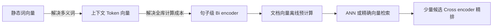

# 7. Embedding 算法演进：从词向量到检索型 Bi-encoder

- 原文：[Embedding 有哪几种算法？](https://xiaolinnote.com/ai/rag/7_embedding_algos.html)
- 主题定位：通过每代解决的瓶颈理解现代 RAG 为什么使用句子级检索模型。
- 一句话结论：静态词向量缺少上下文，Cross-encoder 难以全库检索，句子级 Bi-encoder 以少量交互精度换取可预计算和毫秒检索。

## 1. 三代演进

**第一代：Word2Vec、GloVe、FastText。** Word2Vec 用局部上下文训练 CBOW/Skip-gram；GloVe 利用全局共现；FastText 用字符 n-gram 缓解未登录词。同一个词始终一个向量，无法区分“苹果公司”和“吃苹果”。

**第二代：ELMo、BERT。** token 表示依赖上下文，多义词问题显著改善。原始 BERT 适合把 Query 与文档拼接做 Cross-encoder 判断，但对百万文档逐一前向计算不可行。

**第三代：SBERT、SimCSE、BGE、E5 等。** Query 和 Document 独立编码成句向量，文档向量可离线预计算。对比学习将正样本拉近、负样本推远。

## 2. Bi-encoder 与 Cross-encoder

Bi-encoder 计算 $f(q)$ 和 $g(d)$ 后做余弦：文档侧只算一次，吞吐高，但编码时 Query 与 Document token 没有交叉注意力。

Cross-encoder 直接计算 $h([q;d])$，相关性更细致，却要为每个候选运行模型。因此生产常用“两阶段”：Bi-encoder 对全库粗召，Cross-encoder 对几十个候选精排。

## 3. 项目代码映射

- [run_day9_local_vector_search.py](../run_day9_local_vector_search.py) 体现 Bi-encoder 使用方式：文档向量预建索引，Query 只编码一次。
- [run_day13_reranker_comparison.py](../run_day13_reranker_comparison.py) 的 `rerank_hits` 是词重叠与先验融合的教学重排，并非真正神经 Cross-encoder。
- [run_day20_latency_cost_analysis.py](../run_day20_latency_cost_analysis.py) 记录阶段耗时，适合验证增加真实 Reranker 后的成本变化。

当前仓库调用的是 OpenAI-compatible Embedding API，没有训练 Word2Vec、SimCSE 或 BGE，也没有部署 Cross-encoder。文档只将算法理论映射到架构角色。

## 4. 新趋势与边界

- 指令感知 Embedding 根据检索任务添加 Query 指令。
- Matryoshka 表示允许截取前若干维，在精度与成本间调节。
- 多向量检索为一个文档保留多个 token/片段向量，精度和索引量同时上升。
- 多模态 Embedding 将文本、图像映射到可比较空间。

这些趋势都需要业务评测，不构成“第四代一定更好”的结论。

## 5. 常见误区

- BERT 并非不能生成向量，而是原始训练目标和直接池化不一定适合句子检索。
- Cross-encoder 不是向量数据库替代品，它不能经济地扫描全库。
- Word2Vec 在特定低资源/词级任务仍有价值，只是不适合现代通用 RAG 主检索。
- 模型年代不能代替业务效果测试。

## 6. 模拟面试

**Q1：Word2Vec 的主要局限是什么？**  
A：静态词表示无法根据上下文处理多义词，也不是直接优化句子级检索。

**Q2：为什么不直接用 Cross-encoder 搜全库？**  
A：每个 Query 都要与每篇文档联合前向，计算量随文档数线性增长且无法预计算。

**Q3：SBERT 做了什么关键改变？**  
A：使用 Siamese/Bi-encoder 独立编码句子，通过相似度训练，使文档向量可提前计算。

**Q4：SimCSE 的核心思想是什么？**  
A：用对比学习构造正负样本，改善句向量的可分性和空间分布。

**Q5：项目的 rerank 是 Cross-encoder 吗？**  
A：不是，当前是启发式融合实验；真实 Cross-encoder 仍是待接入能力。

## 7. 复习清单

- 按三代说清“上一代缺口、下一代修复”。
- 能比较 Bi-encoder 和 Cross-encoder 复杂度。
- 知道项目代码对应架构角色而非算法训练实践。
- 能列举指令、MRL、多向量、多模态趋势。