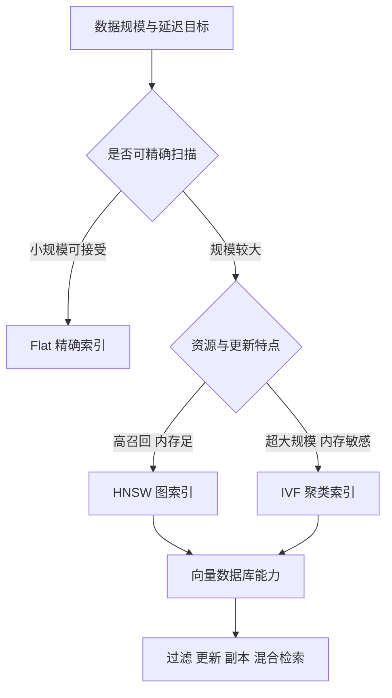

# 8. 向量数据库：ANN 索引、核心能力与选型

- 原文：[什么是向量数据库？有没有做过对比选型？](https://xiaolinnote.com/ai/rag/8_vectordb.html)
- 主题定位：区分“能存向量”和“为高维近邻搜索设计的系统”。
- 一句话结论：选型取决于规模、过滤、更新、部署与混合检索，不应只看 Star；当前项目 FAISS Flat 是本地精确基线。

## 1. 为什么需要向量索引

暴力搜索对 $N$ 个 $d$ 维向量的单次复杂度约为 $O(Nd)$。数据规模增大后，ANN 用可接受的召回损失换取延迟和资源收益。

## 2. HNSW 与 IVF

HNSW 构建多层邻接图，查询从稀疏高层导航到底层。`M` 控制图连接度，`ef_construction` 控制建图候选，`ef_search` 控制查询候选；更大通常提高召回，也增加内存/构建/查询成本。

IVF 先聚类成 `nlist` 个桶，查询只扫描最相关的 `nprobe` 个桶。它更节省内存并适合大规模，但聚类和桶选择会造成边界漏召。

索引参数必须用 Recall@K 与 P95/P99 延迟联合调节，不能只报“几十毫秒”。

## 3. 生产能力与选型维度

- metadata 过滤是否在 ANN 前有效执行。
- 新增、修改、删除与索引可见性。
- 备份、副本、分片和故障恢复。
- Dense 与 BM25/Sparse 混合检索。
- 自托管、托管服务、数据合规和团队运维能力。

Chroma、Qdrant、Milvus、Pinecone、pgvector 各有适用边界。网页给出的产品建议会随版本变化，实际选型要做同一数据/硬件/过滤条件的 PoC。

## 4. 项目代码映射

[run_day9_local_vector_search.py](../run_day9_local_vector_search.py) 使用 `faiss.IndexFlatIP`。Flat 不做近似，它保存全部向量并逐一计算内积，优点是结果可作为 ANN 召回率基准，缺点是规模增大后延迟线性增长。

脚本同时保存 FAISS 索引和 chunk metadata，使搜索结果能还原原文。当前实现没有数据库服务、并发写入、metadata 预过滤、HNSW/IVF、分片或副本。

## 5. 从 Flat 演进的验证顺序

1. 先用 Flat 固定一套精确 Top-K 结果。
2. 建立 ANN 候选索引并统一 Query。
3. 计算 ANN Recall@K：近似结果覆盖了多少精确邻居。
4. 同时记录内存、构建时间、P50/P95/P99、更新可见延迟。
5. 加入真实 metadata 过滤后再测，避免空载基准误导。

## 6. 模拟面试

**Q1：向量数据库和普通数据库加数组字段有什么区别？**  
A：关键不在存储类型，而在高维近邻索引、过滤、更新、分布式与检索接口。

**Q2：HNSW 和 IVF 怎么选？**  
A：HNSW 通常召回高、查询快但内存较大；IVF 用聚类缩小扫描范围，更适合超大规模和内存约束。

**Q3：当前项目是 ANN 吗？**  
A：不是，`IndexFlatIP` 是精确内积搜索，可作为小规模基线。

**Q4：为什么先过滤再 ANN？**  
A：后过滤可能让 Top-K 大量结果被丢弃，最终可用候选不足；预过滤在合法子集内分配名额。

**Q5：如何做向量库 PoC？**  
A：固定语料、向量、过滤和并发，比较 Recall@K、尾延迟、写入可见性、资源与运维成本。

## 7. 复习清单

- 能解释 Flat、HNSW、IVF 的差异。
- 会列生产向量库的五类能力。
- 不把网页 Milvus 案例写成项目现状。
- 能设计 ANN 对精确 Flat 的评估。