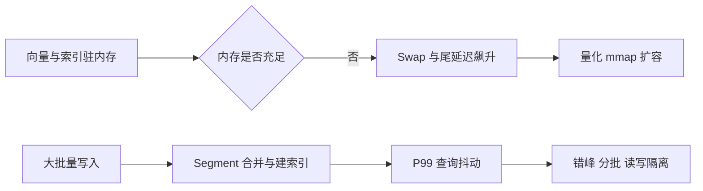

# 9. 向量数据库实战：规模、性能、内存与写入抖动

- 原文：[讲讲你用的向量数据库、数据量级和瓶颈](https://xiaolinnote.com/ai/rag/9_vectordb_practice.html)
- 主题定位：学习如何用可复现实验描述性能，而不是背诵产品数字。
- 一句话结论：任何 QPS 和延迟必须同时给出数据量、维度、索引参数、过滤、硬件和并发；网页 Milvus 数字是案例，不是本项目实测。

## 1. 容量估算

仅原始 float32 向量的空间近似：

$$
Memory_{raw}=N\times d\times 4\ bytes
$$

150 万条、1024 维约为 6.14 GB 十进制空间，但生产内存还包括 HNSW 图、ID、metadata、进程和缓存。SQ8 将单维从 4 字节压到约 1 字节，理论原始向量部分约缩至四分之一，但需实测召回损失。

## 2. 性能报告必须包含什么

- 数据：向量条数、维度、metadata 大小、更新频率。
- 索引：类型和参数，例如 HNSW `M/ef`。
- 查询：Top-K、过滤条件、Query 分布、是否混合检索。
- 环境：CPU、内存、磁盘、网络、节点数。
- 指标：P50/P95/P99、QPS、Recall@K、错误率、写入可见延迟。

均值会隐藏尾部抖动；RAG 的最终体验通常受 P95/P99 和 LLM 生成共同影响。

## 3. 网页案例如何正确解读

网页用 Milvus 百万级、HNSW、SQ8、Segment 合并说明两类典型瓶颈：内存不足触发 swap；批量写入抢占 CPU/IO 导致查询尾延迟上涨。数字与参数是示例背景，不应在面试中伪装成个人生产数据。

真正的回答方式是：先说自己系统事实，再说明测量方法、发现的瓶颈、改动和前后对比。没有生产经验时应明确说这是容量推演和实验设计。

## 4. 项目代码映射

- [run_day9_local_vector_search.py](../run_day9_local_vector_search.py) 是小语料本地 `IndexFlatIP`，不能提供 Milvus、HNSW、百万规模或并发结论。
- [run_day19_cache_dedup_comparison.py](../run_day19_cache_dedup_comparison.py) 的 `EvalCaches`、`CacheProbe` 观察 Embedding/候选缓存和去重收益。
- [run_day20_latency_cost_analysis.py](../run_day20_latency_cost_analysis.py) 的 `percentile`、`summarize_metric` 统计阶段延迟与成本，是形成性能报告的直接锚点。
- [run_day21_rag_v2_release.py](../run_day21_rag_v2_release.py) 将质量、延迟和成本纳入发布门禁。

当前实验主要是串行离线运行，没有负载生成器、并发隔离、内存画像或写入期间查询压测。

## 5. 可执行的压测设计

1. 固定索引快照和 Query 集，先测冷缓存和热缓存。
2. 逐级提高并发，记录吞吐拐点和尾延迟。
3. 同时注入增量写入，观察读延迟和索引可见性。
4. 开启量化或 ANN 参数变化，联合比较 Recall@K。
5. 将检索、Rerank、LLM 分段打点，避免把总延迟都归因向量库。

## 6. 模拟面试

**Q1：为什么只报 20ms 没意义？**  
A：缺少数据量、硬件、索引参数、并发和百分位，无法复现或比较。

**Q2：向量内存如何快速估算？**  
A：条数乘维度乘每维字节，再额外预算索引图、metadata 和运行时开销。

**Q3：为什么内存不足会让查询突然变慢？**  
A：索引页被换到磁盘，随机访问从内存延迟退化为磁盘 IO。

**Q4：批量写入为什么影响查询？**  
A：Segment 合并、建索引、持久化会竞争 CPU、内存带宽和磁盘 IO。

**Q5：量化是否一定值得？**  
A：它能显著降内存，但必须以业务 Recall@K、端到端质量和延迟验证精度损失。

## 7. 复习清单

- 会做 float32 容量估算。
- 能完整描述性能测试上下文。
- 能解释 swap 与写入合并两类瓶颈。
- 明确当前项目没有生产向量库实测。