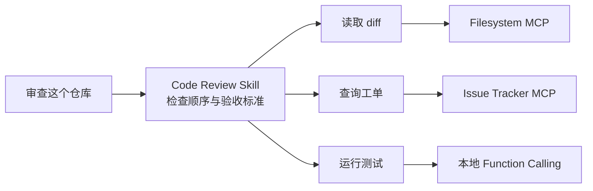

# 10. MCP 与 Agent Skill：外部能力协议和内部工作流知识

- 原文：[MCP 和 Agent Skill 的区别是什么？](https://xiaolinnote.com/ai/tools/10_mcp_vs_skill.html)
- 一句话结论：MCP 解决“能力从哪里发现、怎样调用”，Skill 解决“面对一类任务按什么步骤做”；两者经常组合而不是替代。

## 1. 责任边界

Skill 可以同时调用多个 MCP Server 和本地工具；MCP Server 不应内置某个 Agent 的完整业务流程，否则复用性下降。

## 2. 对比表

| 维度 | MCP | Agent Skill |
| --- | --- | --- |
| 核心对象 | Tool/Resource/Prompt 能力 | 一类任务的流程与知识 |
| 交互边界 | Host Client 到 Server | Agent Host 内的指令加载 |
| 典型载体 | JSON-RPC + stdio/HTTP | `SKILL.md` + scripts/references/assets |
| 发现依据 | 协议能力列表 | name/description 元数据 |
| 主要风险 | 远程权限、Server 供应链 | 指令/脚本供应链、上下文污染 |
| 能否独立使用 | 可以 | 可以，若步骤不需 MCP |

## 3. 项目代码如何组合

[tooling_capabilities_reference.py](examples/tooling_capabilities_reference.py) 中 `SkillCatalog` 和 `McpClient` 没有硬耦合，这正是合理边界。一个上层编排器可先读取 Skill 正文，再按步骤调用 `McpClient.request("tools/call", ...)`。

[run_day25_task_orchestration.py](../run_day25_task_orchestration.py) 可以视为“工作流执行器”锚点：`build_plan` 生成步骤，`execute_step` 运行步骤，`summarize_results` 汇总。若把固定方法沉淀为 Skill、把外部数据访问迁到 MCP，流程知识和能力实现就能独立演进。

当前仓库没有真正的 Skill 自动触发，也没有官方 MCP Server；参考层只证明概念接口和安全约束。

## 4. 常见误区

- “Skill 就是 MCP Tool 集合”：错误。工具清单没有步骤、验收与领域策略。
- “有 Skill 就不用工具”：错误。Skill 不会凭空获得外部数据和副作用能力。
- “MCP Prompt 等于 Agent Skill”：二者都含提示文本，但 MCP Prompt 是协议暴露的模板能力；Skill 是目录级工作流包，生命周期和约定不同。
- “所有复杂逻辑都写进 Skill”：确定性解析、校验和重试应写成代码，避免让模型反复解释自然语言。

## 5. 组合设计方法

先画任务步骤，再为每步标记：纯推理、读取资源、调用只读工具、副作用工具、人工批准。流程写入 Skill；共享外部能力放 MCP；应用私有函数保留本地 Function Calling；高风险步骤由 Host 策略拦截。

## 6. 模拟面试

**Q1：MCP 和 Skill 是竞品吗？**  
A：通常不是。MCP 暴露能力，Skill 编排能力完成任务。

**Q2：MCP Prompt 与 Skill 一样吗？**  
A：不一样。前者是 Server 通过协议提供的可参数化模板；后者是带元数据和资源的工作流包。

**Q3：什么时候只需要 Skill？**  
A：任务主要依赖已有本地工具或纯推理，只需沉淀步骤和验收标准时。

**Q4：什么时候只需要 MCP？**  
A：应用只需暴露/消费标准能力，流程简单且由 Host 代码固定时。

**Q5：怎样避免 Skill 变成脆弱脚本说明书？**  
A：把确定性逻辑放脚本和工具，把 Skill 保留为决策流程、边界和验收。

## 7. 复习清单

- 能用“能力 vs 流程”一句话区分。
- 能解释为何 MCP Prompt 不等于 Skill。
- 能画出 Skill 编排多个工具的关系。
- 能为项目提出渐进组合方案。