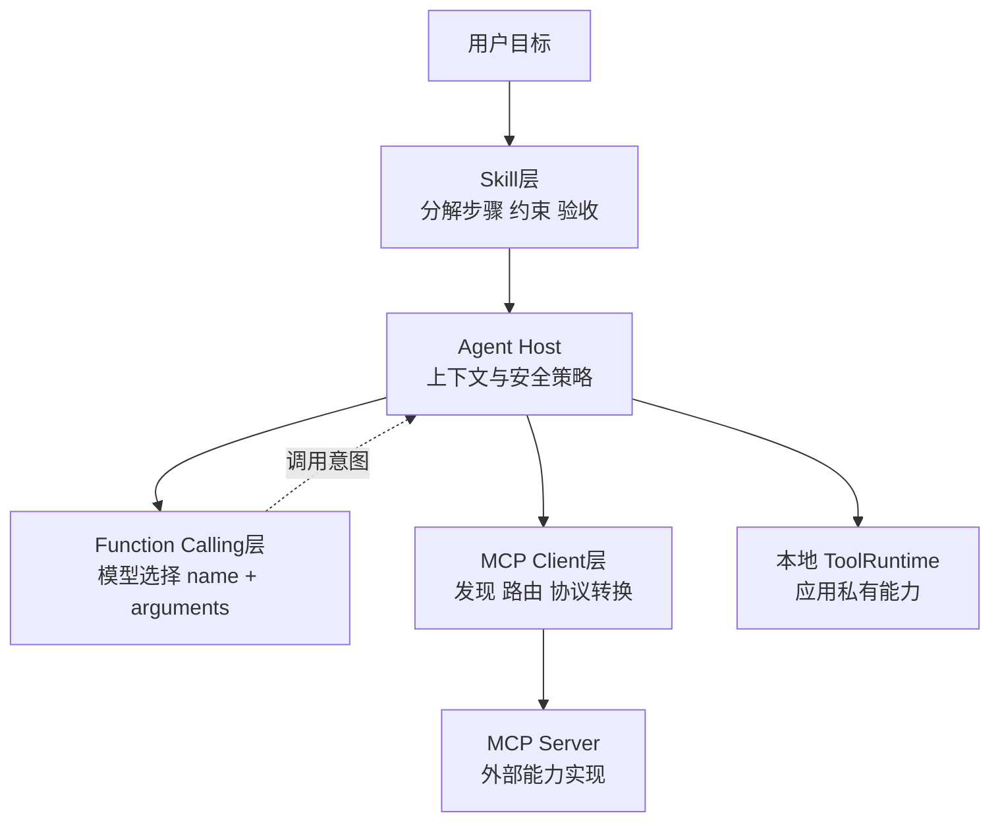

# 11. Function Calling、Skill、MCP：决策表达、工作流与协议接入三层

- 原文：[Function Calling、Skill、MCP 这三个有什么区别？](https://xiaolinnote.com/ai/tools/11_fc_skill_mcp.html)
- 一句话结论：Function Calling 是模型表达一次工具决策的接口，MCP 是外部能力接入协议，Skill 是完成一类任务的方法和编排知识。

## 1. 三层架构

注意图中 Function Calling 不是 MCP 的“下层网络协议”。Host 接收模型调用意图后，可以路由到 MCP，也可以调用本地函数、队列任务或人工审批。

## 2. 同一任务的完整例子

用户要求“分析支付事故并创建修复工单”：

1. Incident Skill 规定先收集告警、再查询负责人、最后在确认后建单。
2. Host 只把当前步骤相关工具 Schema 发给模型。
3. 模型用 Function Calling 选择 `search_incident_playbook`。
4. Host 可在本地执行 Day22 工具，也可经 MCP 调远程知识库。
5. 创建工单是副作用工具，Host 请求用户批准。
6. Skill 的验收规则确认工单包含时间线、负责人和证据链接。

## 3. 当前项目的分层映射

- Function Calling：[run_day22_function_calling_basics.py](../run_day22_function_calling_basics.py) 的 `TOOL_SPECS`、`tool_calls` 和 Tool 回灌循环。
- Skill 风格编排：[run_day25_task_orchestration.py](../run_day25_task_orchestration.py) 的计划、执行和总结，但没有 `SKILL.md` 自动发现。
- MCP/Skill 教学骨架：[tooling_capabilities_reference.py](examples/tooling_capabilities_reference.py) 的 `McpClient/McpServer` 与 `SkillCatalog`。
- 安全能力：[run_day23_database_query_assistant.py](../run_day23_database_query_assistant.py) 和 [run_day24_http_integration_assistant.py](../run_day24_http_integration_assistant.py) 的只读 SQL、HTTPS 白名单和超时。

项目尚未把这些部件组装成在线 Agent，也没有官方协议兼容验证。

## 4. 谁负责什么安全

| 风险 | 主要控制层 |
| --- | --- |
| 模型生成非法参数 | ToolRuntime Schema 校验 |
| 用户是否允许删除 | Host 审批策略 |
| Server 身份和租户权限 | MCP 认证授权 |
| 工作流跳过必要检查 | Skill 步骤和验收 + Host 状态机 |
| 无限工具循环 | Agent Host 轮数/成本预算 |
| 第三方内容注入 | Host 数据分级与上下文隔离 |

没有任何一层能单独承担全部安全。

## 5. 常见错误架构

- 模型直接持有数据库凭据，绕过 Host。
- 把几百个 MCP Tool 一次全给模型，导致上下文膨胀和误选。
- Skill 只写“调用某工具”，没有输入、失败和验收。
- MCP Server 接到 `tools/call` 后不做授权，误以为 Host 已检查。
- 将工具返回文本当成可信系统指令。

## 6. 模拟面试

**Q1：用一句话分别定义三者。**  
A：FC 是模型调用表达；MCP 是能力接入协议；Skill 是任务工作流知识。

**Q2：Skill 能否直接执行 MCP Tool？**  
A：Skill 是指令，不自行执行；Agent Host 解释步骤并通过 Client 调用。

**Q3：Function Calling 输出一定路由到 MCP 吗？**  
A：不一定，也可路由到本地函数、HTTP 服务、队列或审批流程。

**Q4：三个层次谁负责最终授权？**  
A：通常 Host 做用户级决策，Server 仍必须做资源级授权，形成纵深防御。

**Q5：工具很多时怎么减小上下文？**  
A：先由 Skill/任务路由筛选 Server 和能力，再只暴露相关 Schema，可结合语义检索。

## 7. 复习清单

- 能画三层图且不混淆协议关系。
- 能用一个任务串起三者。
- 能为每类风险找到控制层。
- 能准确陈述仓库现有和缺失部分。