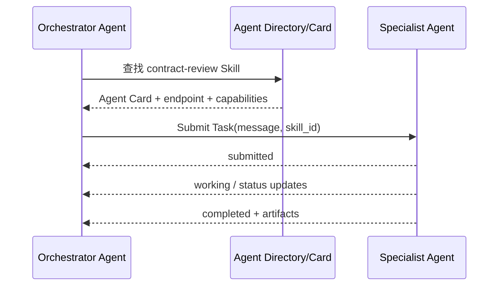

# 12. A2A：Agent 发现、任务委派与产物协作

- 原文：[什么是 A2A 协议？它和 MCP 协议的区别是什么？](https://xiaolinnote.com/ai/tools/12_a2a_protocol.html)
- 一句话结论：A2A 面向 Agent 与 Agent 的任务协作，核心抽象是 Agent Card、Skill、Task 状态和 Artifact；MCP 面向 Host 与能力 Server 的上下文/工具接入。

## 1. A2A 解决的问题

一个采购 Agent 不必了解法律审查 Agent 的内部模型、Prompt 和工具，只需发现它能执行 `contract-review`，提交任务，接收状态和最终报告。这保留了 Agent 的自治和不透明内部实现。

Agent Card 通常声明身份、端点、认证/通信能力和 Skills。Task 是有生命周期的工作单元，Artifact 是报告、文件或结构化结果。长任务可使用流式更新或推送通知，具体取决于实现版本和部署。

## 2. A2A 与 MCP

| 维度 | A2A | MCP |
| --- | --- | --- |
| 交互双方 | Agent 与 Agent | Host/Client 与能力 Server |
| 核心单位 | Task、Message、Artifact | Tool、Resource、Prompt |
| 对方自治 | 高，内部工作流可隐藏 | Server 执行明确能力 |
| 生命周期 | 长任务与状态迁移 | 请求/响应和能力订阅 |
| 常见组合 | Agent 内部可用 MCP | MCP Server 通常不委派自治任务 |

Skill 一词在两处含义也有差异：Agent Card 的 Skill 是对外广告的能力说明；本系列第 9 篇的 Agent Skill 是可加载工作流包，不能因为同名就视为同一文件格式。

## 3. 项目补充实现

[tooling_capabilities_reference.py](examples/tooling_capabilities_reference.py) 提供：

- `AgentCard/AgentSkill`：能力广告。
- `AgentDirectory.find_by_skill`：按精确 Skill ID 发现。
- `A2ATaskStore`：提交任务并强制 `submitted -> working -> completed|failed`。
- `artifacts`：任务完成后的结构化产物。

状态机拒绝从 `completed` 再回到 `working`，避免重复执行和状态覆盖。它没有 `/.well-known/agent-card.json`、HTTP/JSON-RPC 接口、认证、SSE、推送回调、持久化或幂等键，所以不是官方 A2A Server。

[xiaolinnote_agent_analysis/examples/agent_capabilities_reference.py](../xiaolinnote_agent_analysis/examples/agent_capabilities_reference.py) 的 Worker Registry 和 DAG 是单应用内编排，也不能称为跨组织 A2A 协议。

## 4. 生产状态机要补什么

真实系统还需输入校验、租户授权、Task 幂等、取消、超时、重试、状态版本号、事件持久化和 Artifact 访问控制。异步更新应携带序列号，防止旧事件覆盖新状态。

## 5. 模拟面试

**Q1：A2A 和 MCP 的一句话区别？**  
A：A2A 委派自治任务给另一个 Agent；MCP 调用外部能力或读取上下文。

**Q2：Agent Card 有什么作用？**  
A：提供可发现的身份、端点、能力和通信信息，让调用方无需了解内部实现。

**Q3：为什么 A2A 需要 Task 而不只同步函数返回？**  
A：Agent 工作可能长时、分阶段并产生多个状态和 Artifact，需要可追踪生命周期。

**Q4：A2A Skill 与 `SKILL.md` 是同一概念吗？**  
A：不是。前者是对外能力广告，后者是 Agent 内部可加载的工作流包。

**Q5：当前项目实现了官方 A2A endpoint 吗？**  
A：没有，只实现并测试了内存 Agent Card、发现和 Task 状态机。

## 6. 复习清单

- 能比较 Task/Artifact 与 Tool/Resource。
- 能解释两种 Skill 名称的差异。
- 能画出 Agent 发现和委派序列。
- 能列出生产状态机缺失能力。