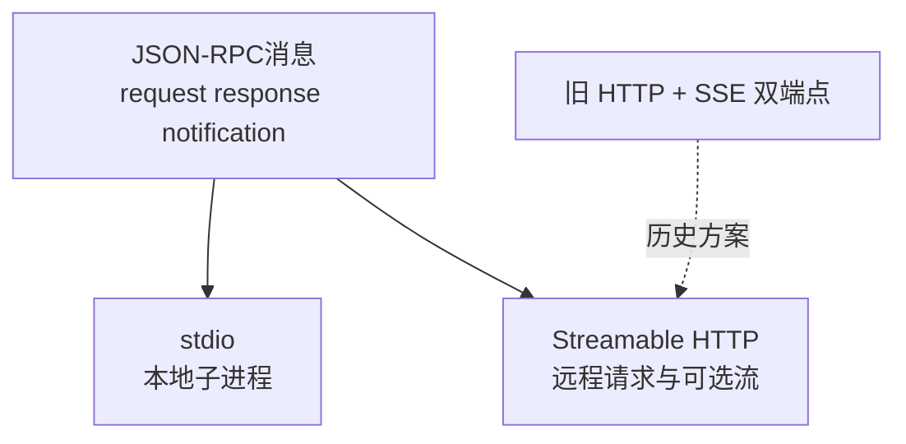

# 13. MCP 通信：stdio、Streamable HTTP 与历史 SSE 方案

- 原文：[MCP 协议通常采用什么通信方式？](https://xiaolinnote.com/ai/tools/13_mcp_transport.html)
- 一句话结论：本地 Server 常用 stdio；远程部署优先按当前规范实现 Streamable HTTP。早期独立 HTTP+SSE 双端点方案属于历史演进，不宜作为新系统默认。

## 1. 消息与传输要分开

MCP 的请求、响应和通知采用 JSON-RPC 2.0 形状；stdio/HTTP 决定消息字节如何流动。相同 `tools/list` 可以通过不同传输发送。

## 2. stdio

Host 启动本地 Server 子进程，通过标准输入写请求、标准输出读协议消息。它配置简单、不暴露端口、适合桌面工具，但 Server 的日志不能混入 stdout，否则会破坏消息帧；日志应写 stderr。

安全上，stdio 不是天然沙箱。Server 继承本机用户权限和被传入的环境变量，仍需最小化工作目录、密钥、文件系统和子进程权限。

## 3. Streamable HTTP

远程 Server 通过 HTTP 接收消息，响应可为普通 JSON，也可按协议和协商使用流式事件。它更适合多客户端、负载均衡、认证和云部署，但需处理会话、断线恢复、代理缓冲、超时和水平扩展。

早期 MCP 常使用 POST 发送请求、单独 SSE endpoint 接收 Server 事件。协议演进后 Streamable HTTP 统一了接入方式。维护旧客户端时可能仍要兼容旧传输，但新实现应以当前官方规范和 SDK 为准。

## 4. 项目代码边界

[tooling_capabilities_reference.py](examples/tooling_capabilities_reference.py) 的 `McpClient` 直接调用内存 `McpServer.handle`，只演示 JSON-RPC 方法和 ID，不执行字节流传输。

同文件 `choose_transport` 把本地 MCP 选为 `stdio`、远程非全双工选为 `streamable_http`；`SseEventBuffer` 演示事件 ID 和重放。这是架构选择器和流语义示例，不是网络 Server。

仓库现有 Day24 有普通 HTTP 工具调用，Day36 有 FastAPI 服务，但二者都不实现 MCP Streamable HTTP。

## 5. 生产检查项

- 初始化和协议版本协商。
- 消息帧、内容类型、最大请求体和 JSON-RPC ID。
- OAuth/服务身份、租户授权、TLS 与 CORS/Origin 策略。
- 代理关闭缓冲、心跳、空闲超时和断线恢复。
- 横向扩展下会话粘性或共享状态。
- stdout 纯协议、stderr 日志的 stdio 约束。

## 6. 模拟面试

**Q1：MCP 只能通过 SSE 吗？**  
A：不能这样说。本地常用 stdio，远程当前主流是 Streamable HTTP；独立 SSE 端点是历史方案之一。

**Q2：JSON-RPC 与 HTTP 谁规定方法名？**  
A：MCP 在 JSON-RPC 语义上定义方法；HTTP 只是承载消息的传输。

**Q3：stdio 为什么不能用 stdout 打日志？**  
A：stdout 是协议通道，任意日志会污染消息帧；日志应走 stderr。

**Q4：Streamable HTTP 的主要运维难点？**  
A：认证、代理缓冲/超时、会话恢复、扩缩容和长连接资源。

**Q5：当前参考实现跑过真实传输吗？**  
A：没有，只跑过内存 JSON-RPC 形状和 SSE 事件缓冲。

## 7. 复习清单

- 区分 JSON-RPC 消息层和传输层。
- 能解释 stdio 的 stdout/stderr 纪律。
- 知道旧 HTTP+SSE 与 Streamable HTTP 的演进关系。
- 不把 Day24/Day36 误称 MCP Transport。