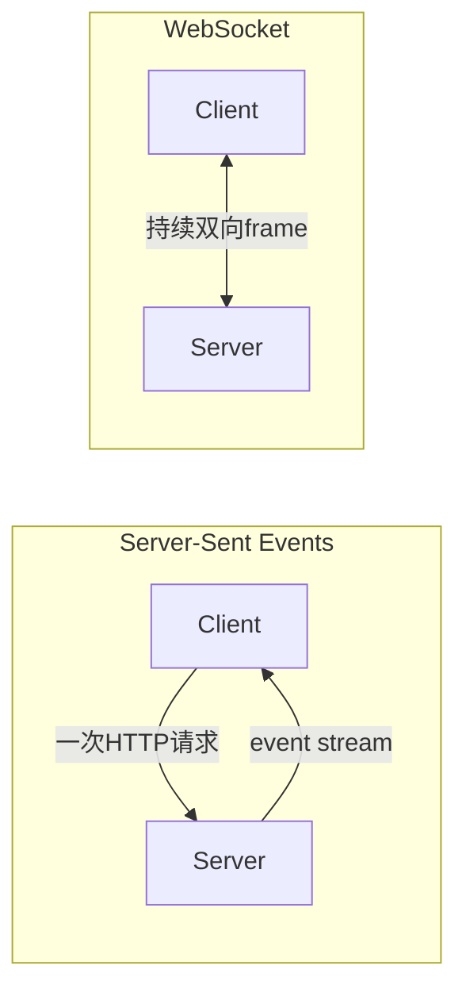

# 14. SSE 与 WebSocket：单向事件流和全双工会话

- 原文：[说说 WebSocket 和 SSE 通信的区别及局限性？](https://xiaolinnote.com/ai/tools/14_sse_vs_websocket.html)
- 一句话结论：SSE 最适合服务端持续向浏览器推文本事件；WebSocket 适合双方都要低延迟频繁发消息的状态化会话。LLM 文本 token 流通常优先 SSE，但不是硬规则。

## 1. 通信模型



SSE 基于 HTTP，响应 `Content-Type: text/event-stream`，事件以空行分隔，可包含 `id`、`event`、`data` 和 `retry`。浏览器 `EventSource` 可自动重连并携带 `Last-Event-ID`，但自定义认证 Header 受原生 API 限制，常改用 Cookie、短期 URL token 或 `fetch` 流。

WebSocket 通过 HTTP Upgrade 建立长连接，之后交换文本/二进制帧。它支持全双工，但请求与响应没有 HTTP 天然对应关系，应用需自行设计消息 ID、状态机、心跳和重连补偿。

## 2. 对比

| 维度 | SSE | WebSocket |
| --- | --- | --- |
| 方向 | 服务端到客户端为主 | 双向同时通信 |
| 数据 | UTF-8 文本事件 | 文本和二进制帧 |
| 协议设施 | HTTP、事件 ID、浏览器重连 | 自定义消息协议和恢复 |
| 基础设施 | 较容易经过代理/CDN | 要支持 Upgrade 和长连接 |
| 典型 AI 场景 | token、进度、日志 | 实时控制、协作、双向 Agent 事件 |

SSE 仍需客户端通过另一条 HTTP 请求提交问题或取消；“单向”不代表产品完全无法双向，只是上下行不在同一连接。

## 3. 项目补充实现

[tooling_capabilities_reference.py](examples/tooling_capabilities_reference.py) 的 `ServerEvent.encode` 生成：

```text
id: 2
event: token
data: {"text": "B"}

```

`SseEventBuffer.replay_after(last_event_id)` 重放断线后事件，并限制内存历史。单元测试验证从 ID 1 恢复时只收到后续事件。

这并不包含真实 HTTP 响应、心跳、代理设置和多实例共享日志。[run_day36_day38_unified_service.py](../run_day36_day38_unified_service.py) 当前返回一次性 JSON，不提供 SSE 或 WebSocket endpoint。

## 4. 可靠性与背压

若模型每秒产生速度高于客户端渲染/网络消费速度，缓冲区会增长。生产系统应批量合并 token、设置队列上限、慢消费者策略和取消。事件重放需要持久/共享事件日志，否则负载均衡到另一个实例会丢失历史。

SSE 的 `id` 提供恢复位置，不自动保证业务 exactly-once。客户端仍需按事件 ID 去重；副作用命令不应只靠事件重放执行。

## 5. 选型

- 聊天回答、进度、日志：优先评估 SSE/fetch streaming。
- 用户可持续发控制、多人协作、低延迟双向状态：WebSocket。
- 实时音视频：通常进一步评估 WebRTC。
- 企业代理环境：先验证 Upgrade、空闲超时和缓冲，而非只看代码 API。

## 6. 模拟面试

**Q1：SSE 是双向协议吗？**  
A：单条 SSE 连接是服务端到客户端；客户端可另发 HTTP 请求形成产品层双向交互。

**Q2：WebSocket 为什么需要应用消息 ID？**  
A：帧本身没有 HTTP request-response 关联，异步并发消息需自行匹配。

**Q3：SSE 自动重连就不会丢数据吗？**  
A：不会自动保证。Server 要保留事件并按 `Last-Event-ID` 重放，客户端还要去重。

**Q4：LLM token 流为什么常选 SSE？**  
A：主要是单向文本流，HTTP 基础设施简单，并原生支持事件语义和重连。

**Q5：SSE 能传二进制音频吗？**  
A：协议是文本，可 Base64 但开销大；音频更适合二进制 WebSocket 或 WebRTC。

## 7. 复习清单

- 能比较方向、帧、恢复和基础设施。
- 知道 EventSource 自定义 Header 的限制。
- 能解释背压与多实例重放。
- 不声称当前 FastAPI 服务已有流式 endpoint。