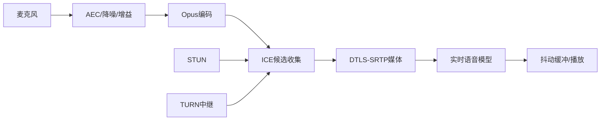

# 15. WebRTC 与 WebSocket：实时语音媒体和通用消息通道

- 原文：[为什么要用 WebRTC？它和 WebSocket 在 AI 对话流中的核心差异是什么？](https://xiaolinnote.com/ai/tools/15_webrtc_vs_ws.html)
- 一句话结论：WebSocket 是可靠有序的通用双向通道；WebRTC 是为低时延实时媒体设计的协议栈，内建网络穿透、加密媒体、抖动处理和音频链路能力。

## 1. 实时语音链路

WebRTC 不是“只有 UDP 的一个协议”。它是一组协议和 API：ICE 选择连通路径，STUN 发现公网映射，TURN 在直连失败时中继，DTLS-SRTP 加密媒体，RTP/RTCP 携带媒体与质量反馈。多数理想媒体路径偏好 UDP，但受限网络可能经 TURN/TCP/TLS 回退。

## 2. 为什么 TCP/WebSocket 会卡

WebSocket 通常运行在 TCP 上，保证可靠、有序交付。丢失一个包时，后续数据会等待重传，形成队头阻塞。文件和业务命令需要可靠性，但实时语音中 300ms 前的丢失帧重传回来往往已经无播放价值。

端到端交互延迟可粗略分解：

$$
T=T_{capture}+T_{encode}+T_{network}+T_{jitter}+T_{inference}+T_{decode}
$$

WebRTC 通过自适应码率、抖动缓冲和丢包隐藏在媒体质量与延迟间取舍；WebSocket 需要应用自行实现这些机制。

## 3. 对比

| 维度 | WebRTC | WebSocket |
| --- | --- | --- |
| 主要目标 | 实时音视频/数据 | 通用可靠双向消息 |
| 传输 | UDP 优先，可回退 | TCP 上的 WS/WSS |
| 媒体能力 | 编解码、抖动、反馈、AEC 等生态 | 应用自行建设 |
| NAT 穿透 | ICE/STUN/TURN | 通常连接公网 Server |
| 可靠有序 | 媒体可容忍丢包；DataChannel 可配置 | 默认可靠有序 |
| 运维复杂度 | 信令、TURN、媒体观测较复杂 | 相对简单 |

WebRTC 仍需要信令交换 SDP/ICE，信令可用 HTTP 或 WebSocket；因此二者也可能同时出现。

## 4. AI 对话中的分工

- WebRTC：麦克风上行、合成语音下行、打断和低延迟媒体。
- WebSocket：控制事件、调试、工具进度，或在环境简单时传小块 PCM。
- SSE：文本 transcript/token 的单向展示。
- HTTP：会话创建、鉴权和资源上传。

[tooling_capabilities_reference.py](examples/tooling_capabilities_reference.py) 的 `choose_transport(... realtime_media=True)` 返回 `webrtc`，只表达需求决策；仓库没有 SDP、ICE、TURN、Opus 或浏览器媒体代码。

## 5. 生产注意事项

- TURN 带宽可能成为主要成本，必须观测 relay 比例。
- 端点需要回声消除，否则模型声音会被麦克风再次采入。
- 打断要联动 VAD、播放队列取消和模型生成取消。
- 媒体、信令和业务权限均需绑定同一短期会话身份。
- 监控 RTT、jitter、packet loss、bitrate、首音频时间和打断响应。

## 6. 模拟面试

**Q1：WebRTC 一定使用 UDP 吗？**  
A：UDP 是媒体优先路径，但 ICE/TURN 可在受限网络回退到 TCP/TLS，不能绝对化。

**Q2：为什么语音可以容忍丢包却不喜欢重传？**  
A：实时播放有截止时间，迟到帧价值低；适度丢包隐藏比等待重传更流畅。

**Q3：用了 WebRTC 还需要 WebSocket 吗？**  
A：可能需要，用于信令、控制或业务消息；媒体本身走 WebRTC。

**Q4：TURN 的作用和代价？**  
A：直连失败时中继媒体提高连通率，但增加带宽成本和路径延迟。

**Q5：AI 语音打断涉及哪些组件？**  
A：VAD 检测用户开口、停止播放、取消模型生成、清空缓冲并切换会话状态。

## 7. 复习清单

- 能解释 ICE/STUN/TURN 和 DTLS-SRTP。
- 能用队头阻塞说明 TCP 局限。
- 知道 WebRTC 与 WebSocket 可组合。
- 不把传输选择器说成真实媒体实现。