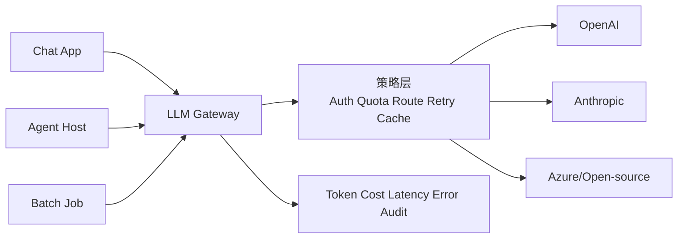

# 16. LLM Gateway：统一模型入口、路由、配额与可观测治理

- 原文：[有没有用过大模型的网关框架？网关层解决了什么问题？](https://xiaolinnote.com/ai/tools/16_llm_gateway.html)
- 一句话结论：LLM Gateway 将多供应商差异、虚拟模型路由、认证配额、重试降级、成本和审计集中到应用与模型之间；它不能替代业务 Agent 或 Tool Runtime。

## 1. 架构位置

应用只请求公共模型名，例如 `smart`、`fast`、`embedding`；网关将其映射到供应商模型和区域。切换供应商时应用契约尽量不变。

## 2. 网关解决的六类问题

1. **API 统一**：消息、流、错误和 usage 格式归一化。
2. **路由与故障转移**：按模型、区域、成本、延迟和健康度选择后端。
3. **认证与配额**：Virtual Key、租户、RPM/TPM 和预算限制。
4. **可靠性**：仅对可重试错误做退避、熔断和备用路由。
5. **可观测性**：请求 ID、TTFT、总延迟、token、费用、错误和供应商。
6. **治理**：模型白名单、数据地域、内容策略、审计和密钥隔离。

语义缓存可降成本，但必须包含模型/参数/租户/权限/知识版本，且不能轻率缓存个性化或敏感响应。

## 3. 当前项目已有基础

[run_day34_unified_inference_api.py](../run_day34_unified_inference_api.py) 用 `UnifiedInferenceEngine` 统一 base 与 LoRA 本地模型加载，是模型适配层。

[run_day36_day38_unified_service.py](../run_day36_day38_unified_service.py) 已具备：

- API Key 认证和滑动窗口请求限流。
- 指数退避重试与结构化错误。
- request ID、模型 ID、usage、延迟和服务指标。
- FastAPI `/v1/inference` 统一入口。

但它只有单一内部推理引擎，没有多供应商路由、Virtual Key token 预算、provider 健康/熔断、流式协议统一或语义缓存，不能直接称为生产 LLM Gateway。

## 4. 补充参考实现

[tooling_capabilities_reference.py](examples/tooling_capabilities_reference.py) 的 `LlmGateway`：

- `GatewayRoute` 把公共模型映射到有顺序的 Provider 列表。
- `set_token_quota` 为虚拟 Key 设置 token 上限。
- `complete` 在主 Provider 失败时尝试备份。
- `GatewayUsage` 记录成功请求、实际 token、估算成本和 Provider 失败数。

单元测试让主 Provider 抛错、备份成功，验证故障转移和配额拒绝。它没有 HTTP、并发锁、分布式配额、流式响应、熔断和生产密钥管理，是离线策略骨架，不是 LiteLLM 替代品。

## 5. 重试为什么危险

网关不能对所有失败盲目重试。429、部分 5xx 和连接错误可能可重试；参数错误、内容策略拒绝通常不可重试。流式响应已向客户端发送一部分 token 后切换 Provider，可能产生重复或语义断裂。

若单次成功概率为 $p$，独立尝试最多 $n$ 次的理论成功率为：

$$
P(success)=1-(1-p)^n
$$

但尝试并非完全独立，且延迟与成本同步上升，因此必须有时间预算、退避、熔断和总尝试上限。

## 6. 安全与隐私

- Provider Key 只保存在网关，应用使用短期/虚拟凭据。
- 日志默认不记录完整 Prompt、Tool 结果和 PII，只存必要元数据或脱敏摘要。
- 按租户隔离缓存、用量和路由策略。
- 记录实际 Provider/模型版本，确保审计和回放。
- MCP Tool 权限与模型 Gateway 权限是两套边界，不能共用一个粗粒度 Key。

## 7. 模拟面试

**Q1：LLM Gateway 与普通 API Gateway 的差异？**  
A：复用认证限流等能力，但还理解模型路由、token、流式输出、供应商错误、成本和 Prompt 隐私。

**Q2：故障转移时为什么要公共模型名？**  
A：应用不绑定供应商 ID，网关可在保持能力等级契约下切换后端。

**Q3：RPM 和 TPM 有何不同？**  
A：RPM 限请求次数，TPM 限 token 消耗；长 Prompt 场景只限 RPM 无法控制成本和容量。

**Q4：所有 5xx 都应重试吗？**  
A：不应。要结合错误类型、幂等、时间预算和流是否已发送；连续失败还需熔断。

**Q5：语义缓存 Key 应包含什么？**  
A：租户/权限、模型和参数、规范化输入、知识/工具版本及安全策略，防止越权命中。

**Q6：当前仓库能否称为用过 LiteLLM？**  
A：不能。仓库有统一服务和离线网关骨架，但未安装、配置或运行 LiteLLM。

## 8. 复习清单

- 能说出六类网关职责。
- 能区分 Day36 服务基线和生产多供应商网关。
- 能解释重试、流式故障转移和语义缓存风险。
- 如实描述参考实现与 LiteLLM 的边界。