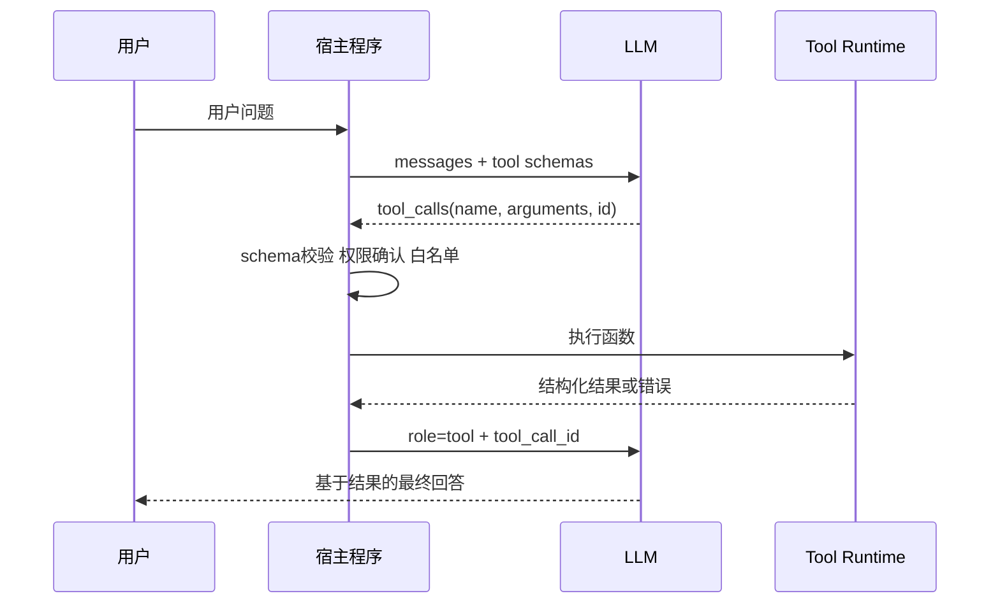

# 1. Function Calling：结构化决策、宿主执行与安全边界

- 原文：[什么是 Function Calling？原理是什么？](https://xiaolinnote.com/ai/tools/1_function_calling.html)
- 一句话结论：模型只产生结构化调用意图，宿主程序负责校验、授权、执行和把结果作为 `tool` 消息回灌。

## 1. 为什么需要结构化调用

自然语言“我想查天气”无法稳定映射到函数。Function Calling 用 JSON Schema 描述工具，让模型输出工具名、调用 ID 和参数；这仍然只是 token 生成，模型没有因此获得网络、文件或数据库权限。



这里通常是两次模型请求，不是“同一次推理真正暂停后原地继续”。宿主把第一轮 Assistant 消息和 Tool 结果加入历史，再发起下一轮推理。

## 2. Schema 如何影响选择

工具定义至少包含 `name`、`description` 和 `parameters`。`description` 应说明用途和不适用范围；参数要声明类型、必填、枚举和格式。Schema 是模型的说明书，但它不是安全边界：模型可能生成缺字段、错类型、额外字段或越权参数，宿主必须再次校验。

```python
{
    "type": "function",
    "function": {
        "name": "lookup_service_owner",
        "description": "查询 payment、order 等服务的负责人",
        "parameters": {
            "type": "object",
            "properties": {"service": {"type": "string"}},
            "required": ["service"],
            "additionalProperties": False,
        },
    },
}
```

## 3. 当前项目代码

[run_day22_function_calling_basics.py](../run_day22_function_calling_basics.py) 已完整展示主循环：

- `TOOL_SPECS` 是传给模型的说明书，`TOOL_IMPLS` 是宿主侧白名单。
- `chat_once_with_tools` 发送 `tools` 和 `tool_choice="auto"`。
- `execute_tool_call` 用 `json.loads` 解析参数，拒绝未知工具并捕获执行异常。
- `main` 遍历同一响应中的多个 `tool_calls`，按 `tool_call_id` 回灌结果，并由 `max_tool_rounds` 阻止无限循环。

它尚未按 JSON Schema 验证参数，也没有副作用授权、单工具超时、并行执行和幂等键。Day22 是机制基线，不是安全沙箱。

## 4. 补充实现解读

[tooling_capabilities_reference.py](examples/tooling_capabilities_reference.py) 的 `ToolRuntime` 做了四个补充：

1. `validate_arguments` 校验必填、类型、枚举和额外字段。
2. `dangerous=True` 的工具必须传 `approved=True`。
3. `execute` 使用 Future 超时返回受控错误。
4. `execute_many` 并发执行无依赖调用，同时保持输入顺序关联调用 ID。

这只是 JSON Schema 子集；生产应使用成熟校验库，并在进程/容器沙箱中执行高风险工具。线程超时也不能强制终止已运行的 Python 函数。

## 5. 并行与串行

查询北京和上海天气互不依赖，可一次产生两个调用并发执行。先创建订单再支付存在数据依赖，必须把第一轮结果交给下一轮决策。判断依据是依赖图，而不是“模型一次能输出几个调用”。

## 6. 模拟面试

**Q1：模型会直接执行函数吗？**  
A：不会。模型只输出结构化意图，宿主代码掌握函数引用、凭据和执行权限。

**Q2：为什么 Schema 不能当安全校验？**  
A：它主要引导模型生成，输出仍不可信；宿主必须进行确定性校验和授权。

**Q3：`tool_call_id` 有什么作用？**  
A：将每条 Tool 结果关联到对应请求，并行调用时尤其必要。

**Q4：什么时候能并行调用？**  
A：调用之间没有数据或副作用顺序依赖时；否则应串行分轮。

**Q5：如何阻止工具循环失控？**  
A：限制轮数、调用数、总耗时和成本，去重相同调用，并将失败作为结构化结果反馈。

## 7. 复习清单

- 能复述“两轮模型请求 + 中间宿主执行”。
- 能区分 Schema 引导和运行时校验。
- 能指出 Day22 的白名单、异常和轮数保护。
- 能说明副作用授权、超时和幂等为何仍需补齐。