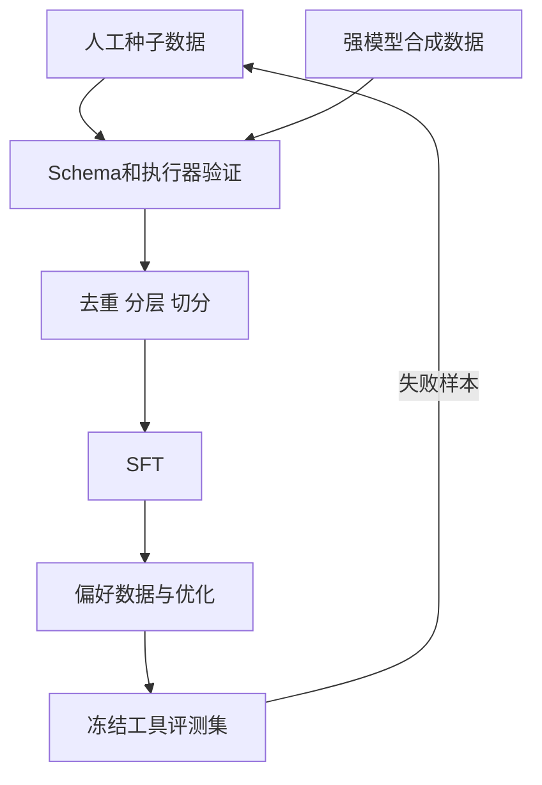

# 3. Function Call 训练：数据覆盖、对齐与错误恢复

- 原文：[大模型的 Function Call 能力是怎么训练出来的？](https://xiaolinnote.com/ai/tools/3_fc_training.html)
- 一句话结论：能力上限主要受训练任务分布和验证质量约束；不只要教成功调用，也要教拒绝、澄清、失败恢复和依赖顺序。

## 1. 训练链路

人工数据质量高但贵；Self-Instruct/蒸馏扩量快，却会复制教师模型的错误。合成后不能只人工抽几条，应把工具调用放入可执行验证器：JSON 是否解析、Schema 是否通过、工具是否存在、模拟执行结果是否符合不变量。

## 2. 数据覆盖矩阵

| 维度 | 必需样本 |
| --- | --- |
| 调用数量 | 单工具、并行多工具、串行依赖 |
| 调用必要性 | 必须调用、无需调用、信息不足先澄清 |
| 参数 | 正常、枚举、边界值、缺失、非法额外字段 |
| 执行结果 | 成功、超时、限流、无权限、部分失败 |
| 多轮 | 复用已有结果、避免重复调用、用户修改目标 |
| 安全 | Prompt Injection、越权资源、危险操作需批准 |

只训练“天气查询成功”会让模型在真实错误场景下重复调用或编造结果。

## 3. 项目可复用代码

[run_day30_build_instruction_dataset.py](../run_day30_build_instruction_dataset.py) 已具备确定随机种子、JSONL、train/eval 拆分和样本报告，可改造成工具训练数据生成器。`build_one_sample` 当前生成的是后端问答模板，改造时应输出完整 `messages` 和 `tools`。

[run_day31_sft_lora_light.py](../run_day31_sft_lora_light.py) 的 `format_example` 将样本拼为文本。真正工具微调应使用目标模型的 chat template，保留 tool call 特殊 token；不能随意把 JSON 当普通正文拼接。

[run_day32_sft_before_after_eval.py](../run_day32_sft_before_after_eval.py) 当前按章节与关键词打分。Function Calling 评测应改用 [参考实现](examples/tooling_capabilities_reference.py) 的 `validate_arguments` 和模拟工具执行，得到结构化成功率。

## 4. 损失与对齐边界

SFT 常用交叉熵：

$$
\mathcal{L}_{SFT}=-\sum_{t\in assistant}\log P_\theta(y_t\mid y_{<t},x)
$$

只在 Assistant 输出计算损失更符合角色职责。偏好优化则比较“正确调用、直接回答、错误参数、无意义调用”等候选。网页描述的奖励模型加 PPO 是经典 RLHF 路线，不是 2026 年所有系统的统一实现。

## 5. 数据污染与版本

工具 Schema 会变化，训练样本必须记录 schema/version。若训练集出现旧参数 `city_name`、线上工具已改成 `city`，模型会稳定地产生过期调用。评测集要按工具、难度和错误类型分层，且与合成模板去重，防止模板泄漏造成虚高。

## 6. 模拟面试

**Q1：工具训练数据为什么必须可执行验证？**  
A：JSON 看似合理不代表工具存在、参数合法或结果满足业务不变量，执行器可过滤大量合成幻觉。

**Q2：并行调用数据解决什么问题？**  
A：让模型在无依赖任务中一次发出多个调用，减少模型往返和总延迟。

**Q3：失败样本如何构造？**  
A：让 Tool 返回结构化超时、限流、权限或参数错误，再标注澄清、换路由、有限重试或终止行为。

**Q4：为什么要记录 Schema 版本？**  
A：工具接口演进会让旧调用失效，版本信息支持过滤、重训和回归定位。

**Q5：如何避免合成数据“幻觉传递”？**  
A：Schema 校验、沙箱执行、规则不变量、去重、人工分层抽检和冻结真实评测集组合使用。

## 7. 复习清单

- 能列出六维覆盖矩阵。
- 会解释 Assistant-only loss。
- 知道项目 SFT 管线可复用但数据目标不同。
- 能设计可执行而非只看文本的评测。