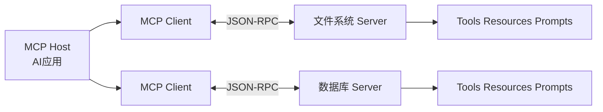

# 4. MCP：标准化上下文与工具接入的开放协议

- 原文：[什么是 MCP（模型上下文协议）？讲讲它的核心内容？](https://xiaolinnote.com/ai/tools/4_what_is_mcp.html)
- 一句话结论：MCP 标准化 Host 与外部 Server 的能力发现和调用；常见能力包括 Tools、Resources、Prompts，消息采用 JSON-RPC 2.0。

## 1. MCP 解决什么

没有统一协议时，每个 AI 应用都要为 GitHub、数据库、文件系统重复编写 Schema、启动、认证、错误和结果适配。MCP 将提供方变成独立 Server，Host 通过 Client 按统一生命周期连接和发现能力。



MCP 是协议，不是模型、Agent 框架，也不是授权系统本身。Server 写一次能被多个兼容 Host 使用，但仍要处理部署、身份、策略和版本兼容。

## 2. 三类能力的精确理解

- **Tools**：模型可调用的操作，可能只读也可能有副作用。网页把 Tools 全部概括为“有副作用”便于入门，但协议层并不要求每个 Tool 都修改状态。
- **Resources**：以 URI 标识、由应用读取并放入上下文的数据。通常按只读资源理解。
- **Prompts**：可发现、可参数化的提示模板，通常由用户/应用选择，不等同模型自主工具。

因此安全策略应看具体工具注解和业务行为，不能只按 capability 名称授权。

## 3. 消息与传输

JSON-RPC 请求包含 `jsonrpc`、`id`、`method`、`params`；响应用相同 `id` 返回 `result` 或 `error`。消息格式与传输解耦，本地常用 stdio，远程使用 Streamable HTTP。

```json
{"jsonrpc":"2.0","id":2,"method":"tools/call","params":{"name":"add","arguments":{"a":20,"b":22}}}
```

## 4. 当前项目与补充实现

Day22-Day25 直接把工具定义内嵌在应用，没有 MCP Host/Client/Server、初始化协商或能力发现。

[tooling_capabilities_reference.py](examples/tooling_capabilities_reference.py) 用 `McpServer.handle` 实现 `tools/list`、`tools/call`、`resources/list/read`、`prompts/list/get`；`McpClient.discover_function_schemas` 将发现结果转成模型函数 Schema。这直接展示“协议发现”和“模型调用格式”之间的适配层。

参考代码是同步内存对象，没有正式 MCP 初始化、capability negotiation、通知、取消、进度、订阅、OAuth 或网络传输，因此只能称为协议形状教学实现。

## 5. 安全与运维

- stdio Server 继承宿主环境，环境变量和文件权限必须最小化。
- 远程 Server 需要认证、授权、TLS、速率限制和审计。
- 工具描述来自外部 Server，Host 应做信任分级和名称冲突处理。
- Tool/Resource 内容都可包含 Prompt Injection，进入模型前要标记为不可信数据。

## 6. 模拟面试

**Q1：MCP 的核心价值是什么？**  
A：标准化能力发现、调用和结果返回，使工具服务与具体 AI 应用解耦并可复用。

**Q2：MCP 是 Anthropic 专属框架吗？**  
A：不是，它由 Anthropic 发起但定位为开放协议，兼容性取决于各 Host/Server 实现。

**Q3：Tools 一定有副作用吗？**  
A：不一定，Tool 也可只读；是否需确认应按具体行为和风险，而非只看分类。

**Q4：JSON-RPC 与 stdio 是什么关系？**  
A：前者定义消息形状，后者定义字节如何在本地进程间传输，两层解耦。

**Q5：当前参考实现为何不能叫完整 MCP Server？**  
A：缺少正式初始化、网络传输、认证、通知/取消和完整规范兼容测试。

## 7. 复习清单

- 能说清协议定位和 Host/Client/Server。
- 能准确比较 Tools、Resources、Prompts。
- 能区分 JSON-RPC 消息与传输层。
- 知道当前项目此前没有 MCP 实现。