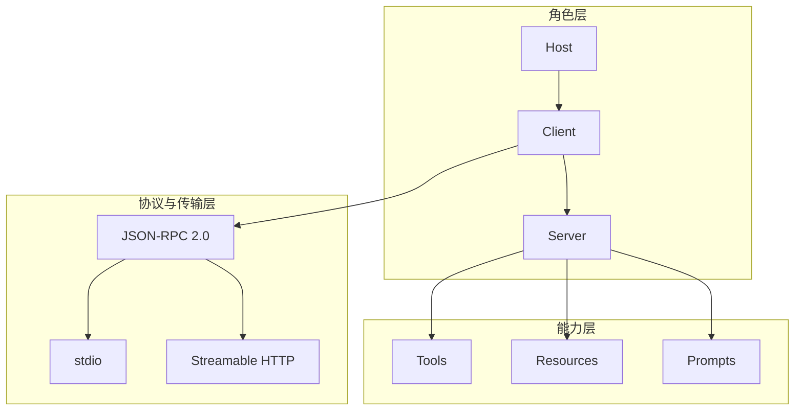

# 5. MCP 组成：角色、能力与传输三层

- 原文：[MCP 由哪几部分组成？](https://xiaolinnote.com/ai/tools/5_mcp_components.html)
- 一句话结论：角色层回答谁负责什么，能力层回答 Server 暴露什么，协议/传输层回答消息长什么样和怎样传。

## 1. 三层总览

### Host

Host 是面向用户的 AI 应用，控制安全边界、用户同意、模型上下文和 Client 生命周期。它不是 Client 的别名。

### Client

Client 通常代表 Host 到一个 Server 的逻辑连接，负责初始化、协商、请求/响应关联和能力调用。一个 Host 可同时管理多个 Client。

### Server

Server 暴露能力并执行具体逻辑。Server 不应默认信任任意 Host，尤其远程部署必须校验身份与租户范围。

## 2. 一次调用经过哪些层

1. Host 决定连接哪些 Server 并创建 Client。
2. Client 初始化并调用 `tools/list`。
3. Host 将工具转成模型可理解的原生 Schema。
4. 模型产生调用意图，Host 应用用户确认与策略。
5. Client 通过 `tools/call` 发 JSON-RPC 请求。
6. Server 执行并返回内容，Host 决定如何放入模型上下文。

## 3. 项目与参考代码

[run_day22_function_calling_basics.py](../run_day22_function_calling_basics.py) 同时承担了 Host、工具注册和执行器职责，`TOOL_SPECS` 也是静态内嵌的，没有 Client-to-Server 边界。

[tooling_capabilities_reference.py](examples/tooling_capabilities_reference.py) 将职责拆开：

- `ToolRuntime` 管 Server 内的定义和实现白名单。
- `McpServer` 管协议方法分派和 JSON-RPC 响应。
- `McpClient` 管请求 ID、错误提升和 Schema 转换。

`McpClient` 每次递增 `_next_id`，Server 原样返回 ID，客户端由此在并发系统中关联响应。生产实现还需处理通知（无 ID）、批量、取消和连接重建。

## 4. 发现与上下文成本

自动发现不等于把几百个工具全塞给模型。工具描述会占用上下文并增加误选概率。Host 可按用户权限、任务分类、Server 信任和语义相关性先筛选，再把小集合交给模型。

若有 $N$ 个工具、每个 Schema 平均 $s$ token，仅定义成本约为：

$$
C_{schema}\approx N\times s
$$

这解释了工具规模上升后需要注册、检索和渐进暴露。

## 5. 模拟面试

**Q1：Host 和 Client 有什么区别？**  
A：Host 是完整 AI 应用和安全边界；Client 是其中面向某个 Server 的协议连接模块。

**Q2：一个 Host 能连几个 Server？**  
A：可以连接多个，常见模型是一条逻辑 Client 连接对应一个 Server。

**Q3：能力层为什么不只包含 Tool？**  
A：MCP 还标准化只读资源和提示模板，分别承担上下文数据与复用交互模板的职责。

**Q4：自动发现有什么代价？**  
A：大量 Schema 占上下文、增加选择混淆，还扩大权限暴露面，因此要筛选。

**Q5：请求 ID 为什么重要？**  
A：它将异步或并发响应匹配到原请求；通知则没有 ID，不期待响应。

## 6. 复习清单

- 能按角色、能力、协议/传输三层作答。
- 能讲出完整调用链六步。
- 能说明工具发现和工具暴露不是一回事。
- 能定位 Day22 的角色耦合点。