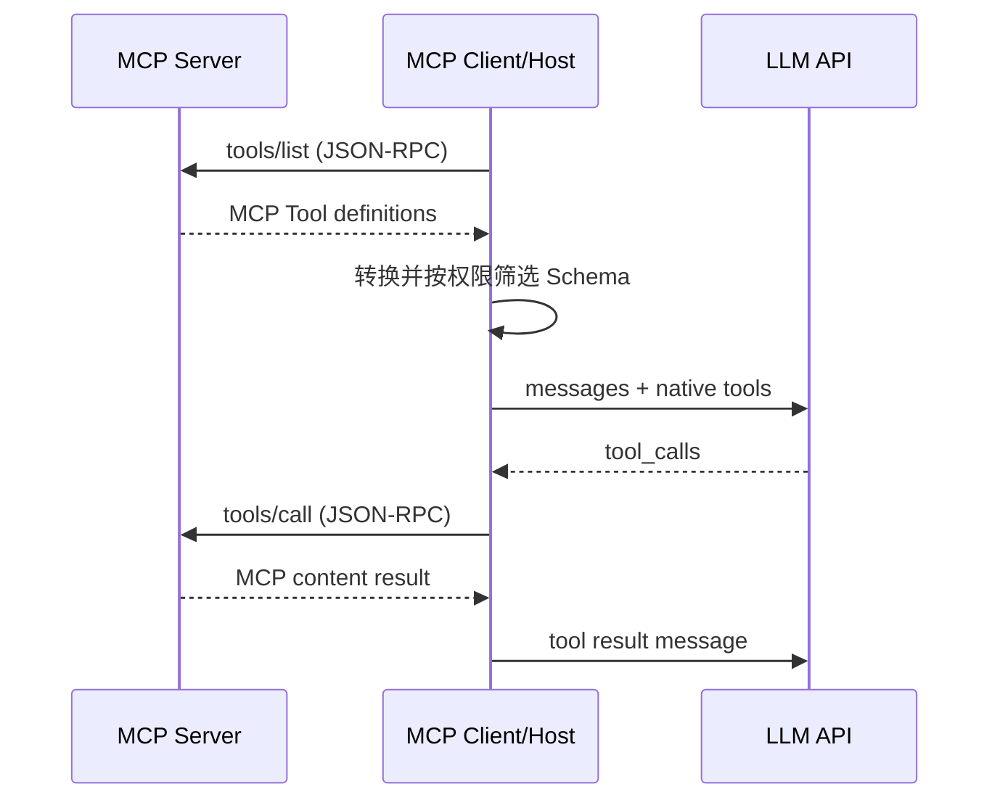

# 6. MCP 与 Function Calling：协议接入和模型调用的两层适配

- 原文：[MCP 和 Function Calling 有什么区别？有没有实际跑过 MCP？](https://xiaolinnote.com/ai/tools/6_mcp_vs_fc.html)
- 一句话结论：Function Calling 是模型 API 的结构化调用机制；MCP 是 Host 与能力 Server 的协议。常见 Host 会把 MCP Tool 转换为模型原生 Tool Schema。

## 1. 两层关系

Function Calling 格式由模型提供商 API 定义，OpenAI、Anthropic 等细节并不完全相同。MCP 则让 Server 不必为每个模型供应商实现一套工具协议，适配发生在 Host。

## 2. 需要修正的绝对化说法

网页称“MCP 底层完全依赖 Function Calling”。对常见 LLM Agent 集成，这个描述抓住了主流实现：Host 通常把 MCP Tools 映射到模型原生工具调用。但从协议层看，MCP Client 可以由普通程序、规则路由器或人工 UI 调用，并不要求某个 LLM 原生支持 Function Calling。没有原生 FC 时，自动 Agent 体验会变差，但协议本身仍可工作。

准确表述是：**MCP 与模型无关；把 MCP Tool 暴露给 LLM 时，原生 Function Calling 是最可靠的触发机制之一。**

## 3. 当前项目对比

[run_day22_function_calling_basics.py](../run_day22_function_calling_basics.py) 每次在应用内维护 `TOOL_SPECS/TOOL_IMPLS`，适合小型单应用，却没有跨项目发现。

[tooling_capabilities_reference.py](examples/tooling_capabilities_reference.py) 中：

- `McpClient.request("tools/list")` 自动发现。
- `discover_function_schemas` 完成 MCP `inputSchema` 到模型 `parameters` 的适配。
- 模型若选择工具，Host 再调用 `tools/call`。

这段代码是实跑的离线协议骨架，但没有配置 Claude Desktop、Cursor 或官方 MCP SDK，因此面试中应说“实现并测试了教学 MCP Client/Server”，不能冒充生产接入经验。

## 4. 工程差异

| 维度 | Function Calling | MCP |
| --- | --- | --- |
| 边界 | 模型 API 与宿主 | Host/Client 与 Server |
| 定义来源 | 应用传入模型 | Server 发现后由 Host 转换 |
| 复用 | 取决于应用封装 | 协议兼容 Host 可复用 |
| 生命周期 | 单次/多轮模型请求 | 初始化、发现、调用、通知、断开 |
| 安全 | 宿主执行策略 | Host 策略 + Server 认证授权 |

## 5. 实际接入应讲什么

面试若问“跑过 MCP”，应如实说明：Server 用什么 SDK、stdio 还是 HTTP、Host 配置、发现了哪些能力、如何授权、怎样观察 JSON-RPC 错误。仅复制配置但没验证工具边界，不算完整工程经验。

## 6. 模拟面试

**Q1：MCP 会淘汰 Function Calling 吗？**  
A：不会。二者在不同边界工作，常见 MCP Host 仍利用模型原生工具调用做决策。

**Q2：模型知道 MCP 存在吗？**  
A：通常只看到转换后的工具 Schema 和结果，发现与路由由 Host 完成。

**Q3：没有原生 Function Calling 就绝对不能用 MCP 吗？**  
A：协议 Client 仍可由程序或人工调用；只是 LLM 自动可靠地产生结构化调用会更困难。

**Q4：MCP 比复制 Schema 多了什么？**  
A：独立生命周期、能力发现、统一调用、资源/提示能力以及跨 Host 复用约定。

**Q5：当前仓库实际跑到了哪一层？**  
A：Day22 跑过模型 Function Calling；新增参考层离线跑过 MCP 形状的发现和调用，未接官方网络 SDK。

## 7. 复习清单

- 能画出 MCP Tool 到原生 Function Calling 的转换链。
- 能区分协议必要条件和常见 Agent 实现。
- 能如实描述仓库实操边界。
- 不把 MCP 说成 Function Calling 的替代品。