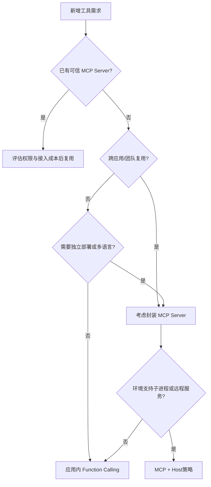

# 7. Function Calling 与 MCP 选型：内嵌工具还是标准能力服务

- 原文：[什么场景使用 Function Calling，什么场景使用 MCP？](https://xiaolinnote.com/ai/tools/7_fc_vs_mcp_usage.html)
- 一句话结论：选型核心是能力所有权和复用边界，不是简单按工具数量或项目大小一刀切。

## 1. 判断树

## 2. 适合应用内 Function Calling

- 原型或单一应用专属工具。
- 工具与应用事务、内存状态强耦合。
- Serverless/受限环境不允许子进程，也不值得部署远程 Server。
- 需要快速做定制参数转换和业务异常处理。

[run_day22_function_calling_basics.py](../run_day22_function_calling_basics.py) 的三个内存函数就是合理例子；它们依赖本模块常量，没有跨项目复用需求。

## 3. 适合 MCP

- GitHub、数据库、浏览器等能力被多个 Host 使用。
- 工具由独立团队维护，版本和凭据应集中治理。
- 需要动态发现 Resources/Prompts，不只有函数。
- 已有经过审计的官方/社区 Server，复用价值高于自建。

但“Agent 系统几乎必选 MCP”也不应绝对化。单进程 Agent、严格低延迟、强事务一致性或极小工具集可能继续使用内嵌运行时。架构应服从边界，而不是追逐协议名。

## 4. 成本模型

内嵌方案前期成本低，但重复项目数 $A$ 和工具数 $T$ 上升时，维护副本近似随 $A\times T$ 增长。MCP 将实现集中到 Server，但增加协议适配、部署、认证、网络与版本治理成本。

$$
C_{embedded}\approx A\times T\times C_{change}
$$

这不是精确财务公式，而是帮助识别复用拐点。

## 5. 安全不因 MCP 自动变好

MCP 可集中治理，但接入未知 Server 也会扩大供应链和权限风险。无论选哪种，都需要白名单、最小权限、参数校验、用户确认、超时和审计。[参考实现](examples/tooling_capabilities_reference.py) 的 `ToolRuntime` 将这些策略放在统一执行边界，可被内嵌或 MCP Server 复用。

## 6. 模拟面试

**Q1：超过几个工具就必须上 MCP？**  
A：没有固定阈值，要看复用、所有权、变更频率、部署和安全治理。

**Q2：大项目一定选 MCP 吗？**  
A：不一定。若工具只服务一个事务边界并与应用强耦合，内嵌可能更清晰。

**Q3：已有社区 Server 应直接接吗？**  
A：先审计来源、版本、权限、网络和维护状态；复用不等于无条件信任。

**Q4：MCP 的主要新增成本是什么？**  
A：独立生命周期、部署认证、协议兼容、网络延迟和跨服务观测。

**Q5：如何渐进迁移？**  
A：先抽象统一 `ToolRuntime`，再把高复用能力迁到 Server，Host 保留相同模型调用和策略层。

## 7. 复习清单

- 用复用边界而非规模口号做选择。
- 能列出两类方案各四个场景。
- 能说明集中治理与供应链风险并存。
- 能给出从 Day22 到 MCP 的渐进路线。