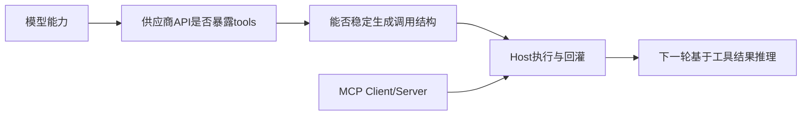

# 8. 推理模型与 MCP：工具调用兼容性的真实边界

- 原文：[为什么有些特定的推理模型不支持 MCP 协议？](https://xiaolinnote.com/ai/tools/8_reasoning_no_mcp.html)
- 一句话结论：是否支持工具主要取决于模型训练、输出格式与服务 API 的编排能力；长推理增加状态、延迟和多轮工具训练难度，但不是“思维链物理上绝对不能暂停”。

## 1. 网页直觉与需要修正之处

网页指出早期推理模型可能不支持 Function Calling，并把冲突解释为连续思考与工具暂停。这能帮助理解产品取舍，但技术表述过于绝对：

- API 工具调用通常结束当前模型响应，宿主执行工具后开启下一次推理，不是冻结 GPU 上同一次生成再恢复。
- 是否保留隐藏 reasoning/KV Cache 是提供商实现细节，应用通常只看到协议消息。
- 推理模型可以通过工具专项训练、结构化输出通道和“思考-调用-观察-再思考”数据支持交错工具使用。
- MCP 本身是 Host-Server 协议；真正受限的是 Host 能否让模型可靠选择并表达工具调用。

## 2. 更准确的兼容链

任何一层缺失都会让“模型自动使用 MCP 工具”失败，但不能把原因都归结为 MCP 不支持。

## 3. 主要工程难点

1. **训练分布**：长推理正确率高，不代表工具选择和参数格式正确。
2. **通道约束**：reasoning 与 tool call 需要清晰分离，避免把 JSON 写进自然语言。
3. **多轮一致性**：工具结果可能推翻此前假设，模型需重新规划而非机械续写。
4. **资源成本**：更多模型往返、长 reasoning token 和慢工具叠加尾延迟。
5. **安全**：隐藏推理不可作为审计依据，最终调用仍必须被宿主验证。

## 4. 项目代码映射

[run_day22_function_calling_basics.py](../run_day22_function_calling_basics.py) 不依赖可见思维链，只判断响应中是否有 `tool_calls`，把结果加入消息后再次调用。这种宿主循环天然支持多轮“调用后重新推理”，前提是所选模型 API 支持工具格式。

`max_tool_rounds` 是关键保险：推理越复杂越不能假设模型一定会自行停止。新增 [参考实现](examples/tooling_capabilities_reference.py) 又在单次执行层增加超时和授权。

仓库没有针对 o1/o3、DeepSeek-R1 或 Extended Thinking 做模型兼容矩阵，不应声称验证了某个厂商的具体行为。

## 5. 兼容性测试矩阵

- 必须工具、可选工具、禁止工具三类 Query。
- 单次、并行、串行依赖和工具失败。
- reasoning effort 不同档位下的调用正确率、总 token、P95 延迟。
- 工具结果与初始假设冲突时是否重新规划。
- 达到轮数/成本预算时是否安全终止。

## 6. 模拟面试

**Q1：推理模型不支持 MCP 的根因一定是 CoT 不能暂停吗？**  
A：不是普遍定律。更准确要看模型训练、API 工具通道和宿主编排是否支持可靠多轮调用。

**Q2：工具调用后是恢复同一次生成吗？**  
A：常见 API 是第一轮响应结束，宿主回灌 Tool 消息后发起下一轮推理。

**Q3：MCP 本身需要模型具备 reasoning 吗？**  
A：不需要。MCP 规范 Host 与 Server 通信；模型是否参与由 Host 决定。

**Q4：长推理为何仍让工具集成更难？**  
A：训练目标、结构化通道、多轮一致性、token 成本和尾延迟都更复杂。

**Q5：如何验证某模型支持工具？**  
A：以厂商 API 能力和固定测试矩阵实测，不能只根据“推理模型”标签推断。

## 7. 复习清单

- 不把产品限制包装成模型物理定律。
- 能画出模型 API、Host 和 MCP 的兼容链。
- 能列五类工程难点和测试矩阵。
- 准确说明项目未做具体推理模型对比。