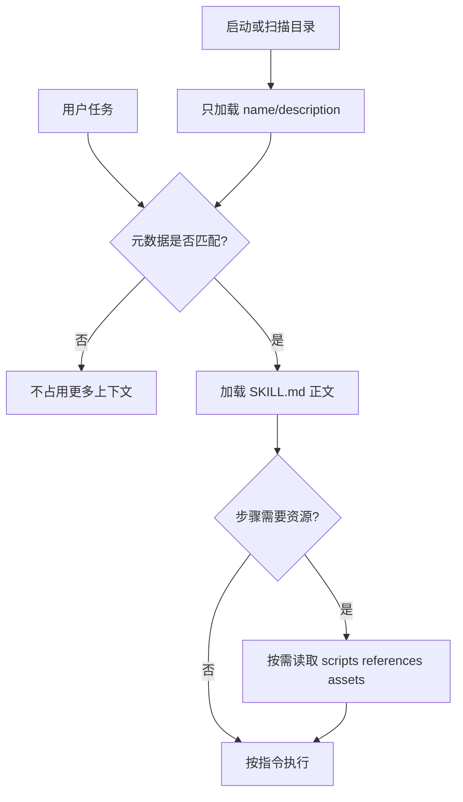

# 9. Agent Skill：可发现、可复用、渐进加载的能力包

- 原文：[Skill 是什么？](https://xiaolinnote.com/ai/tools/9_skill.html)
- 一句话结论：Skill 用元数据声明何时适用，用 `SKILL.md` 教 Agent 如何完成一类任务，并按需加载脚本、参考资料和资产，核心价值是复用流程知识和节省上下文。

## 1. Skill 不是普通 Prompt

单个 Prompt 通常是一次性文本；Skill 是目录级能力包，具备名称、描述、详细指令和可选资源。Agent 先只看到轻量元数据，任务匹配后再加载正文，执行到具体步骤时才读取脚本或模板。



这就是 Progressive Disclosure：发现成本小、执行时信息足。它也降低了“把所有操作手册塞进 System Prompt”造成的上下文浪费和指令冲突。

## 2. 典型目录

```text
code-review/
├── SKILL.md
├── scripts/
│   └── collect_diff.py
├── references/
│   └── severity.md
└── assets/
    └── report-template.md
```

`SKILL.md` 的 YAML frontmatter 至少提供 `name` 和 `description`；正文应写触发边界、步骤、输入输出、失败处理和验收，不应复制几十页参考资料。

## 3. 当前项目映射

[run_day25_task_orchestration.py](../run_day25_task_orchestration.py) 的 `build_plan`、`execute_step` 和 `summarize_results` 展示了 Skill 正文可能描述的计划式工作流，但它不是自动发现的 Skill 目录。

[tooling_capabilities_reference.py](examples/tooling_capabilities_reference.py) 的 `SkillCatalog` 实现三段加载：

1. `scan` 只解析各 `SKILL.md` 的 frontmatter。
2. `load_instructions` 在匹配后读取正文。
3. `read_asset` 仅在执行需要时读取文件，并用 `resolve()` 阻止 `../` 逃逸。

解析器只支持简单 `key: value`，不是完整 YAML；生产应使用平台规定格式和成熟解析器。Skill 本身也不提供沙箱，脚本执行权限仍由 Agent Host 决定。

## 4. 编写原则

- `description` 要同时写“做什么”和“何时用”，因为它参与发现。
- 步骤应可验证，避免“专业地完成任务”这类空泛措辞。
- 长知识放 `references/`，确定性重复操作放 `scripts/`。
- 明确禁止项、审批点、失败退出条件和产物位置。
- 为 Skill 版本、依赖工具和兼容环境建立测试。

## 5. 安全风险

Skill 是代码与指令的供应链单元。第三方 Skill 可能诱导读取密钥、执行命令或把数据发送到外部服务。Host 应显示来源、限制可用工具、审计脚本、隔离执行，并将 Skill 内容视作不可信输入。

## 6. 模拟面试

**Q1：Skill 和 System Prompt 有什么区别？**  
A：System Prompt 全程注入；Skill 可被发现并按需加载，还能携带脚本、参考资料和资产。

**Q2：Progressive Disclosure 的收益是什么？**  
A：减少无关 token 和指令冲突，只在任务需要时增加上下文。

**Q3：`description` 为什么很重要？**  
A：Agent 通常先靠它判断是否加载 Skill；描述模糊会导致漏触发或误触发。

**Q4：Skill 能直接赋予文件权限吗？**  
A：不能。它只描述流程，实际工具和权限由 Host 提供和控制。

**Q5：第三方 Skill 的主要风险是什么？**  
A：恶意指令、脚本供应链、路径逃逸、密钥读取和数据外传。

## 7. 复习清单

- 能说清目录组成和三阶段加载。
- 能区分 Skill、Prompt 和执行权限。
- 能指出参考解析器的 YAML 边界。
- 能设计包含验收与失败处理的 Skill。