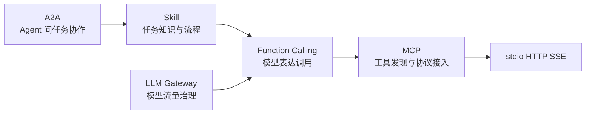

# Xiaolinnote LLM 工具调用 1-16 专题分析

本目录逐页分析 [Xiaolinnote LLM 工具调用面试题](https://xiaolinnote.com/ai/tools/)。每篇都区分三层证据：网页理论、当前项目真实代码、独立教学参考实现。网页中的产品案例不会被写成当前仓库已具备的生产能力。

## 代码入口

- [Day22 Function Calling](../run_day22_function_calling_basics.py)：工具 schema、模型决策、宿主执行、结果回灌、并行调用形状和最大轮数。
- [Day23 数据库工具](../run_day23_database_query_assistant.py)：只读 SQL、单语句限制、结果行数上限。
- [Day24 HTTP 工具](../run_day24_http_integration_assistant.py)：HTTPS、域名白名单、超时和响应裁剪。
- [Day25 编排](../run_day25_task_orchestration.py)：计划、步骤执行和结果汇总。
- [Day30-Day32 SFT](../run_day30_build_instruction_dataset.py)：指令数据、LoRA 训练与前后评估，但并非 Function Calling 专项训练集。
- [Day34/36 统一推理服务](../run_day34_unified_inference_api.py)：统一模型接口、认证、限流、重试和观测基线。
- [工具生态参考实现](examples/tooling_capabilities_reference.py)：纯标准库实现 Function Calling 安全运行时、MCP 形状、Skill 渐进加载、A2A Task、SSE 重放和 Gateway 路由。
- [参考实现测试](../tests/test_tooling_capabilities_reference.py)：10 个离线单元测试。

> 边界：参考实现不启动真实 MCP/A2A/HTTP/WebSocket/WebRTC 服务，也不替代官方 SDK、JSON Schema 校验器、OAuth、TURN 或生产网关。

## 文档索引

| 编号 | 网页主题 | 分析文档 |
| --- | --- | --- |
| 1 | Function Calling 原理 | [结构化调用与宿主执行](1_function_calling_principles_runtime.md) |
| 2 | LLM 如何学会工具调用 | [训练与运行时](2_llm_tool_learning_sft_rlhf_runtime.md) |
| 3 | Function Call 能力训练 | [数据覆盖与对齐](3_function_call_training_data_alignment.md) |
| 4 | 什么是 MCP | [协议定位与核心能力](4_mcp_protocol_tools_resources_prompts.md) |
| 5 | MCP 组成 | [Host、Client、Server](5_mcp_components_host_client_server.md) |
| 6 | MCP 与 Function Calling | [协议层次与集成](6_mcp_vs_function_calling_integration.md) |
| 7 | Function Calling 与 MCP 选型 | [内嵌或标准服务](7_function_calling_vs_mcp_selection.md) |
| 8 | 推理模型与 MCP | [工具调用兼容性](8_reasoning_models_tool_calling_compatibility.md) |
| 9 | Agent Skill | [能力包与渐进加载](9_agent_skill_progressive_loading.md) |
| 10 | MCP 与 Skill | [工具能力与工作流](10_mcp_vs_agent_skill_capability_workflow.md) |
| 11 | Function Calling、Skill、MCP | [三层协作模型](11_function_calling_skill_mcp_three_layers.md) |
| 12 | A2A 协议 | [Agent 发现与任务协作](12_a2a_protocol_agent_collaboration.md) |
| 13 | MCP 传输 | [stdio 与 Streamable HTTP](13_mcp_transport_stdio_streamable_http.md) |
| 14 | SSE 与 WebSocket | [文字流式通信选型](14_sse_vs_websocket_ai_streaming.md) |
| 15 | WebRTC 与 WebSocket | [实时语音传输](15_webrtc_vs_websocket_realtime_voice.md) |
| 16 | LLM Gateway | [统一路由与治理](16_llm_gateway_routing_governance.md) |

建议先读 1、4、5、9、11、12、16 建立骨架，再读 2、3、8、13-15 理解训练和通信细节。